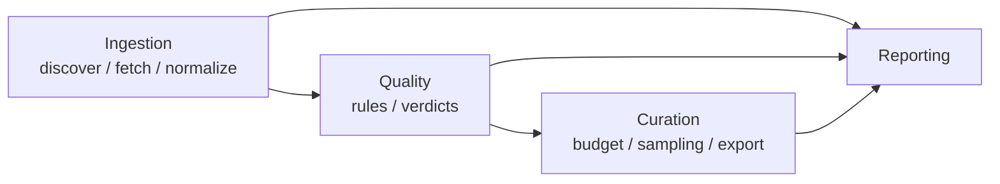

# Architecture — DDD + Clean Architecture for `rdp`

> **Source of truth is code:** where this skill and the codebase disagree, **code wins** — then
> update this file. While a component has no code, [docs/technical_design.md](../../../docs/technical_design.md) §8 wins.
>
> **Most folders below do not exist yet.** This repository is currently documentation-only. Create
> each piece as its milestone arrives ([docs/implementation_plan.md](../../../docs/implementation_plan.md)); do not
> scaffold the whole tree up front.

## The one rule

**Dependency arrows point inward only.**

```
interfaces ──▶ application ──▶ domain
infrastructure ──▶ application, domain
```

`domain/` imports **no** third-party IO library: no `sqlite3`, `pyarrow`, `requests`, `tfds`,
`tensorflow`, `h5py`, `typer`. Pure Python plus a little `numpy`.
`application/` imports **no** `infrastructure`.

This is enforced by `import-linter` (`uv run lint-imports`) as a Definition-of-Done gate from M1.
It is not a style preference: §10.7 of the design answers the entire scale-out question by
pointing at these seams. An unenforced layering rule decays within a week.

## Folder map

```
src/rdp/
  domain/
    episode.py          # Episode aggregate root, incl. stage-transition invariants
    action_spec.py      # SignalSpec + Channel value objects (shared by action and state)
    capabilities.py     # Capabilities value object
    provenance.py       # Provenance value object
    embodiment.py       # Embodiment identity + embodiments.yaml assertions
    boundary.py         # EpisodeBoundary value object
    camera.py           # CameraSpec value object
    frames.py           # FrameTable value object (column name / unit / dtype constraints)
    stage.py            # IngestionStage state machine; advance() rejects illegal transitions
    qc/                 # QCRule protocol + the rules (pure functions)
    curation/sampler.py # sampling strategy: pure function statistics -> SubsetPlan
    errors.py
  application/
    ports.py            # the Protocols listed below
    ingest_episodes.py  # use case: discover -> fetch -> normalize -> qc -> commit
    recover_incomplete.py # use case: the startup recovery pass
    export_subset.py    # use case: budget -> SubsetPlan -> JSONL
    build_report.py
  infrastructure/
    sources/{lerobot_adapter,rlds_adapter,epic_adapter}.py
    persistence/{sqlite_repository,unit_of_work}.py  schema.sql
    storage/{parquet_frame_store,atomic_fs}.py
    media/ffprobe.py
    config/yaml_loader.py
  interfaces/
    cli.py              # typer: run / export / report / doctor / sources
    presenters/report_md.py
tests/{unit,integration,acceptance,fakes,fixtures}
config/{sources.yaml, sources.local.yaml (gitignored), qc.yaml, embodiments.yaml}
scripts/demo_crash_resume.sh
```

## Where does this code belong?

| You are writing…                                                  | It goes in                                                             | Because                                                              |
| ----------------------------------------------------------------- | ---------------------------------------------------------------------- | -------------------------------------------------------------------- |
| A rule about what a valid `Episode`/`SignalSpec`/`Channel` **is** | `domain/` (validating constructor + invariant test)                    | Invariants belong at the single enforcement point, not in 4 adapters |
| A QC check on frame values                                        | `domain/qc/` as a pure function `(FrameTable, EpisodeMeta) -> Verdict` | Testable against synthetic data with zero IO                         |
| "Which episodes, in what order, with what transaction boundary"   | `application/` use case                                                | Orchestration is not a domain concept and not an IO concept          |
| Parsing a specific upstream file format                           | `infrastructure/sources/` behind `SourcePort`                          | The anti-corruption layer; see the `source-adapters` skill           |
| SQL, PRAGMAs, transactions                                        | `infrastructure/persistence/`                                          | The domain never writes SQL                                          |
| `os.replace`, fsync, tmp-file protocol                            | `infrastructure/storage/atomic_fs.py`                                  | One implementation, used by every writer                             |
| Console tables, markdown/JSON report rendering                    | `interfaces/presenters/`                                               | Presentation, not statistics                                         |
| The **vocabulary** of a statistic ("new episodes", "skip reason") | `domain/run.py` (`IngestionRun`)                                       | So the CLI report and a future Prometheus exporter cannot disagree   |
| Reading a YAML config file                                        | `infrastructure/config/`                                               | IO                                                                   |
| Interpreting a config value's meaning                             | `domain/`                                                              | Meaning is domain, loading is infrastructure                         |

**Litmus test:** if the code would still be correct with no filesystem, no network, and no clock,
it belongs in `domain/`. If it needs one of those, it belongs in `infrastructure/` behind a port.

## Port catalogue

Ports are `Protocol`s declared in `application/ports.py`. Implementations live in
`infrastructure/`. Fakes live in `tests/fakes/`.

```python
class SourcePort(Protocol):
    source_id: str
    def list_episodes(self) -> Iterator[EpisodeRef]: ...
    def fetch(self, ref: EpisodeRef, dest: Path) -> RawEpisode: ...
    def normalize(self, raw: RawEpisode) -> CanonicalEpisode: ...

class EpisodeRepository(Protocol):
    def get(self, uid: EpisodeUid) -> Episode | None: ...
    def upsert(self, ep: Episode) -> None: ...            # idempotent
    def list_by_stage(self, stage: IngestionStage) -> list[Episode]: ...

class UnitOfWork(Protocol):
    def __enter__(self) -> "UnitOfWork": ...              # one episode == one transaction
    def commit(self) -> None: ...
    def rollback(self) -> None: ...

class FrameStore(Protocol): ...    # frames.parquet read/write
class BlobStore(Protocol): ...     # videos and other large opaque artifacts
class Clock(Protocol): ...         # so tests are deterministic
class RunReporter(Protocol): ...   # statistics sink; CLI today, metrics exporter later

class FaultInjector(Protocol):
    def maybe_crash(self, checkpoint: str) -> None: ...   # production impl is a no-op
```

`FaultInjector` is a **production port created deliberately for testability**. It turns "crash
during QC" into a programmable, assertable event instead of a race against an external `kill`.
Production injects a no-op; the cost is zero. This is the one place where test-driven design is
allowed to add a production abstraction.

## Bounded contexts



Contexts communicate **only** via `EpisodeUid` plus an immutable `CanonicalEpisode`. No mutable
object crosses a boundary.

- **Quality does not know where data came from.** It sees `FrameTable + SignalSpec + Capabilities
  - Provenance`. If a rule needs to branch on `source_id`, the rule is wrong — the fact it needs
    should be a capability or a provenance field instead.
- **Curation does not know how QC was computed.** It sees `Verdict`.

These interfaces are deliberately minimal, which is why `SignalSpec` can evolve internally with
zero downstream change.

## Adding things

**A new source** → one class implementing `SourcePort` + one entry in `config/sources.yaml` +
characterization tests against a committed mini fixture. `domain/` and `application/` change
**zero lines**. If they need to change, the schema was missing something — that is an ADR, not a
quick edit. See the `source-adapters` skill.

**A new QC rule** → a pure function in `domain/qc/` declaring `required_capabilities`. Write the
test against hand-constructed bad data first. Never bypass `SKIPPED`: if capabilities are unmet,
the domain layer forces `SKIPPED` and the rule cannot override it.

**A new use case** → a module in `application/`, depending only on ports and `domain`. It must
own its transaction boundary explicitly via `UnitOfWork`.

**A new CLI command** → `interfaces/cli.py` calls exactly one application use case. No business
logic in the CLI. A future web dashboard is a second presenter calling the **same** use cases.

## Test placement

| Layer       | Location             | Depends on                                         | Budget |
| ----------- | -------------------- | -------------------------------------------------- | ------ |
| unit        | `tests/unit/`        | `domain/` only, all fakes, no IO                   | < 2 s  |
| integration | `tests/integration/` | real SQLite in tmpdir, real parquet, mini fixtures | < 20 s |
| acceptance  | `tests/acceptance/`  | real subprocess, real `kill -9`, real store        | < 60 s |

Every domain invariant has a unit test, written **before** the implementation. Adapters get
characterization tests with golden fixtures rather than strict TDD, because they depend on real
data formats that must be explored first.

Coverage gate: `--cov=src/rdp/domain --cov-fail-under=90`. Do not chase overall coverage.

## Scale-out: every answer is an existing seam

This table is the payoff of the layering, and it is a graded deliverable (design §10).

| Change                                         | What changes                                                                      | What does not                               |
| ---------------------------------------------- | --------------------------------------------------------------------------------- | ------------------------------------------- |
| SQLite → managed Postgres                      | `EpisodeRepository` / `UnitOfWork` implementations                                | Domain state machine, transaction semantics |
| Local FS → S3 + Lance/chunked parquet          | `FrameStore` / `BlobStore` implementations                                        | Column-name contract, canonical schema      |
| for-loop → Temporal (durable execution)        | The scheduling shell outside `application`; use cases become activities unchanged | Use-case logic, idempotency keys            |
| Per-episode QC → batched vectorized + sampling | The rule executor in `application`                                                | The `QCRule` pure functions                 |
| Run report → Prometheus/Grafana                | A metrics implementation of `RunReporter`                                         | `IngestionRun`'s statistical vocabulary     |
| CLI → CLI + web dashboard                      | A presenter in `interfaces/` + one override use case                              | All use cases and the domain                |
| Single-machine crash recovery → spot instances | **Nothing** — same mechanism, different trigger                                   | Idempotency + leases + atomic writes        |

Migration order (strangler pattern, each step independently shippable and revertible):
① object storage → ② Postgres → ③ Temporal → ④ dashboard. The four seams are mutually decoupled,
so the order is interchangeable.

If the dashboard's numbers ever disagree with `rdp report`, that is an incident, not a rounding
difference — both read the same `IngestionRun` vocabulary.

## Explicitly rejected — do not reintroduce

Domain events / event bus / event sourcing · CQRS · a `Service`/`Manager` layer above
`Repository` · an ORM · a Factory/Builder per value object · a generic ETL framework · 100%
coverage · multiprocessing for throughput · EAV / unbounded `extensions` fields · a web dashboard
this round.

Each was considered and rejected in design §8.6. If you believe one is now necessary, that is an
ADR with evidence, not a refactor.

**The opposite failure is equally real:** do not generalize "so it will be easier to change
later". `unknown` / `raw_extra` / `raw.*` columns are already the escape hatch for facts the
schema cannot yet express. Facts get promoted to first-class fields via an ADR once evidence
accumulates.

## References

- [docs/technical_design.md](../../../docs/technical_design.md) §8 — methodology, layering, invariants, TDD, schema evolution
- [docs/technical_design.md](../../../docs/technical_design.md) §10 — the scale-out answer in full
- [docs/implementation_plan.md](../../../docs/implementation_plan.md) — milestone order and Definition of Done
- [AGENTS.md](../../../AGENTS.md) — commands, conventions, prime directive
