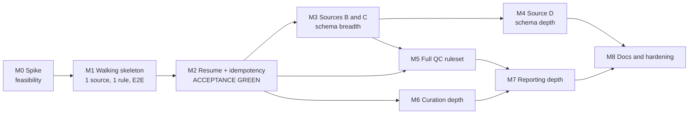

# Implementation Plan

Companion to [technical_design.md](technical_design.md) (the design authority) and
[assessment_for_ai.md](assessment_for_ai.md) (the requirements). This document is written
in English because it is consumed by coding agents.

The design document answers **what** the system is. This document answers **in what order it gets
built, and how each step is proven done**.

---

## 0. Sequencing principle: walking skeleton first, depth second

**Build the thinnest possible end-to-end slice before building any module deeply.**

M1 delivers `discover → fetch → normalize → qc → commit → export → report` running end to end
with **one source, one QC rule, one embodiment** — but with the _real_ state machine, the _real_
SQLite catalog, and the _real_ atomic-write protocol. Every later milestone widens that slice
(more sources, more rules, more spec dimensions) without changing its shape.

Rationale:

1. **The two acceptance scenarios are cross-cutting, not modular.** "Kill during QC, restart,
   resume" and "second run finds nothing new" exercise transaction boundaries, idempotency keys,
   and the stage machine simultaneously. A design error there invalidates work in every module.
   Discovering it in week 1 costs a refactor of ~300 lines; discovering it after four adapters
   costs a rewrite. Front-load the highest-risk, widest-blast-radius work.
2. **The project manager can run the demo from M1 onward.** From that point every milestone is a
   visible increment on a system that already works, not a promise about a system that doesn't.
   Feedback arrives while it is still cheap to act on.
3. **Real infrastructure early beats mocked infrastructure early.** Deferring SQLite/Parquet
   behind fakes until M3 would hide exactly the failure modes (fsync ordering, `os.replace`
   atomicity, WAL semantics) that the acceptance scenarios target.
4. **Each new source is a schema stress test, and they must arrive one at a time.** The design's
   own history shows B, C, and D each forced distinct schema revisions. Landing them serially,
   each behind a green regression suite, turns "schema churn" into a controlled, reviewable
   sequence of ADRs instead of a single unbounded redesign.

What the skeleton deliberately does _not_ compromise: layering rules, domain invariants, and
TDD discipline (§8.3–8.5 of the design) apply inside every milestone. The skeleton is narrow in
**breadth** (how many sources and rules), never shallow in **depth** (how correct each one is).



M5 and M6 depend only on M2 plus whatever sources exist; they can interleave with M3/M4 if work
is parallelized. M2 is the only hard serialization point.

---

## 1. Definition of Done (applies to every milestone)

A milestone is **not** done until all of the following hold. No exceptions, no "will fix in the
next milestone".

| #   | Gate                     | Check                                                                                                                                                                |
| --- | ------------------------ | -------------------------------------------------------------------------------------------------------------------------------------------------------------------- |
| 1   | Tests green              | `pytest` exits 0; no skipped tests without an explicit `reason=`                                                                                                     |
| 2   | Domain coverage          | `pytest --cov=src/rdp/domain --cov-fail-under=90`                                                                                                                    |
| 3   | Layering enforced        | `import-linter` contract passes: `domain` imports no `sqlite3`/`pyarrow`/`requests`/`tfds`/`application`/`infrastructure`; `application` imports no `infrastructure` |
| 4   | Types and lint           | `ruff check .` and `mypy src/rdp` clean                                                                                                                              |
| 5   | Acceptance still green   | From M2 onward, `pytest tests/acceptance -q` passes unchanged                                                                                                        |
| 6   | Verification script runs | The milestone's own verification commands (below) reproduce from a clean clone                                                                                       |
| 7   | Design synchronized      | Any deviation from `technical_design.md` is either reverted or landed as a design edit plus `docs/adr/NNN-*.md` **in the same commit range**                         |
| 8   | Commits are small        | Multiple commits per milestone, each with a "what + why" message; no single squashed dump                                                                            |
| 9   | AI trail recorded        | Raw prompts/responses under `docs/ai/`, rejections in `docs/ai/rejected.md`                                                                                          |

**Gate 3 is worth automating on day one.** The layering rule is the load-bearing claim of the
whole scale-out answer (§10.7 of the design); an unenforced rule decays within a week.

---

## M0 — Feasibility spike (throwaway code)

**Goal:** eliminate the two unknowns that could invalidate the source selection, before any
production code exists.

**Scope**

- Pull exactly one episode from A (`lerobot/pusht`) and one from B
  (`lerobot/aloha_sim_insertion_human`); dump `meta/info.json` and the first 5 parquet rows.
- Install and read one RLDS shard for C (`berkeley_autolab_ur5` or a `bridge` slice). **Decision
  point:** if TFDS/TensorFlow does not install cleanly on the target Python, fall back to either
  direct TFRecord parsing or replacing C with an HDF5 source (robomimic/ALOHA). Record the
  decision in an ADR.
- For D (EPIC-KITCHENS-100): download the annotations repo, one video's EPIC-Fields pose JSON,
  and one IMU file. **Measure the IMU units empirically** (`rad/s` vs `deg/s`) — do not copy the
  documentation.
- Confirm two facts that the design flags as unverified:
  - whether LeRobot's export preserves `terminated` vs `truncated`, or only `next.done`;
  - how EPIC-Fields pose frame indices map to official video fps.

**Deliverables:** `spikes/` directory (excluded from the package, kept in git), one ADR per
decision, and a `docs/adr/000-source-selection.md` recording the final four sources.

**Verification**

```bash
# the spike group is heavyweight and throwaway; it is never a runtime dependency
uv run --group spike python spikes/probe_lerobot.py  # info.json fields + first rows for A and B
uv run --group spike python spikes/probe_rlds.py     # one episode's step keys and shapes, or fails loudly
uv run --group spike python spikes/probe_epic.py     # one segment, pose coverage %, measured IMU units
```

Captured output is committed under `spikes/_out/*.txt`; downloaded data lands in the gitignored
`spikes/_data/`.

**Exit criteria** — **all met; M0 complete.**

- [x] Four sources confirmed reachable, **no substitution** — [ADR 000](adr/000-source-selection.md).
- [x] IMU units determined by measurement and written into the design (§1.1 point 3): accel `m/s^2`
      (mean |a| = 9.8998), gyro `rad/s` (p99 = 1.85), sampled at 195 Hz —
      [ADR 004](adr/004-epic-frame-fps-and-imu-units.md).
- [x] `terminated`/`truncated` for A/B answered: **lost upstream**, registered in design §11 —
      [ADR 002](adr/002-lerobot-v3-layout-and-lost-termination.md).
- [x] `config/sources.yaml` drafted with `max_episodes` caps per source, derived from measured
      episode lengths (≈50k frames total).

**What the spike changed in the design** (Definition of Done gate 7 — each is a design edit plus
an ADR):

| ADR | Finding                                                                                                                                                                                                      |
| --- | ------------------------------------------------------------------------------------------------------------------------------------------------------------------------------------------------------------ |
| 001 | TFDS is unusable (protobuf gencode 6.31 vs runtime 5.29); C is read by parsing TFRecord + `tf.train.Example` directly, with no TensorFlow dependency                                                         |
| 002 | LeRobot is v3.0: many episodes per parquet, one mp4 per dataset, boundaries in `meta/episodes`; and `terminated`/`truncated` do not survive the export                                                       |
| 003 | C's action is **8-D, not 10-D** (`terminate_episode` is a scalar), and its gripper is a ternary **change** command, not an absolute position                                                                 |
| 004 | D's annotation frame indices use an **extraction** fps (50 fps videos @50, all others @60 — 100% of 67,217 segments reproduced) that differs from the official fps for 42% of the corpus; IMU units measured |

**Risk (retired):** TFDS on macOS/Python 3.12 did fail, exactly as anticipated. The pre-authorized
fallback was taken within the spike budget; C was kept.

---

## M1 — Walking skeleton (the pipeline exists end to end)

**Goal:** `rdp run && rdp export && rdp report` works on real data, with real persistence, for
one source. This is the milestone that puts the project manager in the loop.

**Scope — narrow but complete**

- Source: **A only** (`lerobot/pusht`, ~10 episodes via `max_episodes`).
- QC rules: **one** — `TS_MONOTONIC` (chosen because it needs no threshold tuning and its
  `SKIPPED` path on synthetic timestamps already exercises capability gating).
- Domain: `Episode`, `FrameTable`, `SignalSpec`/`Channel`, `Capabilities`, `Provenance`,
  `EpisodeBoundary`, `IngestionStage` — with invariants 1–6 from §8.4 implemented and unit-tested.
  Fields that only later sources need (`level`, `origin`, `clock`, `stream_specs`) exist in the
  model with defaults but are not yet exercised.
- Ports: `SourcePort`, `EpisodeRepository`, `FrameStore`, `UnitOfWork`, `Clock`, `RunReporter`,
  `FaultInjector` (no-op implementation only).
- Infrastructure: real SQLite catalog (`schema.sql`, WAL, `synchronous=FULL`), real Parquet
  frame store with the atomic write protocol (`*.tmp` → fsync file → `os.replace` → fsync dir),
  real `LeRobotAdapter`.
- Application: `ingest_episodes`, `export_subset` (trivial strategy: take PASS episodes in order
  until budget), `build_report`.
- Interface: `typer` CLI with `run`, `export`, `report`, `sources`.

**Explicitly out of scope for M1:** resume logic, staleness detection, sampling strategy,
sources B/C/D, the other nine QC rules, video handling.

**Verification**

```bash
rdp run --source pusht --max-episodes 10
rdp report                                  # console table + reports/run_<id>.json|.md
rdp export --budget 5000 --out exports/subset.jsonl
sqlite3 store/catalog.sqlite "select status, count(*) from episodes group by 1"
```

**Exit criteria**

- [x] `episodes` table has 10 rows, all `status = COMMITTED`.
- [x] `store/normalized/pusht/<upstream_id>/frames.parquet` opens with `pyarrow` and its columns
      match the naming contract exactly: `t`, `action.<name>`, `state.<name>`, `raw.<name>`.
      (Keyed by `upstream_id` rather than `uid`, which embeds a `:` — [ADR 006](adr/006-m1-catalog-schema-and-store-layout.md).)
- [x] `qc_results` has one row per episode for `TS_MONOTONIC` with numeric `metrics_json`.
- [x] `exports/subset.jsonl` parses line-by-line and every line carries all fields listed in §6
      of the design; total frames ≤ budget; every entry spans a whole episode.
- [x] `reports/run_<id>.md` reports per-run and cumulative counts consistent with the database.
- [x] Integration test `tests/integration/test_pipeline_smoke.py` reproduces the above on a
      committed mini-fixture (39 KB) with no network access.

**Outcome — two things measurement changed**

1. pusht's `timestamp` column is bit-for-bit `float32(frame_index / fps)`, so it is synthesized
   and `TS_MONOTONIC` resolves to `SKIPPED(synthetic_timestamp)` on every episode
   ([ADR 005](adr/005-pusht-timestamps-are-synthesized.md)). The one rule M1 ships is skipped on
   the one source M1 ingests — which is the gating path working, not a gap.
2. The `episodes` sketch in design §4 was missing seven columns that QC gating and the export
   manifest actually read ([ADR 006](adr/006-m1-catalog-schema-and-store-layout.md)).

---

## M2 — Resume and idempotency (acceptance scenarios green)

**Goal:** both reviewer scenarios pass, proven by an exhaustive fault-injection matrix _and_ by a
real `kill -9`. After this milestone the demo script is handed to the project manager.

**Scope**

- `episode_state` table with `stage`, `attempt`, `last_error`, `lease_owner`, `lease_expires_at`.
- Idempotency key `(source_id, upstream_id)` plus `content_hash` over **canonical bytes** as
  defined in §5 of the design (not raw file bytes).
- The unified staleness predicate over
  `(content_hash, schema_version, adapter_version, ruleset_version)`, with targeted re-runs:
  schema/adapter change re-runs from `normalize`; ruleset-only change re-runs QC only.
- `recover_incomplete` use case: sweep orphan `*.tmp`, expire stale leases back to the last
  stable stage, validate that `NORMALIZED` parquet files open (else demote to `FETCHED`).
- `FaultInjector` real implementation driven by `FAULT_INJECT=<checkpoint>` plus `FakeSource`
  with per-method call counters.
- `scripts/demo_crash_resume.sh` — real subprocess, real `kill -9`, no simulation.

**TDD order (tests first, red before green)**

1. `tests/acceptance/test_resume.py::test_crash_during_qc_resumes` — write it before the resume
   implementation exists.
2. Parametrize over all eight crash checkpoints: `fetch.before`, `fetch.after`,
   `normalize.before`, `normalize.after_write_before_commit`, `qc.before`, `qc.mid_rule`,
   `qc.after_episode_n`, `commit.after_file_before_db`.
3. Then `test_second_run_is_noop`, then `test_upstream_adds_one_episode`.
4. Real-kill test last, confirming it agrees with the fake-layer conclusions.

**Verification**

```bash
pytest tests/acceptance -q                  # 8 crash points + idempotency + incremental
bash scripts/demo_crash_resume.sh           # real kill -9, prints a before/after diff
```

**Exit criteria** — each is a machine-checked assertion, not an eyeball check:

- [x] After a crash at any of the 8 checkpoints, **at most the single in-flight stage is
      redone**, and never a stage the catalog recorded as complete. Six checkpoints cost nothing;
      `fetch.after` costs one extra `FakeSource.fetch` and `normalize.after_write_before_commit`
      one extra `FakeSource.normalize`, because those are exactly the windows the file-first
      write order opens on purpose. The per-checkpoint cost is declared in a `REDONE` table and
      asserted ([ADR 007](adr/007-m2-resume-leases-and-crash-criteria.md), decision 3).
- [x] Post-resume database state is **field-by-field identical** to the uninterrupted baseline:
      full `episodes` table, full `qc_results` table, and per-file parquet content hashes.
- [x] `runs` has two rows; the second has non-null `resumed_from`.
- [x] Second run on unchanged upstream: `new_episodes == 0`, `episodes` row count unchanged,
      **every `updated_at` unchanged**.
- [x] Upstream gains one episode → exactly one episode is fetched and normalized.
- [x] Bumping `ruleset_version` alone re-runs QC and does **not** re-run fetch or normalize.
      Bumping `adapter_version` re-normalizes and does **not** re-fetch.
- [x] No orphan `*.tmp` files remain after any recovery pass, and a `NORMALIZED` episode whose
      parquet no longer opens is demoted to `FETCHED` rather than exported.

**Discovered during M2** (recorded in [ADR 007](adr/007-m2-resume-leases-and-crash-criteria.md)):

1. The original call-count criterion above was unachievable at two of the eight checkpoints, and
   correctly so — see decision 3. Amended rather than weakened.
2. A pure TTL lease cannot be reclaimed by a restart one second after a `kill -9`, which is the
   only interesting case. A lease is now reclaimable when the TTL has passed **or** when it names
   our own single-writer slot (decision 4).
3. A resume must not call `fetch` again: the `FETCHED` row is itself the receipt that the raw
   bytes are staged, so the `RawEpisode` handle is reconstructed instead (decision 2).

---

## M3 — Breadth: sources B and C

**Goal:** prove the adapter seam by adding two sources with zero changes to `application/`, and
let each source push the schema exactly as far as its data demands.

**Working method for every new source (this is the anti-corruption-layer protocol from §8.7):**
read the raw data → list the facts the current schema cannot express → for each, either route it
to `raw_extra` / `raw.` columns / `unknown` (no version bump), or write an ADR and bump the
schema. Never widen the schema speculatively.

**Scope**

- **B (`aloha_sim_insertion_human`)** via the same `LeRobotAdapter`, driven by `meta/info.json` —
  no per-dataset branching. Forces: channel-level `unit`, channel-level `gripper` with inverse
  transform parameters, `arm_id`, and `StateSpec` symmetry with `ActionSpec`.
- **C (RLDS/OXE)** via `RLDSAdapter`. Forces: channel-level `space`/`is_delta`/`frame`,
  `Channel.rotation`, `role="control_flag"` with `is_physical=False`, `has_rgb` vs `has_video`
  split, `CameraSpec.mount`/`encoding`, frame-level `raw.` columns, synthesized timestamps, and
  an identity scheme that survives a re-shard. (The sketch here was `split/shard#index`; what
  shipped is `split#global_index` with the layout carried in `adapter_version` — a shard-derived
  identity would have made a re-shard look like new data. See
  [ADR 009](adr/009-rlds-identity-clock-and-padding.md), decisions 1–2.)
- Characterization tests per source: assert channel names, order, units, gripper conventions, and
  physical-vs-total dim against committed golden fixtures.
- `embodiments.yaml` registry asserting semantics independently of upstream field names (pusht's
  `motor_0/motor_1` are Cartesian, not motors).

**Verification**

```bash
rdp run --source aloha_sim_insertion --max-episodes 10
rdp run --source berkeley_ur5 --max-episodes 10
pytest tests/integration/test_adapters.py -q        # golden channel maps
pytest tests/acceptance -q                          # M2 assertions must still pass
```

**Exit criteria**

- [x] Adding B and C touched **zero lines** in `domain/` beyond ADR-approved schema changes, and
      zero lines in `application/` — verifiable with `git diff --stat` over the milestone range.
      The only `domain/` change is one enum member, `RotationRepr.EULER_RPY`
      ([ADR 009](adr/009-rlds-identity-clock-and-padding.md), decision 5).
- [x] B: a single episode's `ActionSpec` shows 12 channels with `unit="rad"`,
      `metric_convertible=true` and 2 with `role="gripper"`, `metric_convertible=false`, split
      across `arm_id` left/right.
- [x] C: `SignalSpec.space == "mixed"`, `dim=8`, `physical_dim=7`; the `terminate_episode` channel
      have `is_physical=false`; `state_spec.space == "unknown"`.
- [x] C: `VIDEO_FRAME_MISMATCH` (once it exists) and any `has_video` rule resolve to `SKIPPED`,
      not `FAIL`. C sets `has_video=false` with three `inline_frames` cameras and
      `has_rgb=true`, so the gate is in place before the rule is.
- [x] Re-running the pipeline after C's shard layout changes marks episodes `stale`, not `new`
      (`stale_renormalize == 2`, `discovered == 0`, identities unchanged).
- [x] One ADR per schema revision, each naming the fact that forced it —
      [008](adr/008-aloha-channel-units-and-unverified-gripper.md) and
      [009](adr/009-rlds-identity-clock-and-padding.md).

**Outcome**

`rdp run --source aloha_sim_insertion` and `rdp run --source berkeley_ur5` both complete on real
upstream data, and a second run of each reports `skipped_already_processed` with nothing
re-ingested. 24 episodes across three sources, 19 new tests (133 total), all gates green.

Adding **B cost no Python at all** — one `sources.yaml` entry, one `embodiments.yaml` entry, one
fixture. Adding **C cost one adapter, one 130-line TFRecord reader, and one streaming method on
the fetcher**, with `application/` untouched.

**Discovered during M3** (recorded in ADRs [008](adr/008-aloha-channel-units-and-unverified-gripper.md)
and [009](adr/009-rlds-identity-clock-and-padding.md)):

1. B's gripper is _approximately_ normalized and overflows `[0, 1]` in both directions, and its
   open/closed direction is published nowhere. Recorded as
   `convention: normalized_unverified_direction` with an identity inverse — an explicit unknown
   rather than a plausible guess (ADR 008, decision 4).
2. B's `timestamp` is bit-identical to `float32(frame_index / fps)` at 50 Hz, exactly as pusht's
   is. All three sources ingested so far have synthesized clocks, so `TS_MONOTONIC` is `SKIPPED`
   on all 24 episodes.
3. B's action space is `mixed`, not `joint_position`: 12 radian joints plus 2 normalized
   grippers. Spec-level space is _derived_, never declared, and this is why.
4. C's episodes end with **two** placeholder steps, not one, and zero-valued actions also occur
   mid-episode — so padding is detected by `is_last` **and** an all-zero pose, never by either
   alone (ADR 009, decision 4).
5. C's shard layout had to be separated from C's identity. Identity is the index within the
   split; the layout rides in `adapter_version`, which turns a re-shard into a re-normalization
   through machinery that already existed (ADR 009, decisions 1–2).
6. `RotationRepr` had no honest value for "roll/pitch/yaw, order unstated". `EULER_XYZ` would
   assert an order upstream never gives; `UNKNOWN` would discard the axis naming it does give.
   `EULER_RPY` was added — the one schema change of the milestone, and no `SCHEMA_VERSION` bump,
   since a new enum member invalidates no existing episode.
7. `max_episodes` for C was cut from 80 to 12: an episode stages ~55 MB of inline camera frames,
   and `raw/` is kept verbatim.

---

## M4 — Depth: source D (EPIC-KITCHENS-100)

**Goal:** exercise the three schema dimensions no other source can reach — representation level,
signal origin, and per-episode capability heterogeneity — plus the multi-clock storage layout.

**Scope**

- `EpicKitchensAdapter` as a **layered** source: annotations / camera_pose / IMU, each
  independently available, declared via `layers:` in `config/sources.yaml`. A missing layer
  degrades that layer's capabilities only; it never fails the source.
- Episode granularity = one action segment; `episode_uid = "epic100:<narration_id>"`.
- `ActionSpec.level = "episode_label"` with `physical_dim = 0` and **no** action columns in
  `frames.parquet`.
- Camera pose (`clock="frame"`) into `frames.parquet` with NULL — never 0 — on unregistered
  frames; the IMU (`clock="own_timeline"`) into `streams/gyro.parquet` and
  `streams/accel.parquet`, each with its own `t` column.
- `Channel.origin` / `Provenance.signal_origin`, and the domain-level severity downgrade for
  non-`measured` channels (invariant 13).
- `success_adjudicator = "none"`; local mirror registered under `provenance.mirrors` with its own
  fps, never as the authoritative source.
- Sample selection deliberately includes at least one video **with** IMU and one **without**.

**Verification**

```bash
rdp run --source epic100 --max-episodes 20
sqlite3 store/catalog.sqlite \
  "select json_extract(capabilities_json,'\$.has_imu'), count(*) \
   from episodes where source_id='epic100' group by 1"
pytest tests/integration/test_epic_adapter.py -q
```

**Exit criteria**

- [x] Two episodes under the same `source_id` have **different** `capabilities_json`, and their
      QC conclusions differ accordingly (one `PASS`, one `SKIPPED` on the corresponding rule).
      Three profiles across three videos, and `P28_101_0` PASSes `POSE_COVERAGE` while its
      sibling `P28_101_43` (32 of 48 frames registered) is `REVIEW`.
- [x] Frame-level action rules report `SKIPPED(reason=action_level_is_episode_label)` — a reason
      distinct from "no action", and separately countable in the report.
- [~] A jump in an `estimated` camera-pose channel produces `REVIEW`, not `FAIL`, and the
  `Verdict.reason` states the downgrade basis. **The mechanism is in `evaluate_rule` and is
  unit-tested against a stub FAIL rule; no rule shipped in M4 is FAIL-severity over pose, so
  the production jerk rule that exercises it end to end lands in M5**
  ([ADR 011](adr/011-epic-layered-availability-and-origins.md), decision 5).
- [x] Unregistered pose frames are NULL in parquet (asserted: `null_count == 16` on
      `P28_101_43`, and no zero appears among the missing frames).
- [x] `provenance.frame_index_source` matches `derived_from_seconds@<fps>`; a bare `derived`
      raises a domain error.
- [x] IMU rows live only in `streams/gyro.parquet` and `streams/accel.parquet`; no IMU column
      exists in `frames.parquet`.
- [x] License `CC BY-NC 4.0` is recorded on the source row and propagates to export lines.

**Outcome**

`rdp run` completes on real upstream data for all four sources — 80 pusht, 50 aloha, 12 ur5, 60
epic100 = **202 episodes committed, 0 failed** — and a second run of each re-ingests nothing.
172 tests, domain coverage 97.7%, all gates green.

Adding D cost **one adapter**, two QC rules, and two domain additions — `stream_specs` /
`streams` (invariant 17) and `downgrade_basis` (invariant 13). `application/` changed only where
a new port method was needed (`FrameStore.read_streams`, `SourceRepository.licenses`).

**Discovered during M4** (recorded in ADRs [010](adr/010-epic-two-frame-numberings.md),
[011](adr/011-epic-layered-availability-and-origins.md),
[012](adr/012-epic-imu-is-two-streams.md) and
[013](adr/013-lerobot-global-index-and-qc-history.md)):

1. EPIC has **two** frame numberings for the same segment, and they drift: the annotation CSV
   counts at the extraction fps, EPIC-Fields indexes poses at the official fps. `P01_01_0` is
   frames 8–202 in the CSV and 8–201 on the official clock. We store the official-fps numbering
   and preserve the CSV's under `raw_extra.epic.extraction_numbering` (ADR 010).
2. The IMU rate is **not** a constant: 5.128205 ms on `P01_101`, ~5.05 ms on `P01_103` and
   `P28_101`. The `imu_hz: 195` key was removed from config rather than left as a
   wrong-but-unused nominal (ADR 011, decision 3) — a correction to ADR 004, which measured only
   one video.
3. `P01_101` is **not in the train split** at all, so the first video selection could never have
   produced episodes for it. Replaced by `P01_103`.
4. `P01_01` has no GoPro metadata (404, verified by probe) and no published reconstruction;
   `P01_103` has IMU only; `P28_101` has both. Three capability profiles from three videos.
5. Layer availability had to be measured at `fetch` and **persisted**, not re-probed at
   `normalize`, or a resumed run's result would depend on the network and on when it resumed.
6. `POSE_COVERAGE` needs two independent metrics: coverage, and the longest continuous hole in
   **seconds**. Evenly scattered gaps and one contiguous gap of the same size mean different
   things to a consumer.
7. NaN is now written as a genuine parquet **NULL**. The pipeline never zero-fills, so a NaN in
   a float column always means "upstream did not provide this", and the round trip is lossless.

**Found only by running without `--max-episodes`, after every gate was already green** — four
defects, none of which a fixture could have shown, and all four the same mistake: a fixture that
is a scale model of the _data_ instead of a scale model of its _structure_.

8. **Gyro and accel do not share a clock.** On `P28_101`, 793 of 141,924 `Milliseconds` values
   disagree, by up to 15 ms, contiguously across ~409–673 s. ADR 011's "join if identical, else
   raise" was wrong in both branches; they are now two streams (ADR 012). `P01_103`'s two files
   are bit-identical, which is why one video was not enough to see it.
9. **A staging directory belongs to the adapter version that wrote it.** Splitting the IMU made
   every already-staged EPIC episode fail permanently, because `.staged.json` said "done".
   Markers now carry `adapter_version`, shared by all three adapters (ADR 012 §2).
10. **A `normalized/` write must remove stream files the episode no longer declares**, or a
    re-normalization leaves `streams/imu.parquet` beside the new pair and the next read raises
    (ADR 012 §3).
11. **LeRobot's `dataset_from_index` is dataset-global, not file-relative** — a two-milestone-old
    bug that lost **35 of 50 aloha episodes** the moment a source spanned two data files.
    `pusht` has one file, so nothing had ever exercised it (ADR 013 §1).
12. **`qc_results` is history and the report was reading it as state**: 202 committed episodes
    were reported as 325 `TS_MONOTONIC` verdicts. Unscoped queries now take the newest row per
    (episode, rule) (ADR 013 §2).

---

## M5 — Full QC ruleset with data-driven thresholds

**Goal:** ten rules that catch real defects, with thresholds derived from measured distributions
rather than guesses, and with every known false-positive trap explicitly defended.

**Scope**

- Implement the remaining rules from §3 of the design. Each rule: write the **bad-data test
  first** (rewind a timestamp, inject NaN, copy state into action, drop one video frame, flip a
  mid-episode termination flag), then the rule.
- `rdp stats` sub-command: dump per-channel and per-rule metric distributions across the corpus
  so thresholds are chosen from data. Record before/after hit rates.
- All thresholds live in `config/qc.yaml`; changing it bumps `ruleset_version` and triggers a
  QC-only re-run (already implemented in M2 — this milestone verifies it under real load).
- Rule exceptions are caught per episode and recorded as `ERROR` verdicts; one bad episode never
  aborts a run.

**Verification**

```bash
rdp stats --out reports/qc_stats.md      # distributions used to pick thresholds
for s in pusht aloha_sim_insertion berkeley_ur5 epic100; do rdp run --source "$s"; done
rdp report
pytest tests/unit/qc -q                  # every rule has at least one positive and one negative case
```

**Exit criteria**

- [x] 10 rules implemented, each a pure function of `(FrameTable, EpisodeMeta) -> Verdict`, each
      with unit tests proving it fires on synthetic bad data and stays silent on good data.
      _Eleven, in fact: `SEGMENT_BOUNDS` and `POSE_COVERAGE` are both D-only._
- [x] `STATE_ACTION_ECHO` does **not** fire on ALOHA (B) — the correlation trap is defended by
      bit-equality, and a test asserts `corr > 0.999` yet `PASS`.
- [x] `ACTION_JERK` does **not** fire on every C episode — a test asserts `terminate_episode` is
      excluded from statistics via `physical_view()`.
- [x] `TS_MONOTONIC` on C yields `SKIPPED(reason=synthetic_timestamp)`, never `PASS`.
      _True of all four sources: none publishes a real clock._
- [x] `qc_results.metrics_json` holds numeric values for every rule, and the report's hit rates
      are computed from them by SQL alone. `rdp stats` reads the distributions back the same way.
- [x] Thresholds in `config/qc.yaml` each carry a comment citing the measured statistic that
      justifies them.
- [~] Corpus-wide FAIL rate is sane (not 0%, not >30%); outliers are manually inspected and the
  inspection is recorded. **196 PASS / 6 REVIEW / 0 FAIL over 202 episodes.** The first
  calibration pass produced 5 FAILs and 12 REVIEWs; all 17 were inspected, all 17 were false
  positives from one cause, and the rule was fixed rather than the threshold. The remaining
  6 REVIEWs are real findings and are itemised in
  [ADR 014](adr/014-qc-thresholds-from-measured-distributions.md), which also records why
  manufacturing a FAIL to satisfy this criterion was rejected.

---

## M6 — Curation depth: the real sampling strategy

**Goal:** replace M1's trivial export with the stratified, quality-first, reproducible strategy,
and make its behavior provable rather than plausible.

**Scope**

- `domain/curation/sampler.py` as a pure function: group statistics → `SubsetPlan`.
- Stratify by **embodiment**, not by source; square-root smoothing with per-group floor and cap;
  quality ordering (no-REVIEW before REVIEW); `(source, task)` round-robin within a group.
- Budget is an upper bound: whole episodes only, no truncation, no truncation option. Exit with
  an error if the budget is smaller than the shortest eligible episode.
- `--seed`, `--embodiment`, `--include-review` flags; `exports` table records strategy and stats.

**Verification**

```bash
rdp export --budget 50000 --strategy balanced --seed 7 --out exports/a.jsonl
rdp export --budget 50000 --strategy balanced --seed 7 --out exports/b.jsonl
diff exports/a.jsonl exports/b.jsonl        # must be empty
pytest tests/unit/test_sampler.py -q
```

**Exit criteria**

- [ ] Unit tests pin the quota math for a synthetic four-group corpus with a 100× frame-count
      spread, including floor/cap clamping and the residual redistribution rule.
- [ ] Identical seeds produce byte-identical exports; different seeds differ.
- [ ] No exported entry has `frame_range != [0, n_frames)` — enforced by invariant 5, with a test
      that attempts truncation and expects a domain error.
- [ ] `budget_used <= budget` and the shortfall is smaller than the longest unselected episode.
- [ ] A budget below the shortest eligible episode exits non-zero with a clear message.
- [ ] With `--embodiment aloha_bimanual`, 100% of the budget goes to that embodiment.

---

## M7 — Reporting depth and observability seams

**Goal:** the report becomes the single statistical vocabulary of the system — the same numbers a
future metrics exporter would emit.

**Scope**

- Per-run: new episodes, normalize success/failure with top-N failure reasons, QC pass/fail by
  `rule_id`, skip counts **broken down by skip reason** (already processed / capability missing /
  wrong representation level / synthetic timestamp), wall time per stage.
- Cumulative: total episodes and frames, source × embodiment cross-tab, per-rule hit and SKIP
  rates, store size on disk.
- `rdp report` replays from SQL alone, with no dependence on in-memory run state.
- `IngestionRun` aggregate owns the statistical definitions; `RunReporter` has two
  implementations (markdown presenter, console table) to prove the port is real.

**Verification**

```bash
rdp report --run <id> --format md > reports/run_<id>.md
rdp report --cumulative
python scripts/check_report_consistency.py   # report numbers vs direct SQL aggregates
```

**Exit criteria**

- [ ] Every number in the markdown report is reproduced by an independent SQL query in the
      consistency checker; any mismatch fails the test suite.
- [ ] `rdp report --run <id>` produces identical output when run twice, days apart, from the
      database alone.
- [ ] Skip reasons are separately countable; "no action" and "action is an episode label" never
      collapse into one bucket.
- [ ] Adding the console presenter required no `application/` or `domain/` change.

---

## M8 — Documentation, hardening, and delivery

**Goal:** the repository a reviewer clones behaves exactly as documented.

**Scope**

- Fold implementation findings back into `technical_design.md`; every deviation has an ADR.
- Answer all documentation questions from the assessment: architecture, schema tradeoffs,
  checkpoint strategy, how resume was tested, sampling rationale, productionization, the
  500-dataset / 500M-frame scale-out question, known limitations.
- `README.md`: one command to run, plus the reviewer-scenario reproduction script.
- Organize `docs/ai/` (raw transcripts) and `docs/ai/rejected.md`.
- Secret and local-path leak scan; confirm `config/sources.local.yaml` is gitignored and the
  repository contains only `${EPIC_KITCHENS_MIRROR}` placeholders.
- Clean-clone rehearsal on a fresh checkout with an empty `store/`.

**Verification**

```bash
git clone <repo> /tmp/fresh && cd /tmp/fresh
make setup && make demo        # end-to-end: run, kill, resume, re-run, export, report
grep -rn "/Users/" --include="*.py" --include="*.yaml" --include="*.md" . | grep -v docs/ai
pytest -q
```

**Exit criteria**

- [ ] Fresh clone reproduces both reviewer scenarios with no manual steps.
- [ ] No absolute local paths or credentials outside archived AI transcripts.
- [ ] Every claim in the design document maps to code or to an explicitly listed known limitation
      — verified by a dedicated documentation/code consistency pass.
- [ ] Commit history shows incremental development aligned with the AI transcript timeline.

---

## 2. Traceability

| Assessment requirement                         | Milestone that first satisfies it | Milestone that completes it   |
| ---------------------------------------------- | --------------------------------- | ----------------------------- |
| Incremental ingestion, no reprocessing         | M2                                | M3 (shard-layout staleness)   |
| Unified schema and normalization               | M1                                | M4                            |
| Graceful degradation for missing modalities    | M1 (capability gating)            | M4 (per-episode capabilities) |
| ≥4 QC rules with real failure modes            | M1 (1 rule)                       | M5 (10 rules)                 |
| SQLite storage distinguishing pass/fail/review | M1                                | M5                            |
| Crash resume across all intermediate states    | M2                                | M2                            |
| Training-subset export under a frame budget    | M1 (trivial)                      | M6                            |
| Per-run and cumulative reports                 | M1 (minimal)                      | M7                            |
| Documentation and scale-out answer             | —                                 | M8                            |

---

## 3. Standing risks and pre-authorized responses

| Risk                                           | Trigger            | Pre-authorized response                                                                                                                                |
| ---------------------------------------------- | ------------------ | ------------------------------------------------------------------------------------------------------------------------------------------------------ |
| TFDS/TensorFlow unavailable                    | M0 spike fails     | Direct TFRecord parsing; if that also fails, swap C for an HDF5 source. Do not extend the spike budget.                                                |
| Schema churn from a new source                 | M3/M4 adapter work | Route the fact to `raw_extra`/`unknown` first; bump the schema only with an ADR. Never widen speculatively.                                            |
| Thresholds misfire on real data                | M5 statistics      | Loosen from measured distributions, never from intuition; record before/after hit rates.                                                               |
| EPIC-Fields pose coverage too low to be useful | M4                 | Keep the source; low coverage is itself the `POSE_COVERAGE` rule's evidence. Do not drop D — it is the only source exercising three schema dimensions. |
| Milestone scope creep                          | Any                | Depth belongs to later milestones by construction. If it is not in the milestone's Scope section, it is not in the milestone.                          |
