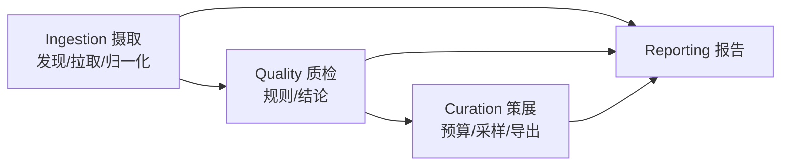

# 实施计划：多来源机器人示教数据的统一入库与质检

对应题目：[docs/assessment_for_ai.md](docs/assessment_for_ai.md)。本文件是动手前的方案与排期，实现过程中若与实际情况冲突，以最终 `docs/design.md` 为准，并在本文件里记录变更原因。

---

## 0. 目标与验收对齐

评审方会做两件事，所有设计都必须先满足它们：

1. 跑一轮 → 在**质检阶段** kill 进程 → 重启，必须从断点继续，不从头再来。
2. 再跑一轮，必须识别"无新增数据"，不重复入库。

由此倒推两条硬约束：

- **状态机必须持久化到进程外**（SQLite），且每个 episode 的阶段推进是**单独事务提交**的，而不是整轮跑完再写库。
- **所有写操作幂等**：以 `(source_id, episode_uid, content_hash)` 为幂等键，重复处理只更新不重复插入。

其余按题目给出的优先级排功：统一表示 > 质检针对性 > 增量/断点 > 采样判断 > 工程质量。AI 使用是平行维度，全程留痕（见第 9 节）。

---

## 1. 数据源选型

要求：≥3 个来源、≥2 种存储格式、含一个非标准/非单臂来源。计划选 4 个（第 4 个是"优雅降级"的证据，量很小）：

| #   | 来源                                                                                                            | 格式                                               | 本体                | action 维度/语义                                                                                      | 帧率                                           | 相机 | 真机/仿真 |
| --- | --------------------------------------------------------------------------------------------------------------- | -------------------------------------------------- | ------------------- | ----------------------------------------------------------------------------------------------------- | ---------------------------------------------- | ---- | --------- |
| A   | `lerobot/pusht`                                                                                                 | Parquet + MP4                                      | 2D 推块（非机械臂） | 2 维，末端 xy 位置目标                                                                                | 10 Hz                                          | 1    | 仿真      |
| B   | `lerobot/aloha_sim_insertion_human`                                                                             | Parquet + MP4                                      | ALOHA 双臂          | 14 维，双臂关节位置 + 夹爪                                                                            | 50 Hz                                          | 1~4  | 仿真      |
| C   | OXE 小切片（`jxu124/OpenX-Embodiment` 中体量小的 sub-dataset，首选 `berkeley_autolab_ur5`，备选 `bridge` 切片） | RLDS/TFDS（episode→steps 嵌套）                    | UR5 单臂            | 7 维物理（末端 delta 位姿 + 夹爪）+ 3 维 `terminate_episode` 控制标志                                 | 5~10 Hz（无时间戳）                            | 2~3  | 真机      |
| D   | **EPIC-KITCHENS-100（官方发布，分层取用）**                                                                     | CSV/pickle 标注 + JSON 相机位姿 + IMU + 长视频 MP4 | 人手 / 头戴相机     | **符号级**：(verb, noun) + 时间区间，episode 级标签，无逐帧连续 action；state 有 IMU(6) + 相机位姿(7) | 事件 ~0.1~1 Hz；IMU ~200 Hz；视频 50/59.94 fps | 1    | 真人      |

选型理由（要写进文档）：

- A 的 action 是**任务空间绝对位置（像素单位）**、B 是**关节空间绝对位置（弧度）**、C 是**末端相对增量（米/弧度）**——三种物理含义、三种单位、三种坐标系，正是"统一表示"最难的地方，比选三个都是 7-DoF 单臂更有说服力。
- A/B 同为 LeRobot 格式但本体/维度/帧率差异大，可以验证"同格式不同本体"的适配器复用。
- **D 是唯一一个「action 存在但表示层级不同」的来源**：它的动作是符号标签（(verb, noun) + 时间区间），不是逐帧向量。A/B/C 三个源的 action 都是「逐帧定宽数值向量」，schema 里这个隐含假设永远不会被检验；D 逼出 `SignalSpec.level` 这个正交维度（见 2.2a）。
- **D 还是唯一一个「信号来源混杂」且「源内 capability 不齐」的来源**：IMU 是实测、相机位姿是 SfM 估计、动作标签是人工标注，三种可信度在同一条 episode 里；且 IMU 只覆盖部分视频、位姿只覆盖 671/700 视频。这两件事分别逼出 `Provenance.signal_origin`（2.2f）与「capability 必须逐 episode 而非逐 source」的验收断言（1.1 第 5 点）。

规模控制：每个来源限制 30~80 个 episode，总量目标 8~12 万帧，`config/sources.yaml` 里用 `max_episodes` 收口。

**取舍（需在文档明确写出）**：默认 `--no-video`，A/B 只拉低维信号与视频**元信息**（HTTP Range 读 mp4 头 / `ffprobe` 拿帧数与分辨率，不下载完整视频）。代价是：涉及画面内容的质检（黑帧、曝光异常、相机错位）降级为"仅结构性检查"（帧数一致性、路数缺失、分辨率一致性）。提供 `--with-video` 开关，对小样本（如每源 5 个 episode）下全量视频，跑完整的画面级质检，证明能力存在。D 的官方视频体量在百 GB 量级，默认同样不取；`--with-video` 时优先走本地镜像（见 1.1 第 6 点），但必须按镜像的 fps 重算帧号。

**但 C 是例外，这个取舍对它不成立**：RLDS 把图像以数组形式**内嵌在与 action 同一批记录里**，没有独立 mp4 可以跳过。`--no-video` 对 C 是空操作：省不下带宽，只能省解码与落盘。因此 C 的记录为 `CameraSpec.encoding="inline_frames"`，`has_rgb=True` 但 `has_video=False`（见 2.2e），依赖 `has_video` 的规则在 C 上 `SKIPPED`。不写清楚的话，上面那段取舍描述对四分之一的来源是错的。

### 1.1 来源 D 的落地细节（EPIC-KITCHENS-100，官方发布 + 分层取用）

**先纠正上一版的两个错误结论**，它们都会让整个 D 的设计走偏（这两条也应写进 `docs/ai/rejected.md`，见第 9 节）：

1. ~~"本地已有副本 = 数据来源"~~。本地那份 512×288 / 30fps 是**为另一个项目重编码的衍生品**。把它当权威来源，等于让全库的帧号绑死在一个非官方的 fps 上。**权威来源是官方发布**；本地副本降级为**可选镜像**，而且它的新角色更有价值：验证"同一 episode 在两个副本里 fps 不同"时 `provenance` 能不能表达出来并让帧号重算（见第 6 点）。
2. ~~"D 无 action、无 state"~~。**这是错的。** D 的 action 存在，只是**表示层级不同**：它是"(动词, 名词) + 时间区间"的符号标签，不是逐帧连续向量。而且 EPIC-KITCHENS 生态里有**两路真正的逐帧物理信号**（IMU 与相机位姿）。写 `ActionSpec.space="none"` 不是优雅降级，是把有信息说成没信息——比补零更隐蔽的一种信息破坏。

#### 官方可取的数据层（已核实）

| 层                                        | 内容                                                                            | 体量            | 本轮                                 |
| ----------------------------------------- | ------------------------------------------------------------------------------- | --------------- | ------------------------------------ |
| `epic-kitchens-100-annotations`（GitHub） | 89.9K action segments、97 动词 / 300 名词、20.5K 条自然语言 narration、官方切分 | ~50 MB，可进 CI | **必取**                             |
| **EPIC-Fields**（NeurIPS'23）             | 671 视频 / 18.7M 帧的 **6-DoF 相机外参 + 内参**（COLMAP 重建）                  | 每视频一个 JSON | **必取**                             |
| **IMU**（Extended Sequences 附带）        | 陀螺仪 + 加速度计（头戴相机自带）                                               | 中等，按视频取  | **取（限几个视频）**                 |
| VISOR（NeurIPS'22）                       | 271K 人工掩膜 + 9.9M 稠密插值掩膜 + 67K 手-物接触关系                           | 大              | 本轮不取，登记为已知局限（第 11 节） |
| EPIC-SOUNDS                               | 117.5K 音频事件 / 44 类                                                         | —               | 不取                                 |
| 视频本体                                  | 700 长视频，原始 1080p @ 50/59.94 fps                                           | 数百 GB         | 默认不取；`--with-video` 走本地镜像  |

单条标注（官方 CSV 的等价视图）：

```json
{
  "narration_id": "P01_01_16",
  "participant_id": "P01",
  "video_id": "P01_01",
  "start_timestamp": "00:00:00.14",
  "stop_timestamp": "00:00:03.37",
  "narration": "open the door",
  "verb": "open",
  "verb_class": 3,
  "noun": "door",
  "noun_class": 3
}
```

#### 关键决策

**1. episode 的粒度 = 一个 action segment，不是一整条视频。** `P01_01` 长 1652 秒（≈8 万帧 @50fps），语义上等价于"一整个采集 session"；`segment`（几秒）才对应机器人数据里的一条示教轨迹。`episode_uid = "epic100:P01_01_16"`——直接用官方 `narration_id`，它是**稳定的上游 ID**，因此 D 不像 C 那样需要自造 `upstream_id`（见第 5 节）。

**2. D 的 action 是 `level="episode_label"`，不是 `space="none"`。** 依赖 2.2a 新增的 `SignalSpec.level` 维度：

- `task = "open door"`（verb + noun 拼接），与 C 的 `language_instruction` 同一个槽位；narration 原文与 `verb_class` / `noun_class` 另存进 `raw_extra`。
- `has_action = True`、`ActionSpec.level = "episode_label"`、`physical_dim = 0`，`frames.parquet` 里**没有** action 列（不是全 NULL 的列，是根本没有这一列）。
- 依赖逐帧数值的规则（`ACTION_RANGE` / `ACTION_JERK` / `GRIPPER_STUCK`）在 D 上 `SKIPPED(reason=action_level_is_episode_label)`——理由是具体的，而不是笼统的"没有 action"。

**3. D 的 state 是真实存在的逐帧信号，而且是四源里唯一"来源混杂"的一个。** 两组通道：

| 通道组     | 来源        | `role` | `space`                   | `unit`  | `metric_convertible`      | `origin`    |
| ---------- | ----------- | ------ | ------------------------- | ------- | ------------------------- | ----------- |
| `gyro[3]`  | IMU 实测    | `head` | `imu_angular_velocity`    | `rad/s` | **True**                  | `measured`  |
| `accel[3]` | IMU 实测    | `head` | `imu_linear_acceleration` | `m/s^2` | **True**                  | `measured`  |
| `cam_t[3]` | EPIC-Fields | `head` | `camera_translation_abs`  | `None`  | **False**（SfM 尺度任意） | `estimated` |
| `cam_q[4]` | EPIC-Fields | `head` | `camera_rotation_abs`     | `None`  | False                     | `estimated` |

`cam_q` 的 `rotation = {"repr": "quat_wxyz", "compose": None}`（绝对旋转不存在复合顺序问题），`frame = "world"`。IMU 的单位约定（rad/s vs deg/s）**M0 必须实测确认，不得照抄文档**。还要注意 IMU（~200 Hz）与视频帧（50/59.94 fps）**不同时钟**，不得重采样进帧表——IMU 作为独立信号流落 `streams/imu.parquet`，规则见 2.2h。

这一组把此前各源分别暴露的洞**第一次叠进同一条 episode 里**：C 只逼出了 `Channel.rotation`，A 只逼出了 `metric_convertible=False`（而且只是 2D 像素）。D 是**一个完整 6-DoF 位姿同时不可换算**——SfM 重建没有绝对尺度，这不是"我们没查到单位"，是数学上就不存在尺度。硬填 `unit="m"` 会让下游把重建坐标当米用。

**4. 新增 `Provenance.signal_origin`（见 2.2f）：`measured` / `estimated` / `interpolated` / `annotated` / `synthesized`。** 这不是学究气，它直接改变质检语义：

- COLMAP 位姿里的一个跳变**大概率是重建失败，不是数据损坏**。EPIC-Fields 只注册了 18.7M / 20M 帧，**未注册帧的位姿是 NULL**（不是 0，也不是插值）。
- 因此规定：`origin != "measured"` 的通道，数值类规则的 severity **自动降一级**（FAIL → REVIEW），并在 `reason` 里写明降级依据。
- A/B/C 的 state 全是 `measured`，这条规则在它们身上是恒等变换——**只有 D 能验证它真的生效**。

**5. 源内 capability 不齐，这是 D 最独特、也最难被别的源替代的一点。** IMU 只覆盖 EK-100 扩展部分（EK-55 那批老视频没有）；EPIC-Fields 覆盖 671/700 视频，且**逐帧**仍可能缺失。于是同一个 `source_id` 下，不同 episode 的 `Capabilities` **不相同**。

A/B/C 三个源内部完全齐整，永远测不出这一点。而第 4 节的 schema 早就把 `capabilities_json` 放在 `episodes` 表上（逐 episode）——**D 是唯一能证明这个设计不是摆设的来源**。为此增加一条验收断言：同一 `source_id` 下存在 `capabilities_json` 不同的两条 episode，且质检结论相应不同（一条 `PASS`、一条对应规则 `SKIPPED`）。

**6. 本地镜像的新角色：一致性检验对象，而不是数据来源。**

```json
"provenance": {
  "is_original": true,
  "upstream_revision": "epic-kitchens-100-annotations@<sha>",
  "timestamp_source": "annotation_seconds",
  "frame_index_source": "derived_from_seconds@<official_fps>",
  "signal_origin": {"gyro": "measured", "accel": "measured",
                    "cam_t": "estimated", "cam_q": "estimated",
                    "task": "annotated"},
  "mirrors": [{"kind": "local_transcode", "fps": 30, "resolution": [512, 288],
               "note": "re-encoded for a prior project; frame indices differ from official"}]
}
```

铁律：**秒是权威，帧号是派生**。官方原视频部分 50 fps、部分 59.94 fps，本地镜像是 30 fps——同一个 segment 在两边的帧号不同。只存帧号的话，换副本时全库静默失效。所以派生量必须**随身携带它所依赖的参数**（`derived_from_seconds@<fps>`），否则无从判断是否过期。代价：(a) 启用 `--with-video` + 本地镜像时，画面级结论只对该镜像成立，不可外推到官方视频；(b) 288p 不足以做精细手部/接触判断，本轮不做视觉标签。

**7. 边界与目标：有指令，无评判。** `EpisodeBoundary.termination_source = "annotator"`、`end_reason = "annotation_bound"`、`success = None`。但要注意 **D 的 `None` 与 C 的 `None` 语义不同**：C 是"评判机制存在，但该条未知"，D 是"体系里根本没有评判者"。因此 `EpisodeBoundary` 增加 `success_adjudicator: "simulator" | "policy" | "operator" | "none"`（见 2.2g）——否则下游无法区分"缺标签、可以补标"与"不可能有标签"。

**8. 选样与规模。** 按 participant 分散挑 5~8 个视频，其中**至少 1 个有 IMU、1 个无 IMU**（刻意制造 capability 不齐），每个视频取前 N 个 segment，由 `config/sources.yaml` 的 `max_episodes` 收口。总量几千到一万帧级别——D 的价值是**证明表示层级降级与来源混杂**，不是堆量。

**9. 可用性、许可与隐私。** 官方 annotations 与 EPIC-Fields 可公开下载，许可为 **CC BY-NC 4.0（非商业）**，必须写进 README 与 `sources` 表的 `license` 字段。取用层由 `config/sources.yaml` 的 `layers: [annotations, camera_pose, imu]` 声明；本地镜像的绝对路径只出现在 `config/sources.local.yaml`（gitignore），仓库里是 `${EPIC_KITCHENS_MIRROR}` 占位。**任一层不可用时只降级该层，不让整个 source 失败**——层级可用性走的就是 capability 声明，与 episode 级 capability 是同一套机制，这也是"降级 ≠ 报错"在数据源层面的体现。

---

## 2. 统一 schema 设计（核心，先想清楚再动手）

### 2.1 三层结构

```
Source（数据集级）→ Episode（轨迹级）→ Frame（帧级）
```

- **Source**：source_id、上游 URI、格式类型、下载快照版本（HF revision / commit sha）。
- **Episode**：本体信息、能力声明、时间信息、质检结论、指向帧数据文件的指针。
- **Frame**：逐帧低维信号，落 Parquet（不进 SQLite，SQLite 只存目录与统计）。

### 2.2 关键设计决策

**a. 动作空间：不强行统一到一个向量，而是"分组保留 + 结构化打标签"。**

理由：把 2 维 xy、14 维关节角、7 维 delta 位姿硬压进同一个空间只能靠补零和瞎缩放，是不可逆的信息破坏，且下游训练无法还原语义。改为：

```python
SignalSpec = {                         # action 与 state 共用同一个值对象，见下方「b'」
  "is_command": bool,                  # True=下发的目标值(action)；False=实测回读(state)
  "level": "per_frame_continuous"      # A/B/C：逐帧定宽数值向量
         | "per_frame_discrete"        # 逐帧离散（如接触状态）
         | "episode_label"             # D：整段一个 (verb, noun) 符号标签
         | "absent",                   # 真的没有
  "space": "joint_position" | "ee_pose_abs" | "ee_pose_delta" | "cartesian_2d"
           | "camera_pose_abs" | "imu"
           | "mixed" | "none" | "unknown",
                                       # **派生汇总**：物理通道的 space 不唯一时为 mixed；
                                       # unknown：上游语义不明（C 的 state[15]），禁止猜
  "dim": int,                          # 存储的总列宽；level 非 per_frame_* 时恒为 0
  "physical_dim": int,                 # 其中物理通道数（统计/阈值只用这些）
  "channels": [ Channel, ... ],
  "is_delta": bool,                    # **派生汇总**：any(c.is_delta for c in 物理通道)
  "clock": "frame" | "own_timeline",   # 见 2.2h：own_timeline 的信号不进 frames.parquet
}

Channel = {
  "name": "left.gripper",
  "group": str | None,                 # 逻辑向量组（"cam_q" / "ee_delta"…）：跨通道不变量
                                       # （四元数单位模、xyz 同坐标系）的落点；独立标量为 None
  "role": "joint" | "end_effector" | "gripper" | "base" | "head"
          | "control_flag" | "unknown",
  "space": "joint_position" | "ee_translation_abs" | "ee_translation_delta"
           | "ee_rotation_abs" | "ee_rotation_delta" | "cartesian_2d"
           | "camera_translation_abs" | "camera_rotation_abs"
           | "imu_angular_velocity" | "imu_linear_acceleration"
           | "gripper" | "flag" | "unknown",  # 语义的唯一真相层（见下方 C 的修正）
  "origin": "measured" | "estimated" | "interpolated"
            | "annotated" | "synthesized",  # 这个数是量出来的、算出来的、还是人写的
  "is_delta": bool,                    # 通道级：C 的位姿是增量、夹爪命令是绝对值
  "frame": "base" | "tool" | "world" | "camera" | "sensor" | None,  # 仅位姿/惯导类通道非空
  "unit": "rad" | "m" | "px" | "rad/s" | "m/s^2" | "normalized" | None,
  "metric_convertible": bool,          # 能否换算到 SI；pusht 的 px、夹爪归一化开度、
                                       # SfM 重建的相机位移（尺度任意）均为 False
  "arm_id": "left" | "right" | None,
  "is_physical": bool,
  "min": float | None, "max": float | None,
  "rotation": {                        # 仅 space 以 ee_rotation / camera_rotation 开头时非空
      "repr": "axis_angle" | "rotvec" | "euler_xyz" | "euler_zyx"
              | "quat_wxyz" | "unknown",
      "compose": "pre" | "post" | "unknown" | None,  # 增量旋转的复合顺序：ΔR·R 还是 R·ΔR；
                                                    # 绝对旋转（D 的 cam_q）为 None
  } | None,
  "gripper": {                         # 仅 role == "gripper" 时非空
      "convention": "0=closed,1=open",
      "original_convention": "continuous_width" | "-1=close,+1=open" | ...,
      "inverse": {"scale": float, "offset": float},   # 归一化的反变换参数
  } | None,
}

ActionSpec = SignalSpec(is_command=True)
StateSpec  = SignalSpec(is_command=False)
```

统一的部分只有**通道级元信息**：每个通道都必须有 `role`、`space`、`is_delta`、`unit`、`metric_convertible`、`arm_id`、`is_physical`、取值范围。下游可以按 role 做跨本体的通用处理，也可以按 space 分桶训练。

**三处相对初稿的修正，全部由来源 B 逼出来**：

- **`gripper` 从 spec 级下沉到通道级。** 初稿的 `{"indices": [6], "convention": ...}` 假设一条 episode 只有一个夹爪；ALOHA 有**两个**，且分属不同 `arm_id`，约定与反变换参数也可能不同。同时 2.2b 要求“保留反变换参数”，初稿里这些参数根本无处安放。
- **新增 `metric_convertible`（通道级）。** 2.2b 与附录 A.A.2 都已断言它必须是通道级属性，但初稿的 schema 块里没有这个字段。B 的 14 维正是最强的证据：12 个 `rad` 通道可换算，2 个夹爪归一化开度不可换算，**同一向量内两种取值**。
- **`role` 枚举修正为 `joint / end_effector / gripper / base / head / control_flag / unknown`。** 初稿写的是 `arm`，但附录 A.A.3 给 pusht 指定的是 `role="end_effector"` ——两处对不上。B 的 12 个关节是 `joint`（可插值），A 的 xy 是 `end_effector`，语义不同，2.2c 的“按 role 决定插值方式”依赖这个区分。

**四处相对上一版的修正，由来源 C 逼出来**（B 把 `unit` / `gripper` 压到了通道级，C 说明这一步压得还不够深）：

- **`space` / `is_delta` / `frame` 继续从 spec 级下沉到通道级。** C 的 action 一个向量里躺着三种东西：`world_vector` / `rotation_delta` 是增量位姿（base 系，m / rad）、`gripper_closedness_action` 是**绝对**开合命令（不是增量、无坐标系）、`terminate_episode` 是标志位。spec 级写 `is_delta=True` 就是直接对夹爪通道说谎，而 2.2a 自己要求“跨源统计先按 `is_delta` 分桶”——这个谎会传导进每一个统计量与每一条阈值。B 其实早有同病（`space="joint_position"` 对它的 2 个夹爪通道为假），只是没落在承重位置上。spec 级字段保留为**派生汇总**（供 `STATE_ACTION_ECHO` 的门控做一次廉价比较），通道级才是真相。
- **新增 `Channel.rotation`（旋转表示与复合顺序）。** `rotation_delta[3]` 配上 `unit="rad"` 仍然不足以确定语义：三个数可以是轴角、旋转向量、欧拉 XYZ、欧拉 ZYX——不知道是哪一种就无法积分、无法比较、无法换算，数据等于不可读。A 没有旋转、B 的弧度是关节角（不需要约定），**只有 C 会暴露这个洞**。按本节“拿不准就不猜”的原则，`repr="unknown"` 是合法取值，但字段必须存在，不能缺席。
- **`raw_extra` 必须按粒度拆分**（episode 级 vs frame 级，见 2.2d 末尾）——C 未建模的上游字段几乎全是逐 step 的。
- **`Capabilities.has_video` 必须拆成 `has_rgb` / `has_video`，并补上缺失的 `CameraSpec`**（见 2.2e）——C 的画面内嵌在记录里、且带一路腕部相机。

**两处相对上一版的修正，由来源 D 逼出来**（A/B/C 把语义压到了通道级，D 说明还有两个**正交维度**没被建模）：

- **新增 `SignalSpec.level`（表示层级），这是 schema 里最隐蔽的一个隐含假设。** A/B/C 的 action 全都是"逐帧、定宽、数值向量"，所以此前整个 `SignalSpec` 是围着这个形状长出来的，而这个假设从未被写下来、也从未被检验。D 的 action 是 `(verb, noun) + [t_start, t_end]` 的符号标签——**它不是"没有 action"，是 action 活在另一个层级上**。上一版写 `ActionSpec.space="none"` 把"有信息"记成了"无信息"，比补零更隐蔽，因为补零至少还能从数值分布上看出异常，而 `space="none"` 是一句看起来合理的谎。加了 `level` 之后，`has_action=True` 与 `physical_dim=0` 可以同时成立，质检规则的门控从 `required_capabilities` 扩展为 `required_capabilities + required_level`，`SKIPPED` 的理由也从"没有 action"变成"action 是 episode 级标签"。
- **新增 `Channel.origin`（信号是量出来的、算出来的、还是人写的）。** A/B/C 的每一个 state 通道都是 `measured`，所以"可信度"这个维度整个不存在。D 的一条 episode 里同时躺着三种来源：IMU 是传感器实测、相机位姿是 COLMAP **估计**（96% 帧注册成功，其余为 NULL）、动作标签是人工**标注**。这直接改变质检语义——SfM 位姿里的一个跳变大概率是重建失败而非数据损坏，按 `measured` 的标准判 FAIL 就是误伤（见第 3 节的 severity 降级规则）。`origin` 放在通道级而不是 episode 级，理由与 `unit` / `gripper` 下沉时完全相同：**同一个向量里就混着两种**。

**b'. `state` 也必须有 spec，不能只有 `action` 有。**

这是初稿最大的结构性缺口，B 让它无法回避：B 的 `observation.state` 与 `action` 是**同一空间、同维、同通道语义**的一对（目标值 vs 实测值），而 C 的 `observation.state[15]` 语义在 dataset card 里都语焉不详。没有 `StateSpec` 会直接导致三件事做不了：

1. `STATE_ACTION_ECHO` 的前置条件“同空间同维”**在数据里无法表达**，规则只能靠列宽相等这种脆弱的猜测来启用；
2. 附录 A.C.7 的“拿不准语义就 `state=NULL`”没有落点——现在写成 `StateSpec.space="unknown"` + 通道 `role="unknown"`，是一个**可被查询、可被规则跳过**的显式声明，而不是沉默的缺失；
3. 8.4 的不变量 3（禁止 0 填充）只覆盖了 action，state 侧没有对称约束。

复用同一个值对象而不是新写一个类，是因为两者的字段需求完全相同，唯一差别就是 `is_command`——这个字段本身也是附录 A.B.3 要求过、但初稿 schema 漏掉的。

**`control_flag` 这个 role 是必需的，不是凑数**：来源 C 的 action 向量里混着 `terminate_episode`（一个 one-hot 控制标志，由策略输出「我做完了」），它和 `world_vector`(m) 躺在同一个向量里，但既没有单位、也没有物理限位、变化模式也完全不同（末帧 0→1 的阶跃）。把它按物理通道处理会让 `ACTION_RANGE` 的限位无意义、让 `ACTION_JERK` 在**每一条 C 的 episode 上都误报**。因此：所有跨通道统计（mean/std/行程/jerk/限位）一律只对 `is_physical == True` 的通道计算，`dim` 与 `physical_dim` 必须分开存。

**b. 数值归一化：默认只做"单位与约定归一"，不做 min-max 缩放。**

- 单位统一：角度一律 rad、长度一律 m、时间一律秒（float64，episode 内从 0 起）。**单位写在通道上而不是 episode 上**：ALOHA 的 14 维里 12 个关节是 rad、2 个夹爪是归一化开度，同一向量内就混单位。无法转换的保留原单位并标 `metric_convertible=false`（pusht 的 action 是**像素**，没有场景尺度就不可能换成米，硬换就是造假）。
- 约定统一：夹爪一律归到 `0=closed, 1=open`（记录原始约定并保留反变换参数；OXE 常见 `-1=close/+1=open`，ALOHA 是连续开度）。
- 统计量（per-channel mean/std/min/max/p1/p99）**只计算并存进 metadata**，不改写原始数值。理由：归一化参数属于训练侧超参，入库阶段就把数据缩放掉会让后续换策略必须重跑全库。

**c. 帧率：不重采样，原样保留 + 显式记录。**

保留 `fps_nominal`（上游声明）、`fps_effective`（由时间戳中位间隔实测）。提供**导出期**可选的重采样（最近邻 / 线性，按通道 role 决定插值方式：关节角可插值、夹爪二值不插值），而不是入库期。理由：入库是唯一真相层，任何有损变换都推迟到导出层，保证可回溯。

**d. 无损 / 有损边界（文档要逐项列表）**

| 必须无损                                                               | 可有损                             | 可丢弃                                              |
| ---------------------------------------------------------------------- | ---------------------------------- | --------------------------------------------------- |
| action / state 原始数值（单位换算是可逆的，记录换算因子）              | 视频（转码、抽帧、只存元信息）     | 上游内部调试字段（如 `frame_index` 冗余列）         |
| 时间戳、episode 边界、帧序                                             | 图像分辨率                         | 上游的行内 padding / 空 step                        |
| 任务语言指令原文                                                       | —                                  | 与轨迹无关的 license/readme 文本（存 URI 引用即可） |
| **逐帧 reward + `terminated`/`truncated` 区分**（见下方修正说明）      | 深度图（本轮不处理，只记录存在性） | `discount`、`done` 的冗余镜像列                     |
| 本体/相机拓扑元信息、`terminate_episode` 等控制标志通道                | —                                  | —                                                   |
| **标注区间的秒值**（D 的权威时间）、`Channel.origin` / `signal_origin` | 帧号（可由秒 + fps 重算）          | —                                                   |

**关于 reward 的修正（原计划把它划进「可有损」，是错的）**：pusht 的 `next.reward` 是 T 块与目标区域的**多边形重叠率**，而该数据集里根本没有存 T 块位姿（`observation.state` 只有推杆 xy），因此这个数值**丢了就永远算不回来**。行为克隆确实用不到它，但离线 RL（IQL / CQL / Decision Transformer）以它为核心监督信号——入库层无权替下游做这个决定。代价上也不成立：一帧一个 float，全源加起来不过几百 KB。同理，`terminate_episode` 这类控制标志通道若要裁掉，必须写进 `provenance.transforms`（`{"op": "drop_channels", ...}`），不能默默消失。

无法归入统一字段的上游字段一律保留，但**必须按粒度分开存放**：episode 级的进 `raw_extra`（JSON）；frame 级的以 `raw.` 前缀作为**额外列留在 `frames.parquet` 里**，列名清单写进 `episode.json` 的 `raw_frame_columns`。这条是被来源 C 逼出来的：C 未建模的上游字段几乎全是逐 step 的（`discount`、`is_first/is_last/is_terminal`、`language_instruction`、`language_embedding`），把逐帧数据塞进一个 episode 级 JSON blob 既不可查也不可用——“不理解的信息也不丢”会恰好在最需要它的那个来源上失去落地机制。

**e. 缺模态的优雅降级：capability 声明。**

```python
Capabilities = {                        # **逐 episode，不是逐 source**（见下方 D 的说明）
  "has_action": bool, "has_state": bool, "has_gripper": bool,
  "has_rgb": bool,                      # 存在任何 RGB 画面（含 C 的内嵌帧）
  "has_video": bool,                    # 存在**可解码的独立视频文件**（质检规则依赖的是这个）
  "has_language": bool, "has_reward": bool, "has_depth": bool,
  "has_imu": bool,                      # D 的部分 episode 有、部分没有
  "has_camera_pose": bool,              # D：EPIC-Fields 重建成功的 episode 才有
  "has_termination_signal": bool,       # 数据里是否存在显式的「结束了」信号
  "is_real_robot": bool, "is_teleop": bool,
}

CameraSpec = {                          # episodes.camera_json 的值对象（此前只有列、没有定义）
  "name": "image" | "hand_image" | "top" | ...,
  "mount": "static" | "wrist" | "head" | "unknown",
  "resolution": [h, w], "channels": int,
  "encoding": "mp4_sidecar" | "inline_frames" | "absent",
  "is_present": bool,
}
```

- 来源 D 是 `has_action=True`（但 `ActionSpec.level="episode_label"`，`physical_dim=0`，`frames.parquet` 里**没有** action 列）、`has_language=True`（verb+noun 就是指令）、`has_rgb/has_video` 取决于是否启用 `--with-video`、`has_imu` 与 `has_camera_pose` **逐 episode 不同**。上一版写的 `has_action=False` + `ActionSpec.space="none"` 是错的，理由见 2.2a 的「由来源 D 逼出来的修正」。
- **`Capabilities` 必须逐 episode 存，这一条只有 D 能证伪。** A/B/C 三个源内部完全齐整，把 capability 挂在 source 上也能跑通，缺陷永远不暴露；D 的 IMU 只覆盖部分视频、EPIC-Fields 只覆盖 671/700 视频，同一个 `source_id` 下必然出现 `capabilities_json` 不同的两条 episode。第 4 节的 schema 本来就把它放在 `episodes` 表上——D 让这个设计从「看起来对」变成「被验证过」。为此增加验收断言：存在同源、不同 capability、且质检结论相应不同（一条 `PASS`、一条对应规则 `SKIPPED`）的两条 episode。
- **`has_rgb` / `has_video` 必须拆开，`CameraSpec` 必须带 `mount` 与 `encoding`——两条都由来源 C 逼出来**：
  - C 的画面是**内嵌在 TFRecord 记录里的数组**，不是独立 mp4。统一写 `has_video=True` 会让 `VIDEO_FRAME_MISMATCH`（比对 mp4 帧数与 parquet 行数）在一个根本没有 mp4 的来源上启用；拆开后它在 C 上干净地 `SKIPPED`。
  - C 的 `hand_image` 是**腕部相机，跟着夹爪一起动**；A/B 的相机是固定的。“画面剧烈变化”在腕部相机上是正常、在固定相机上是异常，质检不知道 `mount` 就只能二选一地误判；下游训练同样把它当一等区分。
- **质检规则声明自己依赖哪些 capability**，不满足时结论是 `SKIPPED`（并记录原因），而不是 `FAIL`——这是"降级"与"报错"的分界线，也是评审最容易看出功力的点。

**f. provenance：区分"上游事实"与"我算出来的"。**

三个来源都有"看似是数据、其实是推断"的字段，不标清楚会直接导致质检假阳性：

```python
Provenance = {
  "is_original": bool,                 # 数据是否未经中间处理
  "timestamp_source": "real" | "synthesized@<hz>" | "annotation_seconds",
  "frame_index_source": "upstream" | "derived_from_seconds@<fps>",
  "signal_origin": {channel_name: "measured" | "estimated" | "interpolated"
                                  | "annotated" | "synthesized"},
  "transforms": [ ... ],               # 转码/降采样等有损变换的记录
  "mirrors": [ ... ],                  # 同一数据的其他副本及其差异（D 的本地重编码版）
  "upstream_revision": str,
  "adapter_version": str,              # 产出本条的 adapter 代码版本；与 episode.json 顶层的
                                       # schema_version 一起构成过期谓词（见第 5 节、8.7）
}
```

典型值：A/B = `real` 时间戳；C = `synthesized@5Hz`（RLDS step 里本来就没时间戳）；D = `annotation_seconds` + `derived_from_seconds@<official_fps>`。

**`signal_origin` 是相对上一版新增的，由 D 逼出来（与 `Channel.origin` 同源，此处是 episode 级的汇总视图）**：A/B/C 的所有 state 通道都是 `measured`，这个维度整个不存在；D 的一条 episode 里 IMU 是实测、相机位姿是 SfM 估计、动作标签是人工标注。**它必须影响质检的 severity**（见第 3 节）：对 `estimated` 通道按 `measured` 的标准判 FAIL 是系统性误伤，因为 COLMAP 的跳变来自重建失败，不来自数据损坏。

**g. episode 边界：不只记录「在哪结束」，还要记录「谁判定的结束」。**

「这条轨迹为什么在这里结束」在四个来源里是四个完全不同的机制，而同一个概念在 schema 里的**结构位置也不同**：A/B 的结束信号是**环境产出的标签**（`next.done`），C 的结束信号是**策略输出的动作通道**（`action.terminate_episode`），D 的边界是**标注员事后画的区间**。不显式建模就会出两类错：跨源统计把控制标志当物理量、离线 RL 的 bootstrap 算错。（初稿还有第三类——导出截断制造上游不存在的假边界——已随「导出禁止截断」的决策整类消除，见第 6 节。）

```python
EpisodeBoundary = {
  "termination_source": "env_rule" | "policy_flag" | "operator" | "annotator",
                             # 初稿还有 "exporter"，随禁止导出截断移除（第 6 节）：
                             # enum 里不留没有生产者的值
  "end_reason": "success" | "truncated" | "operator_stop" | "annotation_bound" | "unknown",
  "is_truncated": bool,      # 被步数上限截断：末状态并非终止态
  "success": bool | None,    # None 表示「不知道」，不是 False
  "success_adjudicator": "simulator" | "policy" | "operator" | "none",
                             # 谁有资格判定成败；"none" = 体系里根本没有评判者
}
```

典型值：A = `env_rule / success`（覆盖率 > 0.95 由仿真器判定）或 `truncated`；B = `operator / operator_stop`（遥操作者停止录制）；C = `policy_flag`，`is_truncated` 由 `is_last & ~is_terminal` 推出；D = `annotator / annotation_bound`，`success=None`。

**`success_adjudicator` 是相对上一版新增的，由 D 逼出来**：C 的 `success=None` 与 D 的 `success=None` 在 schema 里长得一样，语义却相反——C 是「评判机制存在，但这一条未知」（可以补标），D 是「体系里根本没有评判者」（补不了）。缺了这个字段，下游会把 D 当成「标注不全的数据集」而去尝试补标，或者在统计「成功率」时把 D 的分母算进去。

**`terminated` 与 `truncated` 必须分开存，这是最容易被静默写错的一处**：`is_terminal=True` 表示轨迹真正终止，价值自举必须截断（$V(s_T)=0$）；`is_last=True, is_terminal=False` 表示只是被步数上限切断，末状态仍是普通状态，自举必须继续（$V(s_T) \neq 0$）。压成一个 `done` 布尔会让所有基于该导出的离线 RL 训练**无声地错**。pusht 在 gym 层同样区分 `terminated` / `truncated`，但 LeRobot 的导出可能只保留了 `next.done`——M0 spike 要确认，若确已丢失则登记进已知局限（第 11 节）。

**h. 多时钟信号：`frames.parquet` 只承载帧时钟，其余信号流各带自己的时间轴。**

此前整个 schema 有一条从未写下的隐含假设：**一行 = 一帧，所有信号共享同一个时钟**。A/B/C 恰好都是单时钟来源，所以它和 `level` 一样从未被检验；D 直接击穿它——IMU ~200 Hz、相机位姿跟视频帧率（50/59.94 fps）、事件标注 ~0.3 Hz，三种时钟在同一条 episode 里。把 IMU 压进帧表只有两条路：重采样（违反 2.2c 的「入库不重采样」）或行数爆炸，两条都不可接受。因此：

- `frames.parquet` 只存与**帧时钟**对齐的信号（D 的相机位姿按官方 fps 派生帧号后天然对齐）；
- 非帧时钟信号落 `normalized/.../streams/<stream_id>.parquet`，自带 `t` 列（episode 内从 0 起的秒），每个 stream 一个独立的 `SignalSpec`（存 `episode.json` 的 `stream_specs`）；
- `SignalSpec` 增加 `clock: "frame" | "own_timeline"`，硬约束见 8.4 不变量 17；
- 需要帧对齐视图时在**导出期**做（最近邻 / 窗口聚合，按 role 决定插值方式），与 2.2c 同一原则：入库层保真，有损推迟到导出层并记录参数。

D 的 state 因此拆成两份：相机位姿（`clock="frame"`，7 维，进帧表）与 IMU（`clock="own_timeline"`，6 维，进 `streams/imu.parquet`）；`Capabilities.has_imu` 语义不变。附录 A.D 的示例已按此更新。

### 2.3 统一读取

每个来源实现一个 `SourceAdapter`，接口只有三个方法：

```python
class SourceAdapter(Protocol):
    def list_episodes(self) -> Iterator[EpisodeRef]: ...      # 只列，不下载
    def fetch(self, ref: EpisodeRef) -> RawEpisode: ...       # 拉到本地 staging
    def normalize(self, raw: RawEpisode) -> CanonicalEpisode: ...
```

- `LeRobotAdapter`（A/B 复用，靠 `meta/info.json` 驱动通道映射）
- `RLDSAdapter`（C，用 `tfds` 读；若 TF 依赖太重则退化为直接解析 tfrecord + dataset_info.json，作为备选方案先做技术验证）
- `EpicKitchensAdapter`（D，**多层源**：annotations CSV + EPIC-Fields 位姿 JSON + IMU，各层独立可用性→逐 episode 的 `Capabilities`；`--with-video` 时额外读本地镜像的 `ffprobe` 头）
- 预留 `HDF5Adapter`（robomimic/ALOHA），若 C 的 TFDS 环境搞不定则作为替补上位。

**风险前置**：TFDS/TensorFlow 在 macOS + Python 3.11+ 的安装是本项目最大不确定性，**第 1 天就做 spike 验证**，失败立刻切 HDF5（题目允许换同类型数据集）。

### 2.4 落盘布局

```
store/
  raw/<source_id>/<episode_uid>/…          # staging，可清理
  normalized/<source_id>/<episode_uid>/
      frames.parquet                        # 逐帧低维信号（帧时钟，见 2.2h）
      streams/<stream_id>.parquet           # 非帧时钟信号流（如 D 的 IMU），自带 t 列
      episode.json                          # 元信息 + specs + capabilities + schema_version
  catalog.sqlite                            # 目录 + 状态机 + 质检结果 + 运行报告
  exports/subset_<ts>.jsonl
```

原则：**大数据走文件系统，元数据与状态走 SQLite**。SQLite 只存指针和统计，保证库文件小、查询快、备份容易。

**列名契约**：附录 A.C.1 说「通道展开顺序是对外契约」，契约必须落到**列名**而不是列位置。`frames.parquet` 的列名固定为 `t`（秒，episode 内从 0 起）、`action.<channel.name>`、`state.<channel.name>`、`raw.<上游字段名>`；物理列序 = spec 里 `channels` 的声明序，但消费者一律按名取列，位置索引不属于契约。stream 文件同理（`t` + `<channel.name>`）。

### 2.5 为什么要落一层 `normalized/`，而不是"原样存源 + 读时用 adapter 转"

这是本设计里唯一一个"两条路都成立"的岔口，必须把取舍写清楚。注意问题本身要收窄：**adapter 两种方案里都存在**，真正的分歧只有一个——`normalize()` 的输出是**入库时算一次并落盘**，还是**每次读都重算**。这就是 ETL 与 virtual federation 的经典分野，判据是：**读放大倍数 × 单次解码成本 × 是否需要一个不可变产物来承载结论**。

选择落盘的理由：

1. **四个来源的读取成本极不对称。** RLDS/TFRecord 是嵌套的顺序流，"取第 47 条 episode 的第 100~160 帧"是 O(scan)，且要把 TensorFlow 拖进读取进程；Parquet 的 row group 让同一件事变成一次 seek。训练会把同一条 episode 读上百次，而归一化只跑一次——**为省磁盘而每个 epoch 付一次 RLDS 解码，是站错了边**。
2. **依赖的爆炸半径。** 2.3 节已把 TFDS on macOS/py3.11 标为最大风险。若归一化发生在读时，这个风险就永久成为**每一个下游消费者**的依赖；落盘则把它隔离在一次性批处理里，下游只需要 `pyarrow`。
3. **质检结论必须指向不会变的字节。** `episode_x: ACTION_JERK=REVIEW` 只有在它描述一份固定产物时才有意义。读时归一化的话，结论描述的是**某个函数的输出**：adapter 一升级、RLDS 的 action dict 展开顺序一改，所有已存结论静默失效且无从察觉。第 5 节的 `IngestionStage` 状态机同理——它需要一个稳定的对象身份才能推进。产物 + 校验和，才使结论可被证伪。
4. **"对外契约"需要一次物化才能成立。** 附录 A.C 说通道展开顺序一旦确定就是对外契约；懒计算的顺序不是契约，只是"当前 adapter 的当前行为"。写下来的 `episode.json` + `ActionSpec` 才是契约本身。
5. **跨源采样需要统一的物理布局，而不只是统一的逻辑视图。** 第 6 节按帧预算跨 A/B/C/D 选子集，需要统一随机访问与已知帧数；在四套互不兼容的 IO 模型上，这是一次分布式查询，在统一 Parquet 上只是一次索引查找。
6. **错误集中在归一化这一步。** 批处理让错误一次性暴露、落进 catalog、被修掉；懒计算让它在第 400 次训练的中途、以不可复现的方式出现。

**反方成立的情形要一并承认**：当语料极大而读取极少时（为用 1% 而归一化 100 TB 的 OXE），读时 adapter 才是对的。本设计已经对冲了这一点——`list_episodes()` 明确"只列，不下载"，**目录是懒的，只有被选中的切片才物化**。

接受的两项代价与缓解：

- **存储翻倍 + 副本相对上游漂移** → `provenance` 记录源 revision/commit 与 adapter 版本，使"过期"可被检测，重归一化可定向、幂等、可续跑。
- **早期 schema 改动昂贵**（每改一次 `ActionSpec` 就要重跑）→ `normalized/` 被定义为**派生的、可丢弃可重建的数据**，`raw/` 始终保留，重建永远可行。

**最后一层澄清（也是最容易被误读的一点）**：这里落盘的**不是"统一后的数据"**。第 2 节明确拒绝统一数值——不补零、不硬凑公共向量空间，数值留在原生单位里并带 `metric_convertible=false`。被统一的只有**容器与元数据契约**（同一套文件布局、通道级 `ActionSpec`、`Capabilities`、`Provenance`）。所以这一层是**重编码，不是融合**：无损（未建模的一律进 `raw_extra`）、可逆（`raw/` 保留）、全部变换有记录——它不但不违反"有损变换必须可追溯"，它正是该原则的实现机制。

倘若交付物只是一份目录 + 质检报告、下游没有任何训练消费，那么"不落 `normalized/`、读时转"会是更好的答案；但第 6 节要导出可训练子集，所以不是。

---

## 3. 质检规则（目标 10 条，最低要求 4 条）

每条规则实现为 `QCRule`，声明 `rule_id / severity(FAIL|REVIEW) / required_capabilities / required_level / params`，输出 `Verdict(PASS|FAIL|REVIEW|SKIPPED, metrics, reason)`。

| ID                         | 规则                                         | 判据（初值，后续按实跑数据调参）                                                                                                                               | 严重度                          | 依赖                                                                 |
| -------------------------- | -------------------------------------------- | -------------------------------------------------------------------------------------------------------------------------------------------------------------- | ------------------------------- | -------------------------------------------------------------------- |
| `TS_MONOTONIC`             | 时间戳非单调 / 重复                          | 存在 `dt <= 0`                                                                                                                                                 | FAIL                            | `timestamp_source == real`                                           |
| `FPS_DRIFT`                | 实测帧率与标称不符 / 存在丢帧空洞            | `abs(median_dt - 1/fps_nominal) / (1/fps_nominal) > 5%`，或存在 `dt > 3×median_dt` 的空洞                                                                      | REVIEW（空洞多于 1% 帧则 FAIL） | `timestamp_source == real`                                           |
| `ACTION_RANGE`             | 动作越界 / NaN / Inf                         | **仅物理通道**：超出本体注册表的通道限位（如 aloha 关节限位、pusht 的 `[0,512]px`、UR5 delta 的 ±0.1m）；任一 NaN/Inf                                          | FAIL                            | has_action                                                           |
| `ACTION_JERK`              | 帧间突变（跳变、传输丢包造成的阶跃）         | **仅物理通道**：单通道 `abs(delta_a)` 超过该通道 p99.9 的 5 倍，且前后各 2 帧不平滑（排除正常加速）                                                            | REVIEW                          | has_action                                                           |
| `STATIC_EPISODE`           | 几乎全程静止 / 过短                          | 帧数 < 20；或 action **物理通道**总行程 < 阈值；或 95% 的帧 `abs(delta_state)` < 噪声底                                                                        | FAIL                            | —                                                                    |
| `STATE_ACTION_ECHO`        | action 被写成了 state 的回读（采集脚本 bug） | 共位帧 `a_t` 与 `s_t` **位级完全相等**（`max abs(a-s) < 1e-9`）的帧占比 > 90%。**不能只看相关性**：见下方陷阱说明                                              | REVIEW                          | has_action & has_state & 同空间同维                                  |
| `VIDEO_FRAME_MISMATCH`     | 视频帧数与 parquet 行数不一致 / 某路相机缺失 | 任一相机 `abs(n_video - n_rows) > 1`；或相机路数少于该 source 声明                                                                                             | FAIL                            | has_video（独立视频文件；C 的内嵌帧为 `has_rgb`，故在 C 上 SKIPPED） |
| `GRIPPER_STUCK`            | 夹爪通道全程无变化（拿放类示教里几乎不可能） | 夹爪通道 unique 值 == 1 且 episode 帧数 > 50                                                                                                                   | REVIEW                          | has_action & has_gripper                                             |
| `TERMINATION_CONSISTENCY`  | 结束信号与声明的判定方不一致                 | `policy_flag` 源：标志必须全程为 0、且恰好在末帧为 1；`env_rule` 源：`done` 只能出现在末帧。中间帧出现结束信号 = episode 被错误拼接；末帧没有 = 被截断但未标记 | FAIL / REVIEW                   | has_termination_signal                                               |
| `SEGMENT_BOUNDS`（D 专用） | 标注区间越界 / 重叠 / 过短                   | `end > video_duration`、`start >= end`、时长 < 0.4s（<12 帧）、与相邻 segment 重叠 > 50%                                                                       | FAIL / REVIEW                   | 标注型 source                                                        |
| `POSE_COVERAGE`（D 专用）  | SfM 重建的位姿覆盖率过低 / 存在长空洞        | 本 segment 内 `cam_t` 非 NULL 帧占比 < 80%，或存在连续 > 0.5s 的未注册段                                                                                       | REVIEW                          | has_camera_pose                                                      |

设计要点：

- **`STATE_ACTION_ECHO` 是一个真陷阱，必须写进文档**：ALOHA（来源 B）是**关节位置控制的遥操示教**，action 就是下一刻的目标关节角，`corr(a_t, s_t)` 天然 > 0.999——按相关性判会把整个数据集全部误判。真正的异常信号是**位级相等**（真实伺服总有跟踪误差，不可能 bit-identical），以及 `lag-1 互信息` 降为 0（action 完全不领先于 state）。先跑一轮统计把 `max abs(a-s)` 的分布画出来再定阈值。启用条件不得靠“列宽相等”猜，而是显式判 `action_spec.space == state_spec.space and action_spec.dim == state_spec.dim`（这就是 2.2b' 引入 `StateSpec` 的直接原因）；C 的 `state.space == "unknown"` 因此干净地 `SKIPPED`。
- **时间戳类规则需要 `timestamp_source` 而不只是 capability**：RLDS（来源 C）的 step 里**根本没有时间戳**，时间是由 step index / 声明控制频率合成的。对合成时间戳跑 `TS_MONOTONIC` 永远 PASS，是无意义的假阳性——所以结论必须是 `SKIPPED(reason=synthetic_timestamp)`。这一条是“降级 ≠ 通过”的第二个典型例子。
- **非物理通道必须从数值类规则里排除，这是第三个假阳性陷阱**：C 的 `terminate_episode` 在末帧从 0 跳到 1，幅度比该“通道”平时的 p99.9 大几个量级——若不按 `is_physical` 过滤，**每一条 C 的 episode 都会被 `ACTION_JERK` 判成 REVIEW**，且它的“限位”是 $\{0,1\}$ 而不是 ±0.1m，`ACTION_RANGE` 按物理限位判也没意义。因此阈值与统计一律按 `role` 分桶，而不是按列序号。
- **门控不能只看 capability，还得看 `level`，这是第四个陷阱（由 D 逼出）**：D 的 `has_action=True`，但它的 action 是 `episode_label`——只看 capability 的话，`ACTION_RANGE` / `ACTION_JERK` / `GRIPPER_STUCK` 会在一个根本没有逐帧数值列的来源上启用，然后以 KeyError 或空数组告终。正确做法是声明 `required_level={"action": "per_frame_continuous"}`，在 D 上得到 `SKIPPED(reason=action_level_is_episode_label)`。注意这个理由与“没有 action”是**不同的结论**，报告里必须能分开统计：前者意味着“换一种规则就能检”（比如检标签合法性），后者意味着“无物可检”。
- **`origin != "measured"` 的通道，severity 自动降一级（FAIL → REVIEW），这是第五个陷阱（也由 D 逼出）**：D 的相机位姿是 COLMAP 重建的产物，它里的一个跳变大概率是**重建失败**，不是数据损坏；把它当 `measured` 判 FAIL，等于拿模型误差去否定数据。降级由**领域层统一施加**（见 8.4 不变量 13），规则实现无权绕过，且 `reason` 里必须写明降级依据，否则报告里会出现一批无法解释的 REVIEW。A/B/C 的 state 全是 `measured`，这条规则在它们身上是恒等变换——**只有 D 能验证它真的生效**。
- **`TERMINATION_CONSISTENCY` 能抓到其他九条看不见的错**：归一化时把两条 episode 错接成一条（中间帧出现结束信号）、或一条被截成两半（末帧无结束信号）。B/D 没有显式结束信号，`has_termination_signal=False` → 干净地 `SKIPPED`，又一个降级路径的实例。
- 阈值全部走 `config/qc.yaml`，且**先跑一轮统计再定阈值**（数据驱动，不是拍脑袋——这一步的对话记录本身就是 AI 使用的证据）。
- 每条规则输出**数值 metrics**（不只是布尔），存进 `qc_results`，报告里的命中率与分布直接从这里算。
- 不合格不阻塞：单 episode 规则异常被捕获，记为 `ERROR` 结论并继续，绝不让一条坏数据中断整轮。
- 规则都是**纯函数**（`frames + EpisodeMeta -> Verdict`），不碰 IO、不碰 DB，因此可以用合成数据先写测试再写实现（见第 8 节 TDD）。

---

## 4. SQLite schema（草案）

```sql
sources(source_id PK, kind, uri, revision, shard_layout_revision, config_json, created_at)

episodes(
  episode_uid PK,            -- f"{source_id}:{upstream_id}"
  source_id, upstream_id, content_hash,
  embodiment, action_space, action_dim, n_frames,
  fps_nominal, fps_effective, duration_s,
  capabilities_json, action_spec_json, state_spec_json, stream_specs_json, camera_json, raw_extra_json, boundary_json,
  frames_path, status,       -- 状态机，见下
  schema_version, adapter_version,  -- 过期谓词的组成部分（见第 5 节、8.7）
  qc_verdict,                -- PASS | FAIL | REVIEW | PENDING
  first_seen_run, last_update_run, updated_at,
  UNIQUE(source_id, upstream_id)
)

episode_state(episode_uid PK, stage, attempt, last_error, lease_owner, lease_expires_at, updated_at)

qc_results(id PK, episode_uid, rule_id, verdict, metrics_json, reason, run_id,
           ruleset_version,   -- 规则代码 + qc.yaml 阈值的联合摘要
           UNIQUE(episode_uid, rule_id, run_id))

runs(run_id PK, started_at, finished_at, status, args_json, stats_json)

exports(export_id PK, run_id, budget_frames, strategy, path, stats_json, created_at)
```

`status` / `stage` 状态机：

```
DISCOVERED → FETCHED → NORMALIZED → QC_DONE → COMMITTED
                ↘ FAILED(attempt, last_error) ↗（可重试）
```

`PRAGMA journal_mode=WAL; synchronous=FULL;`，每个 episode 的阶段推进 = 一次事务（写文件 → fsync → 事务里更新 stage）。

---

## 5. 增量与断点恢复

**幂等键**：`(source_id, upstream_id)` 唯一；`content_hash` 用于识别"上游改过"。A/B/D 的 `upstream_id` 有天然载体（`episode_000042.parquet` / D 的官方 `narration_id` 如 `P01_01_16`），`content_hash` 取上游文件 sha256（或 size+mtime+revision 的组合摘要）即可。D 的多层结构要注意：`content_hash` 必须覆盖**所有已启用层**（annotations + 位姿 + IMU），否则“后来补下了 EPIC-Fields”这种变更会被误认为无变化而跳过。

**C（RLDS）是唯一没有稳定上游 ID 的来源，必须单独处理**：一个 TFRecord shard 里装着**很多条** episode，episode 的唯一身份只有“它在 shard 里的序号”。按 shard 文件做 hash 会让同一 shard 内所有 episode 共享一个 hash；上游一旦重新分片，所有序号平移、`upstream_id` 集体失效——第二轮会把整批老数据当成新增。这直接打在验收项“再跑一轮识别无新增”上，所以不是细节：

```
upstream_id  = f"{split}/{shard_basename}#{index_in_shard}"
content_hash = sha256(归一化后 episode 的规范字节)      # 不是 shard 文件的 hash
sources 表增列 shard_layout_revision                     # 重新分片可被检测为 stale，而不是“新增”
```

代价要写进文档：C 的 `content_hash` 只有归一化之后才算得出来，因此“靠 hash 提前跳过下载”对 C 不成立——只能靠 `upstream_id` 跳过，`content_hash` 用于事后校验与 stale 检测。

**「规范字节」必须自己定义，parquet 文件字节不合格**：压缩器、row group 划分、写入器版本都会改变文件字节，同一逻辑内容会得到不同 hash。定义为：按 spec 声明的通道序，把各列数值转成 float64 小端原始字节依次拼接，前置一段按 key 排序的元信息 JSON（列名、dtype、行数），对整体取 sha256——哈希的是**逻辑内容**，不是容器。

- 新一轮 `list_episodes` 后做差集：库里 `COMMITTED` 且 hash 未变 → 跳过（这就是"识别无新增数据"）。
- hash 变了 → 标记 `stale`，重跑并写新版本（`episodes` 保留旧行的 supersede 标记，不物理删除）。

**「过期」是一个统一谓词，不只看上游**：

```
stale ⟺ 库中记录的 (content_hash, schema_version, adapter_version, ruleset_version) ≠ 当前元组
```

「上游改了数据」与「我们改了 schema / adapter / 阈值」共用同一条检测与重跑路径：命中即标 stale，幂等地定向重跑对应阶段（schema / adapter 变更从 normalize 起重跑；仅 ruleset 变更只重跑 QC）。schema 迭代因此**不需要一次性迁移脚本**——它就是又一轮增量入库（见 8.7）。

**崩溃安全的三条铁律**：

1. 所有产物写 `*.tmp` 后 `os.replace()` 原子改名，先 fsync 文件再 fsync 目录。
2. 先落文件、后写状态。崩在中间 → 状态仍是上一阶段，重跑时覆盖同名 tmp，天然幂等。
3. 启动时做 **recovery pass**：清理孤儿 `*.tmp`；把 `lease_expires_at` 过期的 `IN_PROGRESS` 打回上一个稳定阶段；校验 `NORMALIZED` 的 parquet 能否打开，打不开就回退到 `FETCHED`。

**测试计划**（文档要写清楚模拟了什么故障、恢复后行为是否符合预期）：

- `tests/test_resume.py`：用 `FAULT_INJECT=qc:after_n=3` 环境变量在质检第 3 个 episode 后 `os._exit(1)`；断言重启后 `fetch/normalize` 调用计数为 0（用 counter 文件验证"没重复处理"），最终结果与不中断跑一遍完全一致（比对 DB 快照 + parquet 校验和）。
- 覆盖三种中间态：下载完未归一化、归一化完未质检、质检完未写库。
- 覆盖"再跑一次无新增"：断言第二轮 `new_episodes=0` 且 `episodes` 表行数不变、`updated_at` 不变。
- 覆盖"上游新增 1 个 episode"：只处理新增的那一个。
- 提供 `scripts/demo_crash_resume.sh` 一键复现评审场景（真 `kill -9`，不是模拟）。

---

## 6. 训练子集导出

CLI：`rdp export --budget 50000 --strategy balanced [--embodiment <id>] --out exports/subset.jsonl`

默认是跨本体的混合子集（题目问的就是「预算怎么分给不同来源和本体」，且跨本体训练是真实下游——但它们在**模型侧**消化异构，前提正是本 schema 保留了各本体原生语义）；单本体训练用 `--embodiment` 过滤，把过滤从下游前移到导出层，不浪费预算。

**采样策略（分层 + 平方根平滑 + 质量优先 + 组内多样性）**：

1. 只从 `qc_verdict == PASS` 的 episode 里选（`REVIEW` 可用 `--include-review` 放进来，默认不放）。
2. 第一层按**本体**分配，而不是按来源——训练关心的是本体/动作空间的覆盖，来源只是存储事实。
3. **组间**配额用**平方根平滑**：$w_i = \sqrt{N_i} \big/ \sum_j \sqrt{N_j}$（$N_i$ = 第 $i$ 个本体组的合格帧数），再对每组施加上下限 $[\text{floor}, \text{cap}]$（如单组不超过总预算 40%、不少于 5%）。理由：纯按帧数比例分配会让 ALOHA 50Hz 的数据淹没 10Hz 的 pusht（帧数差 5 倍但信息量并不差 5 倍）；纯均分又浪费大源的多样性；sqrt 是行业里常用的折中（多语言 NLP 语料采样同款做法）。
4. **组内**选 episode：先按 QC 质量分（无 REVIEW 命中 > 有 REVIEW 命中），再按 `(source, task)` 做轮转去重，避免预算被同一个任务吃满。注意本轮四源恰好 source ↔ embodiment 一一对应，按 source 轮转是退化的恒等操作；它只在多个 source 同本体（如两个 UR5 数据集）时显形——这是「按本体分层而非按来源」的配套细节，否则同本体的配额会被单一 source 吃满。
5. 帧预算是**上限，不是目标**：只装整条 episode，装不下下一条就停，**不截断、也不提供截断选项**。算账：不截断的缺口最多一条 episode 的长度（对 5 万帧预算 < 2%，训练无感）；截断的代价是制造上游不存在的假边界（最坏情形：切掉带 `success=True` 的末帧，一条成功示教静默变成无标签数据），且被切的恰是信息密度最高的尾段（抓取/放置的完成时刻）——为省 <2% 预算引入一整套假边界语义与下游特判，交换比不成立。报告与 `exports` 表记录 `budget_used / budget`；预算小于最短合格 episode 时导出报错退出，而不是退化为截断。
6. 固定 `--seed`，导出可复现；`exports` 表记录策略与统计。

输出行（JSONL）字段：`source_id, embodiment, action_space, action_dim, physical_dim, episode_uid, frame_start, frame_end, n_frames, fps, capabilities, boundary, task, frames_path, key_stats(mean/std/min/max per physical channel), qc_verdict, qc_rules_hit`。`frame_start/frame_end` 恒为整条 `[0, n_frames)`，保留字段是为了让消费方无需另查元数据即可定位帧区间。

---

## 7. 报告

`rdp run` 结束后同时输出控制台表格与 `reports/run_<run_id>.json` / `.md`：

- **本轮**：新增 episode 数、归一化成功/失败（含失败原因 top-N）、质检通过/未通过（按 rule_id 分类计数）、耗时、跳过数（含跳过原因：已处理 / capability 不满足）。
- **累计**：总 episode 数、总帧数、按 source × embodiment 的交叉分布、各质检规则命中率与 SKIPPED 率、库体积。

`rdp report` 可单独重放（纯 SQL 聚合，不依赖本轮内存状态）。

---

## 8. 工程方法论：DDD + Clean Architecture + TDD

**结论：三个都用，但都只用"能还本"的那部分。** 这题的形态恰好是三者最擅长的场景，但也极容易滑向过度设计——本节同时写明**采纳什么**和**明确拒绝什么**（拒绝清单本身是交付物，见第 9 节）。

### 8.0 为什么这三个方法在这题上真的划算

| 方法       | 这题里的真实痛点                                                                                                 | 它解决什么                                                                                          | 不用会怎样                                                                                 |
| ---------- | ---------------------------------------------------------------------------------------------------------------- | --------------------------------------------------------------------------------------------------- | ------------------------------------------------------------------------------------------ |
| DDD        | "episode"在 LeRobot 是一段 parquet、在 RLDS 是嵌套 steps、在 EPIC 是视频里的一个时间区间；action 有 4 种物理含义 | 用统一语言 + 值对象把这些概念钉死，让"归一化"变成一个有明确输入输出的领域动作，而不是散落在 if/else | schema 概念漂移，文档说的和代码里的字段对不上（这正是题目点名的降档信号）                  |
| Clean Arch | 上游数据源会持续新增（题目明说）；SQLite 只是本轮选型，扩展题里要换 Postgres/对象存储                            | 数据源与存储都是**可插拔的 port/adapter**，领域逻辑不依赖它们                                       | 加第 5 个数据源要动核心代码；扩展题的回答变成空谈（"可以改"但代码里没有接缝）              |
| TDD        | 验收场景是 kill -9 后恢复。手工验证一次要跑几十分钟，且难以覆盖三种中间态                                        | 用 fake adapter + 故障注入 port，**秒级**跑完所有崩溃时序，真跑之前就确信恢复逻辑对                 | 只能靠"跑一次没出错"当证据，评审方换个 kill 时机就崩；题目恰好要求写"你如何测试了断点恢复" |

### 8.1 通用语言（Ubiquitous Language）

代码、DB 字段、文档、CLI 输出**只用这一套词**，不允许同义词漂移（`trajectory`/`demo`/`rollout` 一律叫 Episode）：

| 术语                 | 含义                                                          | 代码位置                               |
| -------------------- | ------------------------------------------------------------- | -------------------------------------- |
| **Source**           | 一个上游数据集（含 revision）                                 | `domain/source.py`                     |
| **Episode**          | 一条完整示教/操作片段，**聚合根**                             | `domain/episode.py`                    |
| **Frame**            | episode 内一帧低维信号                                        | 帧数据不是实体，是 `FrameTable` 值对象 |
| **Embodiment**       | 本体（aloha_bimanual / ur5 / pusht_planar / human_ego）       | `domain/embodiment.py`                 |
| **ActionSpec**       | 动作空间的结构化描述（值对象，不可变）                        | `domain/action_spec.py`                |
| **StateSpec**        | 状态空间的结构化描述，与 ActionSpec 共用 `SignalSpec` 值对象  | `domain/action_spec.py`                |
| **Capabilities**     | 该 episode 拥有哪些模态（值对象）                             | `domain/capabilities.py`               |
| **CameraSpec**       | 一路相机的拓扑与存储形式（mount / encoding，值对象）          | `domain/camera.py`                     |
| **Provenance**       | 数据来自哪、经过什么变换、时间戳是真的还是合成的              | `domain/provenance.py`                 |
| **EpisodeBoundary**  | episode 在哪结束、由谁判定、是终止还是被截断                  | `domain/boundary.py`                   |
| **IngestionStage**   | episode 在流水线上的阶段（状态机，含合法迁移）                | `domain/stage.py`                      |
| **QCRule / Verdict** | 一条质检规则 / 它的结论（PASS/FAIL/REVIEW/SKIPPED）           | `domain/qc/`                           |
| **IngestionRun**     | 一次 pipeline 运行（聚合根，报告的统计口径）                  | `domain/run.py`                        |
| **SubsetPlan**       | 一次导出的采样计划（预算 → 各组配额 → 选中的 episode 帧区间） | `domain/subset.py`                     |

### 8.2 限界上下文（Bounded Context）

四个上下文，共享 `Episode` 标识但各自关心不同侧面——这也正好对应题目的四个环节：



上下文之间只通过 `EpisodeUid` + 不可变的 `CanonicalEpisode` 传递，不共享可变对象。Quality 不知道数据从哪来（它只看 `FrameTable + ActionSpec + Capabilities + Provenance`），Curation 不知道质检怎么算的（它只看 `Verdict`）。

### 8.3 分层与依赖方向（Clean Architecture）

**依赖规则：箭头只能指向内层。`domain/` 不 import 任何第三方 IO 库（不 import sqlite3 / pyarrow / requests / tfds）。**

```
src/rdp/
  domain/                    # 最内层：实体、值对象、领域服务。纯 Python + 少量 numpy，零 IO
    episode.py               # Episode 聚合根（含 stage 迁移不变量）
    action_spec.py  capabilities.py  provenance.py  embodiment.py  boundary.py  camera.py
    frames.py                # FrameTable 值对象（列名/单位/dtype 约束）
    stage.py                 # IngestionStage 状态机：advance() 拒绝非法迁移
    qc/                      # QCRule 协议 + 10 条规则（纯函数）
    curation/sampler.py      # 采样策略（纯函数：统计 -> SubsetPlan）
    errors.py

  application/               # 用例编排 + 端口定义（依赖 domain，不依赖 infra）
    ports.py                 # SourcePort / EpisodeRepository / FrameStore / BlobStore
                             # / UnitOfWork / Clock / RunReporter / FaultInjector
    ingest_episodes.py       # 用例：discover -> fetch -> normalize -> qc -> commit
    recover_incomplete.py    # 用例：启动时的 recovery pass
    export_subset.py         # 用例：预算 -> SubsetPlan -> JSONL
    build_report.py

  infrastructure/            # 最外层：所有脏活。可替换，不被内层依赖
    sources/lerobot_adapter.py  rlds_adapter.py  epic_adapter.py  (hdf5_adapter.py)
    persistence/sqlite_repository.py  schema.sql  unit_of_work.py
    storage/parquet_frame_store.py  atomic_fs.py
    media/ffprobe.py
    config/yaml_loader.py

  interfaces/
    cli.py                   # typer：run / export / report / doctor / sources
    presenters/report_md.py

tests/
  unit/                      # 只测 domain：无 IO，毫秒级
  integration/               # 测 infrastructure adapter（用 tests/fixtures 的迷你数据集）
  acceptance/                # 端到端：崩溃恢复、二次运行无新增、导出预算
  fakes/                     # InMemoryEpisodeRepository / FakeSource / FakeClock / CrashInjector
  fixtures/                  # 每源几十帧的迷你样本，可进 git（<1MB）
config/{sources.yaml, sources.local.yaml(gitignored), qc.yaml, embodiments.yaml}
scripts/demo_crash_resume.sh
```

**接缝在哪、扩展题就答在哪**——这是这套分层最直接的回报：

- 新增数据源 = 新写一个实现 `SourcePort` 的类 + 一行配置，`domain/` 与 `application/` 零改动。
- SQLite → Postgres = 换 `EpisodeRepository` + `UnitOfWork` 实现；因为领域层从不写 SQL，事务边界由 `UnitOfWork` 统一持有。
- 本地 FS → 对象存储 = 换 `FrameStore` / `BlobStore` 实现。
- 单进程 → 队列 worker = 换 `application` 层的调度器；`IngestionStage` 的租约字段已经在领域模型里。

**关键端口（草案）**：

```python
class SourcePort(Protocol):
    source_id: str
    def list_episodes(self) -> Iterator[EpisodeRef]: ...
    def fetch(self, ref: EpisodeRef, dest: Path) -> RawEpisode: ...
    def normalize(self, raw: RawEpisode) -> CanonicalEpisode: ...

class EpisodeRepository(Protocol):
    def get(self, uid: EpisodeUid) -> Episode | None: ...
    def upsert(self, ep: Episode) -> None: ...          # 幂等
    def list_by_stage(self, stage: IngestionStage) -> list[Episode]: ...

class UnitOfWork(Protocol):
    def __enter__(self) -> "UnitOfWork": ...            # 一个 episode 一个事务
    def commit(self) -> None: ...
    def rollback(self) -> None: ...

class FaultInjector(Protocol):                          # 生产实现是 no-op
    def maybe_crash(self, checkpoint: str) -> None: ...
```

`FaultInjector` 是有意为测试而生的**生产端口**：它让"在质检阶段崩溃"变成可编程、可断言的事件，而不是靠外部 `kill` 撞运气。生产环境注入 no-op 实现，开销为零。这是我认为值得为可测试性付出的少量设计成本。

### 8.4 领域不变量（写在 domain 里，而不是散在流程里）

1. `IngestionStage.advance()` 只允许 `DISCOVERED → FETCHED → NORMALIZED → QC_DONE → COMMITTED`，跳级或回退必须显式调用 `reset_to()` 并带原因。
2. `CanonicalEpisode` 一旦构造完成即不可变；`SignalSpec.dim == len(channels) == 对应列宽`（action 与 state 各自校验），构造时校验，违反直接抛领域异常。
3. `SignalSpec.level == "absent"` ⟺ `Capabilities.has_* == False`；`level == "episode_label"` ⟹ `dim == 0` 且 `frames.parquet` 里**不得存在**对应列（不是全 NULL 的列，是没有这一列）；`level` 为逐帧类型且某帧无值时只能写 NULL（**禁止 0 填充**，D 的未注册帧位姿适用此条）。action 与 state 各自校验。
4. QCRule 的 `required_capabilities` 不满足 ⟹ 结论只能是 `SKIPPED`，领域层强制，规则实现无法绕过。
5. `SubsetPlan` 总帧数 ≤ 预算，且每个条目一律是**整条** episode（`frame_range == [0, n_frames)`，导出不截断，见第 6 节）。
6. `SignalSpec.physical_dim == len([c for c in channels if c.is_physical])`；且任何跨通道统计（限位/jerk/行程）只能在物理通道子集上计算——由领域层的 `physical_view()` 统一提供，规则拿不到完整向量，从机制上无法误用。
7. `EpisodeBoundary.is_truncated == True` ⇒ `end_reason != "success"`；`success` 为 `None` 时禁止任何下游把它当 `False` 读（类型层强制）。
8. `role == "gripper"` ⟹ `channel.gripper` 非空（必须带原始约定与反变换参数）；`role != "gripper"` ⟹ `channel.gripper is None`。否则 2.2b 的“归一化可逆”只是口号。
9. `Channel.space` / `Channel.is_delta` 是语义的唯一真相；`SignalSpec.space` / `SignalSpec.is_delta` **只能由物理通道派生**（space 不唯一时必为 `"mixed"`），构造器禁止手工赋值——否则 C 的夹爪通道会被 spec 级 `is_delta` 说谎。
10. `channel.space` 以 `ee_rotation` 开头 ⟺ `channel.rotation` 非空；`repr` 可以是 `"unknown"`，但字段不得缺席。
11. `Capabilities.has_video == True` ⟹ 至少一个 `CameraSpec.encoding == "mp4_sidecar"`；`inline_frames` 只能置 `has_rgb`。依赖 `has_video` 的规则因此在 C 上自动 `SKIPPED`。
12. 写入 `frames.parquet` 的未建模上游列必须带 `raw.` 前缀且全部登记在 `raw_frame_columns`；任何无前缀、未登记的列 = 领域异常（防止 schema 漂移惄惄发生）。
13. `Channel.origin != "measured"` ⟹ 数值类规则在该通道上的 severity 自动降一级（FAIL → REVIEW），且 `Verdict.reason` 必须包含降级依据。降级由领域层施加，规则实现无法绕过——同不变量 4。
14. `EpisodeBoundary.success_adjudicator == "none"` ⟹ `success is None`；反之不成立（C 是 `policy` + `None`）。任何「成功率」聚合必须排除 `success_adjudicator == "none"` 的 episode，而不是把它们算进分母。
15. 派生量必须携带其所依赖的参数：`frame_index_source` 必须形如 `derived_from_seconds@<fps>`，只写 `derived` 不合法——否则无从判断副本更换后帧号是否过期。
16. 同一 `Channel.group` 内的通道 `space` / `frame` / `unit` / `origin` 必须一致；组级约束（如 `quat_wxyz` 四通道齐全且模长可归一）在组上校验一次，不重复挂在每个标量通道上。
17. `SignalSpec.clock == "own_timeline"` ⟹ 该 spec 的通道不得出现在 `frames.parquet`，对应 stream 文件必须自带单调的 `t` 列；`clock == "frame"` ⟹ 列的行数恒等于 `n_frames`。

这些不变量全部有对应的单元测试，先写测试再写实现。

### 8.5 TDD 策略（重点用在断点恢复上）

**测试金字塔与运行时间预算**：

| 层             | 数量级 | 依赖                                          | 目标耗时 |
| -------------- | ------ | --------------------------------------------- | -------- |
| unit（domain） | ~60    | 无 IO，全 fake                                | < 2 s    |
| integration    | ~15    | 真 SQLite（tmpdir）、真 parquet、迷你 fixture | < 20 s   |
| acceptance     | 4~6    | 真子进程 + 真 kill -9                         | < 60 s   |

**恢复能力的 TDD 顺序（红 → 绿 → 重构，每步一个 commit）**：

1. 先写 `tests/acceptance/test_resume.py::test_crash_during_qc_resumes`：用 `FakeSource`（10 个合成 episode，可统计每个方法被调用几次）+ `CrashInjector(checkpoint="qc.after_episode_3")`。**此时实现还不存在，测试必然红。**
2. 断言三件事，缺一不可：
   - 恢复后 `FakeSource.fetch` / `normalize` 的调用计数**不增加**（真的没重复处理，而不是"看起来跳过了"）；
   - 最终 DB 状态与"一次跑完不崩"的基线**逐字段相等**（比对 `episodes` 全表 + `qc_results` + parquet 内容 hash）；
   - `runs` 表里有两条记录，第二条的 `resumed_from` 非空。
3. 参数化覆盖**每一个阶段边界**：`fetch.before/after`、`normalize.after_write_before_commit`（最刁钻的一种：文件已落盘但事务未提交）、`qc.mid_rule`、`commit.after_file_before_db`。用 `pytest.mark.parametrize` 一次覆盖 8 个崩溃点，这是手工测试做不到的。
4. `test_second_run_is_noop`：断言第二轮 `new_episodes == 0`、`episodes` 表行数与 `updated_at` 全部不变（幂等的强断言，不是"没报错"）。
5. `test_upstream_adds_one_episode`：只处理新增的那 1 个。
6. 最后才是 `tests/acceptance/test_demo_script.py`：跑真实的 `scripts/demo_crash_resume.sh`（真子进程、真 `kill -9`、真 SQLite），确认与 fake 层结论一致——**fake 测穷尽性，真 kill 测真实性，两者都要**。

**其他 TDD 用法**：

- QC 规则：每条规则先用**手工构造的坏数据**写测试（时间戳倒退、注入 NaN、把 action 复制成 state、把某路相机帧数减 1），再写实现。这样"规则真的能抓到坏数据"是被证明的，而不是被声称的。
- 采样器：先写"预算 5 万帧、四个来源帧数悬殊"的期望配额测试，把 sqrt 平滑与上下限的行为钉死，再实现。
- 归一化：用 `tests/fixtures` 里的迷你真实样本做**特征化测试（characterization test）**，把每个源的通道名、单位、夹爪约定写成断言——通道映射写错是最隐蔽的 bug，必须靠测试锁住。

### 8.6 明确拒绝的"教科书式"做法（防过度设计）

| 拒绝                                   | 理由                                                                                     |
| -------------------------------------- | ---------------------------------------------------------------------------------------- |
| 领域事件 + 事件总线 / 事件溯源         | 单进程顺序流水线，事件总线只增加追踪难度；状态机 + 一张 `episode_state` 表足够           |
| CQRS / 读写模型分离                    | 读侧就是几条聚合 SQL，分离纯属仪式                                                       |
| Repository 之上再套 Service/Manager 层 | 用例类本身就是应用服务，多一层只是转发                                                   |
| ORM（SQLAlchemy）                      | schema 小、要精确控制事务与 PRAGMA，裸 sqlite3 + 一个 `schema.sql` 更可控                |
| 给每个值对象写 Factory / Builder       | pydantic 的校验构造器已经够用                                                            |
| 100% 覆盖率 / 给 adapter 也做严格 TDD  | adapter 依赖真实数据格式，先探索再补特征化测试更现实；覆盖率目标只对 `domain/` 设为 90%+ |
| 抽象出"通用 ETL 框架"                  | 只有 4 个源，YAGNI；插件点就一个 `SourcePort`                                            |

技术栈：Python 3.11、pydantic v2、numpy、pyarrow、typer、rich、pytest（+ `pytest-parametrize`）、sqlite3（标准库）。

### 8.7 Schema 演化流程（安全迭代的机制，不靠第一次就设计对）

schema 不可能一次设计对——2.2a 里 B/C/D 各自逼出的三轮修正已经证明了这一点。安全迭代的来源是**改动便宜**，不是**预先万能**。四个机制：

**① `raw/` 权威 + `normalized/` 派生 ⟹ schema 迭代 = 定向重归一化，不是数据迁移。** 2.5 已确立 `normalized/` 可丢弃可重建；配合第 5 节的统一过期谓词，改版的执行路径与日常增量入库是**同一条路径**：bump `schema_version` → catalog 批量命中 stale → 现有幂等状态机定向重跑 normalize / QC。不存在「一次性迁移脚本」这个物种。

**② 版本政策：tolerant reader + 增改分级。**

- 加可空/可选字段 = **minor**：老 `episode.json` 直接可读（读方忽略未知字段、缺省补默认），不触发重建；
- 改名 / 删字段 / 改语义（如当初把 `is_delta` 从 spec 级下沉到通道级）= **major**：触发 ① 的定向重建；
- SQLite 侧走 expand–migrate–contract：`PRAGMA user_version` + 编号迁移脚本（启动时应用），先加可空列、回填、最后才删；大 JSON 列（`*_json`）让 catalog 的多数演化天然是 additive 的。

**③ DDD 已就位的三张安全网，用足：**

- 值对象 + 校验构造器 = schema 的**单一执行点**：改 schema = 改一个 `domain/` 类 + 它的不变量测试，所有违反新 schema 的路径在构造期炸出，而不是散在 4 个 adapter 里各改一遍；
- adapter 即防腐层（ACL），**「新源逼 schema」固化为流程**：spike 读原始数据 → 列出「现 schema 表达不了的事实」清单 → 每条要么进 `raw_extra` / `unknown`（不改版），要么立 ADR 改版走 ①。压力只在防腐层边界产生，不直接渗进 domain；
- 限界上下文的窄接口限定爆炸半径：Quality 只看 `FrameTable + Spec + Capabilities`、Curation 只看 `Verdict`——这两个接口刻意保持最小、独立于 `SignalSpec` 内部演化：内部翻天，下游零改动。

**④ 决策留痕：ADR + golden diff。**

- `docs/adr/NNN-*.md`：每次 schema 改版记 context / decision / 被拒方案 / 是否触发重建（与 `docs/ai/rejected.md` 互补——后者记「拒绝了什么」，前者记「接受了什么、代价是什么」）；
- M4 的特征化测试 golden fixtures 就是 schema 的**可执行快照**：改版时 golden diff 即 review 材料——评审的不是代码，是「pusht 第 2 列从 X 变成 Y」这类领域事实。

**反面戒律**：不为「以后好改」而泛化 schema——EAV、generic key-value、无限 `extensions` 字段都是把校验推迟到运行时，schema 名存实亡。`unknown` / `raw_extra` 已经是逃生舱：暂时表达不了的事实先进逃生舱，攒够证据再经 ADR 升格为一等字段——D 的 `level` 正是这条路径的成功案例。

---

## 8.8 里程碑（TDD 顺序：测试先行的步骤已标注）

每个里程碑对应若干次 commit，且与 AI 对话记录时间线对齐。

| 阶段                        | 产出                                                                                                                           | 关键风险                                                        |
| --------------------------- | ------------------------------------------------------------------------------------------------------------------------------ | --------------------------------------------------------------- |
| M0 数据可达性 spike         | A/B/C 各拉通 1 个 episode；D 拉通 annotations + 1 个视频的 EPIC-Fields 位姿 + IMU（**实测确认 IMU 单位**）；确认 TFDS 是否可用 | TFDS 装不上 → 切 HDF5；EPIC-Fields 位姿格式与帧号对齐方式需实测 |
| M1 通用语言 + domain 模型   | `domain/` 全部值对象与不变量 + **对应单元测试（先写测试）**；design 初稿                                                       | 设计返工，先用 AI 交叉评审再写代码                              |
| M2 端口 + 状态机 + 恢复用例 | `ports.py`、`IngestionStage`、`recover_incomplete`；**先写恢复的验收测试（红）**                                               | 事务边界写错                                                    |
| M3 SQLite/Parquet 基础设施  | 让 M2 的红测试变绿：真仓储、原子写、UnitOfWork                                                                                 | fsync/rename 细节                                               |
| M4 三个 adapter             | 归一化跑通，产出 normalized parquet；特征化测试锁通道映射                                                                      | 通道语义映射错                                                  |
| M5 QC 规则                  | 10 条规则（每条先写坏数据测试）+ 先统计后定阈值                                                                                | 阈值过松/过紧、ALOHA 的 echo 假阳性、控制标志通道误入统计       |
| M6 真 kill 验收             | `demo_crash_resume.sh` + 真子进程验收测试                                                                                      | 与 fake 层结论不一致                                            |
| M7 导出 + 报告              | JSONL 子集、run/cumulative 报告                                                                                                | —                                                               |
| M8 文档与收尾               | design.md 全部问题、扩展问题、已知局限、AI 记录整理                                                                            | 文档与代码对不上（专门用一次 AI 做对齐检查）                    |

---

## 9. AI 使用计划（独立考察项，按题目要求执行）

不是"顺手用一下"，而是按阶段分角色，并且**全程保存原始对话**（原始 prompt + 原始回答 + 我的修改），存到 `docs/ai/NN_<阶段>_<工具>.md`，不写事后摘要。

- **设计阶段**：用 AI-1 出 schema 方案；用 **AI-2 交叉评审**（明确 prompt："找出这个 schema 在跨本体动作语义上最可能错的 3 个地方"）。
- **实现阶段**：分模块对话，每模块一次 commit，避免千行大提交。
- **审查阶段**：让 AI 反向挑错——"这个 checkpoint 设计在什么并发/崩溃时序下会重复入库"、"这些质检阈值在 50Hz 数据上会不会全部误报"。
- **验收阶段**：让 AI 做非代码活：文档与代码一致性检查、**本地路径/密钥泄露扫描**、错样分析（把 FAIL 的 episode metrics 丢给 AI 让它判断是真坏还是规则误伤）。
- **数据驱动调整**：QC 阈值必须基于实跑统计让 AI 给改法，把"改前/改后命中率"记进对话记录。
- **主动拒绝记录**：单独维护 `docs/ai/rejected.md`，记录"AI 建议 X / 我改成 Y / 因为 Z"。已预判会拒绝的：把所有本体硬压成统一 32 维向量、引入 ORM/Airflow/Ray 这类过度设计、入库阶段就做 min-max 归一化、用多进程并发换取那点吞吐，以及 8.6 节列出的整套 DDD/Clean Architecture 仪式（事件总线、CQRS、Factory 层）。
- **已发生的两次自我纠错（写进 `rejected.md`，它们比拒绝 AI 建议更有价值）**：（1）把 D 写成“无 action、无 state”——实际上 EPIC-KITCHENS 生态有 IMU、EPIC-Fields 位姿、VISOR 掩膜与 5 个官方 challenge，D 的 action 只是**表示层级不同**；（2）把本地重编码副本当权威数据源——正确做法是官方发布为权威、本地件降级为镜像。两条都是“不熟悉数据源就写 schema”造成的，也都是靠**查证上游官方文档**而不是靠推理修正的。

Commit 纪律：小步提交、message 说明"做了什么 + 为什么"，节奏与对话时间线一致。

---

## 10. 架构扩展问题的回答思路（500 数据集 / 5 亿帧 / 按帧随机读）

文档里要展开，这里把论点与选型记全。先算规模账再分层回答；每小节末尾点明「当前代码里对应的接缝」——扩展答案的可信度来自第 8 节的分层在第一天就把接缝留好了（10.7 汇总）。

### 10.0 规模画像（先算账，再选型）

| 量           | 本轮（4 源） | 500 数据集                       | 含义                                             |
| ------------ | ------------ | -------------------------------- | ------------------------------------------------ |
| episode 数   | ~200         | ~1.7M（按 ~300 帧/条估）         | `episodes` 仍是"小表"，Postgres 单实例可扛       |
| 低维信号     | < 1 GB       | ~0.2–0.5 TB parquet              | 对象存储便宜；难点在**读模式**不在体量           |
| 视频/图像    | 默认不取     | 数十–数百 TB                     | 成本主体，必须分层生命周期管理                   |
| `qc_results` | ~2K 行       | ~10⁸ 行（1.7M × 10 规则 × 多轮） | 真正的大表：分区 + 归档                          |
| 摄取形态     | 一次性批处理 | 持续流入 + 随时定向重算          | 从"跑一轮"变成**常驻服务**，可维护性成为一等需求 |

### 10.1 元数据与目录层：SQLite → 托管 Postgres

- 瓶颈不是行数是**写并发**：SQLite 单写者，几百个 worker 同时推进状态机会串行在一把锁上。换托管 Postgres（RDS / Aurora / 云 RDS）：多 AZ 主备、自动故障转移、PITR 备份、只读副本承接报表与看板查询。过渡态可先**分片 SQLite（按 source 分库）+ 定期合并**把迁移往后推——但跨源查询和全局幂等键会变难，Postgres 是更少后悔的选择。
- `qc_results` 按 `run_id`（或按月）分区；旧分区归档为对象存储上的 parquet，报表侧用 DuckDB/Athena 直查归档，不占主库。
- **帧级索引不进 Postgres**：`global_frame_id → (shard, row_offset)` 是 5 亿行的静态映射，属于数据文件的伴生索引（见 10.3）——拿 OLTP 引擎存它是站错了引擎。
- 接缝：换 `EpisodeRepository` / `UnitOfWork` 实现；领域层从不写 SQL，事务边界语义不动。

### 10.2 调度层：把状态机放到 Temporal（或同类 durable execution）上

单进程 for-loop → 任务编排。选型与理由：

- **首选 Temporal（自托管或 Temporal Cloud）**：它的核心抽象——durable execution、activity 自动重试、心跳、超时——与本设计的 `IngestionStage` 状态机**同构**：每个 episode 一个 workflow，`fetch / normalize / qc / commit` 各是一个 activity；崩溃恢复从「手写 recovery pass + 租约」升级为平台语义。现在的 `lease_owner / lease_expires_at / attempt` 字段就是 Temporal worker heartbeat / retry policy 的手工版——迁移是替换而不是新增概念。
- 同类替代：已有 K8s 基础设施则 Argo Workflows；数据资产视角则 Dagster（asset + 分区物化的模型与「episode 是资产」很合拍）。Airflow 不适合 per-episode 粒度（百万级 DAG run 不是它的设计点）。
- 三条纪律：(a) workflow payload 只传 `EpisodeUid` 与 URI，帧数据绝不过编排器（有 payload 上限，也本不该承载数据）；(b) **catalog 仍是数据状态的唯一真相**，Temporal 只拥有"执行"状态——workflow 历史可以清理，`episodes` 表不能错；(c) activity 语义是 at-least-once，幂等仍靠现有的 `(source_id, upstream_id, content_hash)` 键与原子写，不依赖编排器去重。
- 毒丸 episode：attempt 达上限进 dead-letter（状态机的 `FAILED` 已建模），人工介入走 10.6 的看板，改判后以 Temporal signal 唤醒继续。
- QC 执行形态同步升级：逐条串行 → 批量向量化 activity + **抽样 / 分层复检**（新 source 或新规则上线先全量，稳定后降为抽样，命中率异常再升回全量）；全量重跑 5 亿帧不现实，靠第 5 节的统一过期谓词（`ruleset_version`）只对受影响分片定向重算。
- 接缝：application 层用例函数**原样**变成 activity；调度器本来就在 application 之外。

### 10.3 训练侧 IO：按帧随机读是「格式 × 缓存」的联合问题

「5 亿帧随机读」正打在对象存储最弱处（单 GET 毫秒级延迟 + 按请求计费 + 单前缀限速），必须两头解：

**格式侧（减小每次读的放大）**

- 帧数据按 `(embodiment, shard)` 重组为固定大小 chunk：Lance 类列存（原生 `take(row_ids)`）、或 parquet 严格对齐 row group、或 WebDataset tar；全局帧索引与数据一起发布、带版本号。训练侧读路径是 **mmap + row-group 级随机读**，而不是整文件反序列化。
- 先跟训练侧把需求对齐清楚：多数训练要的是**充分打乱**而不是任意寻址——shard 级 shuffle + shard 内 buffer shuffle（WebDataset 模式）把随机 IO 变成顺序 IO，吞吐差一个量级以上；索引式 `take()` 只留给真任意寻址的场景（如重放某个 QC 命中的帧区间）。
- 视频不做随机 seek 解码：预切 clip 或预抽帧成 chunk、关键帧索引先行；训练消费图像的话直接物化 JPEG chunk（存储换延迟，最常见的工程解）。

**基础设施侧（把延迟藏起来）**

- 训练节点本地 NVMe 缓存 + 分布式缓存/加速层（Alluxio / JuiceFS / Mountpoint-S3 / FSx for Lustre 挂 S3）：热子集常驻缓存，冷数据（`raw/`、被 supersede 的旧 normalized 版本）走生命周期策略转低频/归档存储。
- **导出的训练子集本身就是热集合的定义**：`exports` 表 + 子集清单驱动缓存预热，训练开始前 prefetch 完成——策展层与 IO 层在这里闭环。
- 吞吐按「每 GPU 每秒帧数 × 节点数」倒推容量；S3 单前缀有请求速率上限，shard 命名要打散前缀（云上随机读的日常坑）。
- 接缝：换 `FrameStore` / `BlobStore` 实现；列名契约、canonical schema、导出采样逻辑（domain）零改动。

### 10.4 云上可维护性与稳定性

- **全部 IaC**（Terraform/Pulumi），环境可复制可销毁；优先托管服务（RDS、Temporal Cloud、对象存储），自运维面只留 worker 池。
- worker 池用 spot/抢占式实例省成本：归一化与 QC 是无状态批处理，被抢占等价于 kill -9——**本设计的验收场景（幂等 + 租约 + 断点恢复）就是 spot 实例的日常**，这是单机时代的设计在云上的直接变现。
- 发布与迁移：worker 蓝绿/滚动发布；生产 schema 迁移走 8.7 的 expand–migrate–contract（additive 先行、双写窗口、最后收缩）；adapter/ruleset 升级靠统一过期谓词定向重算，全程不停摄取。
- 数据完整性：写路径沿用第 5 节铁律的对象存储版——「先写对象、后提交元数据」两阶段，S3 没有 rename，靠「同 key 覆盖是原子的 + catalog 提交才算存在」保证；现有 `content_hash` 对接 S3 ETag / S3 Inventory 做定期对账；备份演练（catalog 恢复到时间点 + 抽查 normalized 与索引一致性）例行化。
- 监控与告警展开见 10.5。
- 合规下沉为机器强制：许可字段（D 的 CC BY-NC）在 500 数据集规模下不能再靠文档提醒——导出层加硬校验，非商业数据不得混入商业用途子集。

### 10.5 可观测性：把 run 报告长成指标体系，而不是另建一套

单机设计里已经有三个可观测性原件，云上不是重做而是给它们接上导出器：

| 单机原件                                          | 云上形态                                                                     | 接缝                                         |
| ------------------------------------------------- | ---------------------------------------------------------------------------- | -------------------------------------------- |
| `runs` 表 + `rdp report`（纯 SQL 聚合）           | Prometheus 指标 + Grafana 看板                                               | `RunReporter` 端口加一个上报实现（8.3 已有） |
| `qc_results`（数值 metrics，不只是布尔，第 3 节） | 数据质量看板 + 突变告警                                                      | 报表直查只读副本 / 归档 parquet              |
| 状态机 + `attempt` / `last_error`                 | OpenTelemetry trace（Temporal workflow 历史天然是逐 episode 的全链路 trace） | 无需新增埋点                                 |

**系统指标（按四个黄金信号组织）**：

- 延迟：上游可见 → `COMMITTED` 的 p50/p95/p99（按 source 分维度）；staging 滞留时长；
- 流量：各阶段 episodes/hour、帧吞吐、bytes ingested；
- 错误：各阶段失败率（按 error class 分）、dead-letter 队列深度、重试率；
- 饱和：worker 池利用率、DB 连接/锁等待、对象存储限速命中（503 SlowDown 计数）、存储成本斜率。

**数据质量指标单独一套，比系统指标更值钱**（系统指标告诉你管道活着，质量指标告诉你管道没在安静地产出垃圾）：

- 每规则 FAIL / REVIEW / SKIPPED 率的时间序列，按 source × rule_id 分维度——**突变告警比绝对阈值有用**：某规则命中率跳变通常意味着上游换了 revision 或 adapter 坐了 bug，而不是数据真的集体变坏；
- capability 分布漂移（某 source 的 `has_video` 占比突降 = 上游布局变更的早期信号）；
- REVIEW 队列深度与消化速率（10.6 看板的 SLO）；
- 人工改判率（人判 ≠ 机判的占比）：阈值健康度的代理指标，接 10.6 的反馈回路。

**告警分级**：page（摄取停止、DB 故障转移、dead-letter 激增）；ticket（单 source 失败率超阈、QC 率突变、成本斜率异常）；只上看板不告警（长期趋势）。日志结构化（JSON），以 `episode_uid` / `run_id` 为关联键与 trace 对齐。

接缝：`RunReporter` 端口与 `IngestionRun` 聚合根已把「统计口径」定义在 domain 里；云上只是把同一份口径从 markdown presenter 改接到 metrics exporter，指标含义与 run 报告逐字一致——看板上的数字和 `rdp report` 对不上才是事故。

### 10.6 人工复核：要不要 Web 看板？

要，但分阶段——而且它在 schema 里早已就位：题目要求区分「合格 / 不合格 / 需要人工复核」，`REVIEW` 这个 verdict 本来就是给人看的。

- **本轮（4 源、百级 episode）不做 web，是正确取舍**（8.6 反过度设计同款理由）：REVIEW 队列就是一条 SQL，CLI + markdown 报告足够。
- 500 数据集规模：REVIEW 成为持续产生的工作流（10⁴–10⁵ 条/月量级），没有看板就没人消化，队列只会单调增长。做一个**薄的**：REVIEW 队列页（按规则/来源过滤）、episode 详情页（指标曲线、命中规则的 evidence、视频 clip）、唯一的写操作——人工改判 `human_verdict + 理由`，带审计（谁/何时/为何），写回 catalog 并 signal 唤醒等待中的 workflow。
- **改判记录是免费的标注数据**：定期用它回归 QC 阈值（"规则判 REVIEW、人判 PASS"占比高 = 阈值过紧），这个反馈回路是质检体系能进化的前提，也是看板超越"消化队列"的第二价值。
- 接缝：看板只是 `interfaces/` 的第二个 presenter——与 CLI 调用**同一套** application 用例；新增一个改判用例 + domain 的 `human_verdict` 字段与不变量（人工改判与机器结论**并存**，不覆盖）。

### 10.7 Clean Architecture 的回报：每一条扩展答案对应一个既有接缝

上面每一小节的"改法"都不是重写，是换 adapter——不是巧合，是 8.3 的依赖规则在第一天就规定了变化被隔离在哪：

| 规模化改动                    | 换什么                                        | 不动什么                   |
| ----------------------------- | --------------------------------------------- | -------------------------- |
| SQLite → Postgres             | `EpisodeRepository` / `UnitOfWork` 实现       | 领域状态机、事务边界语义   |
| 本地 FS → S3 + Lance/chunk    | `FrameStore` / `BlobStore` 实现               | 列名契约、canonical schema |
| for-loop → Temporal           | application 之外的调度壳；用例原样变 activity | 用例编排逻辑、幂等键       |
| 逐条 QC → 批量向量化 + 抽样   | application 层的规则执行器                    | `QCRule` 纯函数本身        |
| run 报告 → Prometheus/Grafana | `RunReporter` 加一个 metrics 上报实现         | `IngestionRun` 的统计口径  |
| CLI → CLI + Web 看板          | `interfaces/` 加一个 presenter                | 全部用例与 domain          |
| 单机崩溃恢复 → spot 实例常态  | 无（同一套机制换了个触发者）                  | 幂等 + 租约 + 原子写       |

**渐进迁移路径**（绞杀者模式，每步独立上线、独立回退）：① `FrameStore` 指向对象存储（风险最低，先解成本）→ ② Repository 换 Postgres（解写并发）→ ③ 用例包成 Temporal activity（解调度与常驻化）→ ④ 加看板（解人工复核吞吐）。顺序可换，因为四个接缝互不耦合。

**不变的部分**：canonical schema、capability 声明、幂等键设计、阶段状态机——这正是这套设计的价值所在。"可扩展"在代码里的形状不是预建分布式，而是**把每个未来会变的决定都放在一个可单独替换的位置上**；规模变化只换执行引擎与存储介质，领域模型一行不动。

---

## 11. 已知局限（提前登记，最终写进文档）

- 默认不下视频 → A/B/C 的画面级质检降级（见第 1 节）。
- 不做跨本体的动作空间统一 → 下游若需要单一向量输入，需自行加投影层（这是有意的取舍）。
- 单机单进程，吞吐不是本轮目标。
- OXE 只取一个小 sub-dataset，不代表整个 OXE 的多样性。
- **来源 D 按层取用，本轮不取 VISOR（手-物掩膜与接触关系）与 EPIC-SOUNDS（音频事件）**；因此 D 的“接触/抓放”语义目前无法与机器人的夹爪通道对齐。这是工期取舍，不是架构限制——`layers` 配置已预留接缝。
- **D 的相机位姿是 SfM 估计结果，尺度任意**（`metric_convertible=false`），且只覆盖 671/700 视频、逐帧仍可能缺失；基于它的任何距离/速度结论都是相对量。
- **D 的官方视频默认不下载**（百 GB 量级）；`--with-video` 走本地镜像时，该镜像是 512×288 / 30fps 的**重编码版**，与官方原始视频（1080p @ 50/59.94fps）不同，视觉侧结论不可外推，且帧号必须按镜像 fps 重算。
- **D 的许可是 CC BY-NC 4.0（非商业）**，与 A/B/C 不同；导出子集若混入 D ，整个子集的使用受此约束。`sources.license` 字段与导出行都要带上这一信息。
- D 的 action 是 `episode_label` 层级，不可直接用于行为克隆；本轮不进入训练子集默认配额，它的价值在于验证**表示层级降级、信号来源混杂、源内 capability 不齐**三条路径。
- **`terminated` / `truncated` 的区分可能在上游就已丢失**：LeRobot 导出的 A/B 只有 `next.done`，若 M0 确认无法区分“达成目标”与“被步数上限切断”，则 `EpisodeBoundary.is_truncated` 对 A/B 只能填 `unknown`，该子集不适合直接用于离线 RL。

---

## 12. 交付物清单

- [ ] 含 `.git/` 的完整项目（小步 commit，message 有意义）
- [ ] `docs/design.md`：架构、schema 取舍、checkpoint 策略、断点恢复测试、采样策略、生产化考虑、扩展问题、已知局限
- [ ] `docs/ai/`：完整原始对话记录 + `rejected.md`
- [ ] `docs/adr/`：schema 演化决策记录（见 8.7）
- [ ] `README.md`：一条命令跑通（含评审场景复现脚本）
- [ ] 示例输出：`reports/` 报告、`exports/subset.jsonl` 样例

---

## 附录 A. 四个来源的数据形态实例（写 schema 前先看这个）

> A/B/C 的具体数值来自各数据集公开文档与常见版本，**以 M0 spike 实际读到的 `meta/info.json` / `dataset_info.json` 为准**；本附录用于建立直觉、驱动 schema 讨论。D 是本机实测。

### A. `lerobot/pusht` —— 2D 平面推块（非机械臂，像素单位）

```
pusht/
  meta/info.json          # robot_type, fps, total_episodes/frames, features 的 dtype/shape/names
  meta/tasks.*            # task_index -> 自然语言任务
  meta/episodes*          # 每个 episode 的长度、起止 index
  data/chunk-000/episode_000000.parquet
  videos/chunk-000/observation.image/episode_000000.mp4
```

`meta/info.json` 关键片段（形态示意）：

```json
{
  "robot_type": "pusht",
  "fps": 10,
  "total_episodes": 206,
  "total_frames": 25650,
  "features": {
    "action": {
      "dtype": "float32",
      "shape": [2],
      "names": ["motor_0", "motor_1"]
    },
    "observation.state": {
      "dtype": "float32",
      "shape": [2],
      "names": ["motor_0", "motor_1"]
    },
    "observation.image": { "dtype": "video", "shape": [96, 96, 3] },
    "next.reward": {},
    "next.success": {},
    "timestamp": {},
    "frame_index": {},
    "episode_index": {},
    "index": {}
  }
}
```

parquet 的一行：

```
episode_index=0  frame_index=3  timestamp=0.3  index=3  task_index=0
action           = [222.0, 97.0]    # 推杆目标 xy，单位像素，值域约 [0, 512]
observation.state= [221.4, 98.7]    # 推杆当前 xy（像素）
next.reward=0.14  next.done=false  next.success=false
```

**对 schema 的启发**：

1. `names` 叫 `motor_0/motor_1` 是**误导**——它其实是任务空间 xy，不是电机。**上游字段名不可信，语义必须由我们自己的 `embodiments.yaml` 断言**，这是 adapter 层最该做的事。
2. 单位是**像素**，没有场景尺度就无法换算成米。这直接击碎"一切长度归一到米"的天真设想 → `unit="px"` + `metric_convertible=false` 必须是**通道级**属性。
3. 没有夹爪、没有关节、没有姿态：`space=cartesian_2d`，`channels[*].role="end_effector"`。这就是那个"非标准单臂"来源。
4. `next.reward` 是**逐帧连续值**（T 块与目标区域的多边形重叠率），且 T 块位姿**没有**出现在任何列里 → 丢了算不回来，必须**无损保留**（原计划写的"可有损、只留 episode 级 success"是错的，见 2.2d）。
5. **终止是环境判定的**：`coverage > 0.95` 由仿真环境算出，策略本身不产出结束信号 → `EpisodeBoundary.termination_source="env_rule"`。但 LeRobot 只导出了 `next.done`，`terminated`（达成）与 `truncated`（步数上限）可能已在上游合并，M0 spike 必须先确认这一点。

### B. `lerobot/aloha_sim_insertion_human` —— 双臂 14 自由度（关节空间，混合单位）

同一套目录结构，内容完全不同（形态示意）：

```json
{
  "robot_type": "aloha",
  "fps": 50,
  "total_episodes": 50,
  "total_frames": 20000,
  "features": {
    "action": {
      "dtype": "float32",
      "shape": [14],
      "names": [
        "left_waist",
        "left_shoulder",
        "left_elbow",
        "left_forearm_roll",
        "left_wrist_angle",
        "left_wrist_rotate",
        "left_gripper",
        "right_waist",
        "right_shoulder",
        "right_elbow",
        "right_forearm_roll",
        "right_wrist_angle",
        "right_wrist_rotate",
        "right_gripper"
      ]
    },
    "observation.state": { "dtype": "float32", "shape": [14] },
    "observation.images.top": { "dtype": "video", "shape": [480, 640, 3] }
  }
}
```

一行数据：

```
timestamp = 0.06
action            = [-0.011, -0.96, 1.11, ..., 0.021, ...]   # 目标关节角(rad) + 夹爪开度
observation.state = [-0.010, -0.95, 1.10, ..., 0.019, ...]   # 实测关节角(rad) + 夹爪开度
```

**对 schema 的启发**：

1. **同一个向量里混着两种单位**：12 个关节是 `rad`，2 个夹爪是归一化开度（或米）。所以 `unit` 只能是通道级属性，不能挂在 episode 上。
2. **需要 `arm_id`**：`left_* / right_*` 必须结构化成 `arm_id="left"/"right"`，否则双臂数据下游无法按臂拆分，也无法和单臂数据做任何对齐。这是"分组保留 + 打标签"策略的直接依据。
3. **action 与 state 是同一空间的"目标值 vs 实测值"**——这是 `STATE_ACTION_ECHO` 假阳性陷阱的来源（第 3 节）；也说明 action 语义不止有"空间"这一维，还需要 `is_command: bool` 来区分下发值与回读值，且 state 必须有与 action 对称的 spec（已落入 2.2 的 `SignalSpec`）。
4. 相机路数随数据集变化（sim 版通常只有 `top`，真机 ALOHA 常见 4 路：top / low / left_wrist / right_wrist）→ 相机拓扑必须数据驱动读出，禁止硬编码。
5. 50 Hz vs pusht 的 10 Hz：**同样 8 秒的轨迹，帧数差 5 倍**。这直接决定采样策略不能按帧数比例分配（第 6 节）。

### C. OXE / RLDS（如 `berkeley_autolab_ur5`） —— 末端增量控制（嵌套结构、无时间戳）

`episode → steps` 嵌套，反序列化后大致是：

```python
{
  "episode_metadata": {"file_path": "..."},
  "steps": [
    {
      "observation": {
         "image":      uint8[480, 640, 3],   # 外部相机
         "hand_image": uint8[480, 640, 3],   # 腕部相机
         "state":      float32[15],          # 机器人状态，语义需查 dataset card
      },
      "action": {                            # 注意：是 dict，不是扁平向量
         "world_vector":              float32[3],  # 末端位置增量 (m)，量级 ~1e-2
         "rotation_delta":            float32[3],  # 末端姿态增量 (rad)
         "gripper_closedness_action": float32[1],  # 约定可能是 -1=开 / +1=合
         "terminate_episode":         float32[3],
      },
      "reward": 0.0, "discount": 1.0,
      "is_first": True, "is_last": False, "is_terminal": False,
      "language_instruction": "put the block in the bowl",
      "language_embedding": float32[512],
    },
  ]
}
```

**对 schema 的启发**：

1. **action 是嵌套 dict，扁平化顺序由我们决定**，一旦确定就是对外契约 → 展开后的通道名列表必须写进 `ActionSpec.channels` 并落库，否则几个月后没人能解释第 4 列是什么。按 2.2a 的通道级 schema 展开后长这样（`dim=10, physical_dim=7, space="mixed"`）：

| idx | name                        | role         | channel.space          | is_delta  | frame  | unit       | is_physical | 备注                       |
| --- | --------------------------- | ------------ | ---------------------- | --------- | ------ | ---------- | ----------- | -------------------------- |
| 0-2 | `ee.dx/dy/dz`               | end_effector | `ee_translation_delta` | **true**  | `base` | m          | true        | 量级 ~1e-2                 |
| 3-5 | `ee.drx/dry/drz`            | end_effector | `ee_rotation_delta`    | **true**  | `base` | rad        | true        | `rotation.repr` 待 M0 确认 |
| 6   | `gripper`                   | gripper      | `gripper`              | **false** | None   | normalized | true        | 绝对命令，非增量           |
| 7-9 | `flag.terminate_episode[i]` | control_flag | `flag`                 | false     | None   | None       | **false**   | 一个向量里的非物理通道     |

这张表就是 2.2a 中“`space` / `is_delta` / `frame` 必须下沉到通道级”的全部论据：**四行里没有任何一列是均质的**。

2. **增量与绝对混在同一向量里**：位姿 6 维是增量（与 A/B 的绝对量根本不同），夹爪却是绝对命令。跨源做任何统计（均值/方差/阈值）都必须先按 `is_delta` 分桶，而分桶只能在**通道粒度**上做，否则会把夹爪当增量统计；`ACTION_RANGE` 的阈值因此按 `(embodiment, channel.space)` 维护，而不是 `(embodiment, spec.space)`。
   - 附带的一个洞：**`rotation_delta[3]` 的旋转表示没有任何地方声明**——轴角 / 旋转向量 / 欧拉 XYZ / 欧拉 ZYX 都是 3 个 rad。不知道是哪种就无法积分、无法与其他数据集对齐。M0 spike 先查 dataset card，查不到就写 `rotation.repr="unknown"`（字段必须存在，见 2.2a）。
3. **steps 里没有时间戳**，只有隐含控制频率（如 5 Hz）。时间必须合成，`provenance.timestamp_source="synthesized@5Hz"`，时间戳类规则一律 `SKIPPED`。这是第 3 节那条设计的来源。
4. **`is_first/is_last/is_terminal` 与末尾 padding step**：RLDS 最后一步常带零动作/占位动作，直接算进统计会污染 `ACTION_JERK` 与静止检测 → 归一化时按 `is_last` 裁掉并记进 `raw_extra`。
5. **夹爪约定不同**（-1/+1 vs 0/1 vs 连续宽度）→ 归一化到 `0=closed,1=open` 并保留反变换参数。
6. `language_instruction`（文本）**必须无损保留**；`language_embedding`（512 维）**可丢弃**——它是可由文本重算的派生物，占空间且绑定特定编码器版本。这是"无损 / 可丢弃"边界最好的教学例子。注意这一批字段（连同 `discount`、`is_first/is_last/is_terminal`）都是**逐 step** 的，因此未建模的部分存进 `frames.parquet` 的 `raw.*` 列，而不是 episode 级的 `raw_extra`——这就是 2.2d 末尾那条拆分规则的来源。
7. `observation.state[15]` 的语义在不同 sub-dataset 间不一致且文档常语焉不详。**原则：拿不准语义的字段，宁可 `state=NULL` + `raw_extra` 原样保留，也不要猜着安一个 role**——猜错比缺失更有害。
8. **`terminate_episode` 是塞在 action 向量里的控制标志，不是物理量**：这里"谁判定结束"的答案是**策略自己**（`termination_source="policy_flag"`），与 A 的环境判定、B 的操作者停录、D 的事后标注完全不同。因此：
   - 维度声明为 `dim=10, physical_dim=7`，这 3 列 `role="control_flag", is_physical=False`，从 `ACTION_RANGE / ACTION_JERK / STATIC_EPISODE` 的统计里排除；
   - 若最终选择只保留 7 维，**这是一次有损变换**，必须落 `provenance.transforms = [{"op": "drop_channels", "channels": [...], "reason": ...}]`，不能像原表格那样直接写"7 维（3+3+1）"当作无损；
   - `is_last` 与 `is_terminal` 要分开读：`is_last & ~is_terminal` 即被截断（`is_truncated=True`），末状态不是终止态，离线 RL 在这里不能把 $V(s_T)$ 当 0。

9. **相机：两路，其中一路是腕部相机，且都是内嵌帧而非 mp4**（这是 2.2e 新增 `CameraSpec` 与拆分 `has_rgb`/`has_video` 的直接来源）：

```json
"cameras": [
  {"name": "image",      "mount": "static", "resolution": [480, 640], "encoding": "inline_frames"},
  {"name": "hand_image", "mount": "wrist",  "resolution": [480, 640], "encoding": "inline_frames"}
]
```

“画面剧烈变化”在 `wrist` 上是正常、在 `static` 上是异常；而 `inline_frames` 意味着第 1 节的 `--no-video` 对 C 是空操作。

10. **它是唯一没有稳定上游 episode ID 的来源**：一个 shard 装多条 episode，身份只有 shard 内序号。`upstream_id = f"{split}/{shard}#{i}"`，`content_hash` 必须算在**归一化后的 episode 字节**上而不是 shard 文件上，否则上游一重新分片就会把整批老数据误识为新增——直接打在验收项上，详见第 5 节。

### D. EPIC-KITCHENS-100（官方发布）—— action 存在但**表示层级不同**的人类第一视角

结构与决策见 1.1 节。它在四源里承担三件别处测不到的事：**表示层级降级**（action 是 episode 级符号标签）、**信号来源混杂**（实测 / SfM 估计 / 人工标注同处一条 episode）、**源内 capability 不齐**。进到统一 schema 后长这样：

```json
{
  "episode_uid": "epic100:P01_01_16",
  "schema_version": 1,
  "embodiment": "human_ego",
  "task": "open door",
  "time_range_s": [0.14, 3.37],
  "frame_range": [7, 168],
  "n_frames": 162,
  "fps_nominal": 50.0,
  "fps_effective": 50.0,
  "action_spec": {
    "level": "episode_label",
    "space": "none",
    "dim": 0,
    "physical_dim": 0,
    "channels": []
  },
  "state_spec": {
    "level": "per_frame_continuous",
    "clock": "frame",
    "space": "mixed",
    "dim": 7,
    "physical_dim": 7,
    "channels": [
      {
        "name": "cam_t.x",
        "group": "cam_t",
        "role": "head",
        "space": "camera_translation_abs",
        "origin": "estimated",
        "unit": null,
        "metric_convertible": false,
        "frame": "world",
        "is_physical": true
      },
      {
        "name": "cam_q.w",
        "group": "cam_q",
        "role": "head",
        "space": "camera_rotation_abs",
        "origin": "estimated",
        "unit": null,
        "metric_convertible": false,
        "frame": "world",
        "is_physical": true,
        "rotation": { "repr": "quat_wxyz", "compose": null }
      }
    ]
  },
  "stream_specs": {
    "imu": {
      "level": "per_frame_continuous",
      "clock": "own_timeline",
      "space": "mixed",
      "dim": 6,
      "physical_dim": 6,
      "channels": [
        {
          "name": "gyro.x",
          "group": "gyro",
          "role": "head",
          "space": "imu_angular_velocity",
          "origin": "measured",
          "unit": "rad/s",
          "metric_convertible": true,
          "frame": "sensor",
          "is_physical": true
        },
        {
          "name": "accel.x",
          "group": "accel",
          "role": "head",
          "space": "imu_linear_acceleration",
          "origin": "measured",
          "unit": "m/s^2",
          "metric_convertible": true,
          "frame": "sensor",
          "is_physical": true
        }
      ]
    }
  },
  "capabilities": {
    "has_action": true,
    "has_state": true,
    "has_imu": true,
    "has_camera_pose": true,
    "has_rgb": false,
    "has_video": false,
    "has_language": true,
    "has_gripper": false,
    "is_real_robot": false
  },
  "provenance": {
    "is_original": true,
    "upstream_revision": "epic-kitchens-100-annotations@<sha>",
    "adapter_version": "epic_adapter@<git-sha>",
    "timestamp_source": "annotation_seconds",
    "frame_index_source": "derived_from_seconds@50fps",
    "signal_origin": {
      "gyro": "measured",
      "accel": "measured",
      "cam_t": "estimated",
      "cam_q": "estimated",
      "task": "annotated"
    }
  },
  "boundary": {
    "termination_source": "annotator",
    "end_reason": "annotation_bound",
    "is_truncated": false,
    "success": null,
    "success_adjudicator": "none"
  }
}
```

对照着看**同一 source 里的另一条 episode**（老视频、无 IMU、SfM 重建失败）：`has_imu=false`、`has_camera_pose=false`、`state_spec.level="absent"`。两条 episode 同源、同 adapter、`capabilities_json` 却不同——这就是 1.1 第 5 点那条验收断言的对象。

### 四源横向对照（这张表就是"为什么不能压成一个向量"的论据）

| 维度        | A pusht                   | B aloha          | C ur5 (RLDS)                              | D epic100                                    |
| ----------- | ------------------------- | ---------------- | ----------------------------------------- | -------------------------------------------- |
| 存储        | Parquet + MP4             | Parquet + MP4    | TFRecord 嵌套                             | CSV 标注 + JSON 位姿 + IMU + MP4             |
| 本体        | 平面推杆                  | 双臂 6+1 ×2      | 单臂 UR5                                  | 人手 / 头戴相机                              |
| action 层级 | 逐帧连续                  | 逐帧连续         | 逐帧连续                                  | **episode 级符号标签**                       |
| action 空间 | 任务空间绝对 xy           | 关节空间绝对角   | 末端增量位姿                              | (verb, noun) + 时间区间                      |
| action 维度 | 2                         | 14               | 10（7 物理 + 3 控制标志）                 | 0（无逐帧列）                                |
| state 维度  | 2                         | 14               | 15（语义不明）                            | 位姿 7（帧时钟）+ IMU 6（独立时钟，2.2h）    |
| 单位        | **像素**                  | rad + 归一化开度 | m + rad                                   | rad/s + m/s² + **无尺度位姿**                |
| 信号来源    | 实测                      | 实测             | 实测                                      | **实测 / SfM 估计 / 人工标注 三种混合**      |
| 是否增量    | 否                        | 否               | **位姿是 / 夹爪否（同一向量内混）**       | 否                                           |
| 时间戳      | 真实                      | 真实             | **无（需合成）**                          | 标注秒 → 派生帧号                            |
| 帧率        | 10 Hz                     | 50 Hz            | ~5 Hz                                     | 事件 ~0.3 Hz；IMU ~200 Hz；视频 50/59.94 fps |
| 相机        | 1（96×96）                | 1~4（640×480）   | 2（static + **wrist**），**内嵌帧无 mp4** | 1（head，默认不取）                          |
| 真机/仿真   | 仿真                      | 仿真             | 真机                                      | 真人                                         |
| 语言指令    | 有（单一任务）            | 有（单一任务）   | 有（逐 step）                             | verb+noun 合成 + narration 原文              |
| 夹爪        | 无                        | 连续开度 ×2      | ±1 二值                                   | 无                                           |
| 终止判定    | 环境规则（coverage>0.95） | 操作者停止录制   | **策略输出 `terminate_episode`**          | 标注员事后画区间                             |
| 成败评判者  | 仿真器                    | 操作者           | 策略                                      | **无（不是未知，是不存在）**                 |
| 源内一致性  | 齐整                      | 齐整             | 齐整                                      | **capability 逐 episode 不同**               |

**结论**：能被真正统一的只有**结构**（episode/frame 的组织方式、通道级元信息、能力声明、provenance），**不是数值**。这就是第 2 节那套 schema 的全部立论依据。而最后三行是 D 加入后才出现的：**表示层级、信号可信度、源内一致性这三个维度，在只看 A/B/C 时是隐形的**——因为它们在三个机器人数据集上取值恒定，于是容易被当成“不需要建模”。
