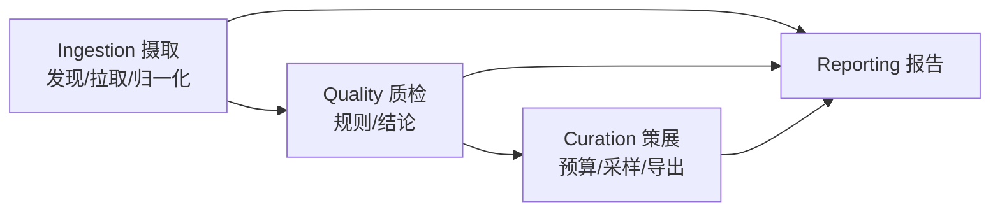

# 实施计划：多来源机器人示教数据的统一入库与质检

对应题目：[docs/assessment_for_ai.md](docs/assessment_for_ai.md)。本文件是动手前的方案与排期，实现过程中若与实际情况冲突，以最终 `docs/design.md` 为准，并在本文件里记录变更原因。

---

## 0. 目标与验收对齐

评审方会做两件事，所有设计都必须先满足它们：

1. 跑一轮 → 在**质检阶段** kill 进程 → 重启，必须从断点继续，不从头再来。
2. 再跑一轮，必须识别"无新增数据"，不重复入库。

由此倒推两条硬约束：

- **状态机必须持久化到进程外**（SQLite），且每个 episode 的阶段推进是**单独事务提交**的，而不是整轮跑完再写库。
- **所有写操作幂等**：以 `(source_id, episode_uid, content_hash)` 为幂等键，重复处理只更新不重复插入。

其余按题目给出的优先级排功：统一表示 > 质检针对性 > 增量/断点 > 采样判断 > 工程质量。AI 使用是平行维度，全程留痕（见第 9 节）。

---

## 1. 数据源选型

要求：≥3 个来源、≥2 种存储格式、含一个非标准/非单臂来源。计划选 4 个（第 4 个是"优雅降级"的证据，量很小）：

| #   | 来源                                                                                                            | 格式                            | 本体                | action 维度/语义                 | 帧率                | 相机 | 真机/仿真 |
| --- | --------------------------------------------------------------------------------------------------------------- | ------------------------------- | ------------------- | -------------------------------- | ------------------- | ---- | --------- |
| A   | `lerobot/pusht`                                                                                                 | Parquet + MP4                   | 2D 推块（非机械臂） | 2 维，末端 xy 位置目标           | 10 Hz               | 1    | 仿真      |
| B   | `lerobot/aloha_sim_insertion_human`                                                                             | Parquet + MP4                   | ALOHA 双臂          | 14 维，双臂关节位置 + 夹爪       | 50 Hz               | 1~4  | 仿真      |
| C   | OXE 小切片（`jxu124/OpenX-Embodiment` 中体量小的 sub-dataset，首选 `berkeley_autolab_ur5`，备选 `bridge` 切片） | RLDS/TFDS（episode→steps 嵌套） | UR5 单臂            | 7 维，末端 delta 位姿 + 夹爪开合 | 5~10 Hz（无时间戳） | 2~3  | 真机      |
| D   | **EPIC-KITCHENS-100（本地已有副本）**                                                                           | 长视频 MP4 + JSON 时序标注      | 人手（无本体感知）  | **无 action、无 state**          | 30 fps（已重编码）  | 1    | 真人      |

选型理由（要写进文档）：

- A 的 action 是**任务空间绝对位置（像素单位）**、B 是**关节空间绝对位置（弧度）**、C 是**末端相对增量（米/弧度）**——三种物理含义、三种单位、三种坐标系，正是"统一表示"最难的地方，比选三个都是 7-DoF 单臂更有说服力。
- A/B 同为 LeRobot 格式但本体/维度/帧率差异大，可以验证"同格式不同本体"的适配器复用。
- D 用来证明 schema 能靠**可空字段 + capability 声明**降级，而不是塞 0 或抛异常；且它是本地文件源、无网络依赖，正好验证"数据源是可插拔插件"这一架构主张（见第 8 节）。

规模控制：每个来源限制 30~80 个 episode，总量目标 8~12 万帧，`config/sources.yaml` 里用 `max_episodes` 收口。

**取舍（需在文档明确写出）**：默认 `--no-video`，A/B/C 只拉低维信号与视频**元信息**（HTTP Range 读 mp4 头 / `ffprobe` 拿帧数与分辨率，不下载完整视频）。代价是：涉及画面内容的质检（黑帧、曝光异常、相机错位）降级为"仅结构性检查"（帧数一致性、路数缺失、分辨率一致性）。提供 `--with-video` 开关，对小样本（如每源 5 个 episode）下全量视频，跑完整的画面级质检，证明能力存在。D 因为视频已在本地，画面级质检默认就能跑（只 `ffprobe` + 抽稀疏关键帧，不全解码）。

### 1.1 来源 D 的落地细节（本地 EPIC-KITCHENS-100）

实际目录（已核实）：

```
~/Documents/datasets/epic_kitchens_100/
  annotations/
    epic_kitchens_full.json      # {version, database: {video_id: {subset, duration, annotations:[...]}}}，700 个视频
    epic_kitchens_verb.json / epic_kitchens_noun.json   # 同结构的任务切分变体
    labels_verb.json / labels_noun.json                  # id_XXX -> 动词/名词 文本
    category_idx_verb.txt / category_idx_noun.txt
  raw_data/epic_kitchens_100_30fps_512x288/
    P01_01.mp4 … （700 个长视频，共 ~30 GB）
```

单条标注长这样：

```json
"P01_01": {"subset": "train", "duration": 1652.152817, "annotations": [
  {"segment": [0.14, 3.37], "verb_label": "id_003", "verb_label_name": "open",
   "noun_label": "id_003", "noun_label_name": "door"}, …]}
```

关键决策：

1. **episode 的粒度 = 一个动作 segment，不是一整条视频。** `P01_01` 单条就有 1652 秒（≈5 万帧），语义上等价于"一整个采集 session"，而 `segment` 才对应机器人数据里的一条示教轨迹（一个原子操作）。`episode_uid = "epic100:P01_01#0042"`，`task = "open door"`（verb + noun 拼成自然语言指令，与 C 的 `language_instruction` 对齐）。
2. **不下载、不解码全量视频。** 只用 `ffprobe` 读 `P01_01.mp4` 的 fps / 分辨率 / 总帧数（每个视频一次，缓存到 SQLite），segment 的帧范围由 `round(t * fps)` 换算得到；帧级 parquet 里只有 `frame_index` 与 `timestamp`，`action/state` 全为 NULL。
3. **预处理来源必须显式登记为 provenance，这是本项目最好的一个"有损变换要可追溯"的实例。** 该副本是**为另一个项目重编码过的**：512×288、30 fps，与官方原始视频（1080p，部分 50/59.94 fps）不同。因此 `episode.json` 里写：

```json
"provenance": {
  "is_original": false,
  "transforms": [{"op": "transcode", "fps": 30, "resolution": [512, 288],
                  "note": "upstream original is 1080p @50/59.94fps; re-encoded for a prior project"}],
  "timestamp_source": "annotation_seconds",
  "frame_index_source": "derived_from_seconds@30fps"
}
```

代价要写清楚：(a) 秒 → 帧号的换算依赖本地 fps，若日后换回原始视频，帧号必须重算，所以**入库存的是秒（权威）+ 帧号（派生）**，不能只存帧号；(b) 288p 不足以做精细手部/接触判断，本轮不做视觉标签，只做结构性质检。4. 选样：从 `database` 里按 participant 分散挑 5~8 个视频、每个视频取前 N 个 segment（`config/sources.yaml` 控制），总量控制在几千到一万帧级别——D 的价值是**证明降级路径**，不是堆量。5. 私密性：本地绝对路径只出现在 `config/sources.local.yaml`（gitignore），仓库里提交的是 `${EPIC_KITCHENS_ROOT}` 环境变量占位版本。评审方没有这份数据时，该 source 自动标记为 `unavailable` 并跳过，不影响其余三源跑通——这一点必须写进 README，否则验收会直接失败。

---

## 2. 统一 schema 设计（核心，先想清楚再动手）

### 2.1 三层结构

```
Source（数据集级）→ Episode（轨迹级）→ Frame（帧级）
```

- **Source**：source_id、上游 URI、格式类型、下载快照版本（HF revision / commit sha）。
- **Episode**：本体信息、能力声明、时间信息、质检结论、指向帧数据文件的指针。
- **Frame**：逐帧低维信号，落 Parquet（不进 SQLite，SQLite 只存目录与统计）。

### 2.2 关键设计决策

**a. 动作空间：不强行统一到一个向量，而是"分组保留 + 结构化打标签"。**

理由：把 2 维 xy、14 维关节角、7 维 delta 位姿硬压进同一个空间只能靠补零和瞎缩放，是不可逆的信息破坏，且下游训练无法还原语义。改为：

```python
ActionSpec = {
  "space": "joint_position" | "ee_pose_abs" | "ee_pose_delta" | "cartesian_2d" | "none",
  "dim": int,
  "channels": [ {"name": "left_arm.j1", "role": "arm", "unit": "rad",
                 "arm_id": "left", "min": ..., "max": ...}, ... ],
  "gripper": {"indices": [6], "convention": "0=closed,1=open"} | None,
  "frame": "base" | "world" | "camera" | None,
  "is_delta": bool,
}
```

统一的部分只有**通道级元信息**：每个通道都必须有 `role`（arm / gripper / base / head / none）、`unit`、`arm_id`、取值范围。下游可以按 role 做跨本体的通用处理，也可以按 space 分桶训练。

**b. 数值归一化：默认只做"单位与约定归一"，不做 min-max 缩放。**

- 单位统一：角度一律 rad、长度一律 m、时间一律秒（float64，episode 内从 0 起）。**单位写在通道上而不是 episode 上**：ALOHA 的 14 维里 12 个关节是 rad、2 个夹爪是归一化开度，同一向量内就混单位。无法转换的保留原单位并标 `metric_convertible=false`（pusht 的 action 是**像素**，没有场景尺度就不可能换成米，硬换就是造假）。
- 约定统一：夹爪一律归到 `0=closed, 1=open`（记录原始约定并保留反变换参数；OXE 常见 `-1=close/+1=open`，ALOHA 是连续开度）。
- 统计量（per-channel mean/std/min/max/p1/p99）**只计算并存进 metadata**，不改写原始数值。理由：归一化参数属于训练侧超参，入库阶段就把数据缩放掉会让后续换策略必须重跑全库。

**c. 帧率：不重采样，原样保留 + 显式记录。**

保留 `fps_nominal`（上游声明）、`fps_effective`（由时间戳中位间隔实测）。提供**导出期**可选的重采样（最近邻 / 线性，按通道 role 决定插值方式：关节角可插值、夹爪二值不插值），而不是入库期。理由：入库是唯一真相层，任何有损变换都推迟到导出层，保证可回溯。

**d. 无损 / 有损边界（文档要逐项列表）**

| 必须无损                                                  | 可有损                                             | 可丢弃                                              |
| --------------------------------------------------------- | -------------------------------------------------- | --------------------------------------------------- |
| action / state 原始数值（单位换算是可逆的，记录换算因子） | 视频（转码、抽帧、只存元信息）                     | 上游内部调试字段（如 `frame_index` 冗余列）         |
| 时间戳、episode 边界、帧序                                | 图像分辨率                                         | 上游的行内 padding / 空 step                        |
| 任务语言指令原文                                          | reward / done 的具体数值（保留 bool 化的成功标记） | 与轨迹无关的 license/readme 文本（存 URI 引用即可） |
| 本体/相机拓扑元信息                                       | 深度图（本轮不处理，只记录存在性）                 | —                                                   |

无法归入统一字段的上游字段，整体存进 `raw_extra`（JSON），保证"不理解的信息也不丢"。

**e. 缺模态的优雅降级：capability 声明。**

```python
Capabilities = {
  "has_action": bool, "has_state": bool, "has_video": bool, "has_gripper": bool,
  "has_language": bool, "has_reward": bool, "has_depth": bool,
  "is_real_robot": bool, "is_teleop": bool,
}
```

- 来源 D 是 `has_action=False, has_state=False, has_video=True, has_language=True`（verb+noun 就是指令），schema 里 `action` 字段为 NULL（不是 0 向量），`ActionSpec.space="none"`。
- **质检规则声明自己依赖哪些 capability**，不满足时结论是 `SKIPPED`（并记录原因），而不是 `FAIL`——这是"降级"与"报错"的分界线，也是评审最容易看出功力的点。

**f. provenance：区分"上游事实"与"我算出来的"。**

三个来源都有"看似是数据、其实是推断"的字段，不标清楚会直接导致质检假阳性：

```python
Provenance = {
  "is_original": bool,                 # 数据是否未经中间处理（D 为 False）
  "timestamp_source": "real" | "synthesized@<hz>" | "annotation_seconds",
  "frame_index_source": "upstream" | "derived_from_seconds@<fps>",
  "transforms": [ ... ],               # 转码/降采样等有损变换的记录
  "upstream_revision": str,
}
```

典型值：A/B = `real` 时间戳；C = `synthesized@5Hz`（RLDS step 里本来就没时间戳）；D = `annotation_seconds` + `derived_from_seconds@30fps`。

### 2.3 统一读取

每个来源实现一个 `SourceAdapter`，接口只有三个方法：

```python
class SourceAdapter(Protocol):
    def list_episodes(self) -> Iterator[EpisodeRef]: ...      # 只列，不下载
    def fetch(self, ref: EpisodeRef) -> RawEpisode: ...       # 拉到本地 staging
    def normalize(self, raw: RawEpisode) -> CanonicalEpisode: ...
```

- `LeRobotAdapter`（A/B 复用，靠 `meta/info.json` 驱动通道映射）
- `RLDSAdapter`（C，用 `tfds` 读；若 TF 依赖太重则退化为直接解析 tfrecord + dataset_info.json，作为备选方案先做技术验证）
- `EpicKitchensAdapter`（D，本地文件源：读 JSON 标注 + `ffprobe` 视频头，`fetch` 是 no-op，正好验证 port 抽象不依赖网络）
- 预留 `HDF5Adapter`（robomimic/ALOHA），若 C 的 TFDS 环境搞不定则作为替补上位。

**风险前置**：TFDS/TensorFlow 在 macOS + Python 3.11+ 的安装是本项目最大不确定性，**第 1 天就做 spike 验证**，失败立刻切 HDF5（题目允许换同类型数据集）。

### 2.4 落盘布局

```
store/
  raw/<source_id>/<episode_uid>/…          # staging，可清理
  normalized/<source_id>/<episode_uid>/
      frames.parquet                        # 逐帧低维信号
      episode.json                          # 元信息 + ActionSpec + capabilities
  catalog.sqlite                            # 目录 + 状态机 + 质检结果 + 运行报告
  exports/subset_<ts>.jsonl
```

原则：**大数据走文件系统，元数据与状态走 SQLite**。SQLite 只存指针和统计，保证库文件小、查询快、备份容易。

---

## 3. 质检规则（目标 8 条，最低要求 4 条）

每条规则实现为 `QCRule`，声明 `rule_id / severity(FAIL|REVIEW) / required_capabilities / params`，输出 `Verdict(PASS|FAIL|REVIEW|SKIPPED, metrics, reason)`。

| ID                         | 规则                                         | 判据（初值，后续按实跑数据调参）                                                                                  | 严重度                          | 依赖                                |
| -------------------------- | -------------------------------------------- | ----------------------------------------------------------------------------------------------------------------- | ------------------------------- | ----------------------------------- |
| `TS_MONOTONIC`             | 时间戳非单调 / 重复                          | 存在 `dt <= 0`                                                                                                    | FAIL                            | `timestamp_source == real`          |
| `FPS_DRIFT`                | 实测帧率与标称不符 / 存在丢帧空洞            | `abs(median_dt - 1/fps_nominal) / (1/fps_nominal) > 5%`，或存在 `dt > 3×median_dt` 的空洞                         | REVIEW（空洞多于 1% 帧则 FAIL） | `timestamp_source == real`          |
| `ACTION_RANGE`             | 动作越界 / NaN / Inf                         | 超出本体注册表的通道限位（如 aloha 关节限位、pusht 的 `[0,512]px`、UR5 delta 的 ±0.1m）；任一 NaN/Inf             | FAIL                            | has_action                          |
| `ACTION_JERK`              | 帧间突变（跳变、传输丢包造成的阶跃）         | 单通道 `abs(delta_a)` 超过该通道 p99.9 的 5 倍，且前后各 2 帧不平滑（排除正常加速）                               | REVIEW                          | has_action                          |
| `STATIC_EPISODE`           | 几乎全程静止 / 过短                          | 帧数 < 20；或 action 总行程 < 阈值；或 95% 的帧 `abs(delta_state)` < 噪声底                                       | FAIL                            | —                                   |
| `STATE_ACTION_ECHO`        | action 被写成了 state 的回读（采集脚本 bug） | 共位帧 `a_t` 与 `s_t` **位级完全相等**（`max abs(a-s) < 1e-9`）的帧占比 > 90%。**不能只看相关性**：见下方陷阱说明 | REVIEW                          | has_action & has_state & 同空间同维 |
| `VIDEO_FRAME_MISMATCH`     | 视频帧数与 parquet 行数不一致 / 某路相机缺失 | 任一相机 `abs(n_video - n_rows) > 1`；或相机路数少于该 source 声明                                                | FAIL                            | has_video                           |
| `GRIPPER_STUCK`            | 夹爪通道全程无变化（拿放类示教里几乎不可能） | 夹爪通道 unique 值 == 1 且 episode 帧数 > 50                                                                      | REVIEW                          | has_action & has_gripper            |
| `SEGMENT_BOUNDS`（D 专用） | 标注区间越界 / 重叠 / 过短                   | `end > video_duration`、`start >= end`、时长 < 0.4s（<12 帧）、与相邻 segment 重叠 > 50%                          | FAIL / REVIEW                   | 标注型 source                       |

设计要点：

- **`STATE_ACTION_ECHO` 是一个真陷阱，必须写进文档**：ALOHA（来源 B）是**关节位置控制的遥操示教**，action 就是下一刻的目标关节角，`corr(a_t, s_t)` 天然 > 0.999——按相关性判会把整个数据集全部误判。真正的异常信号是**位级相等**（真实伺服总有跟踪误差，不可能 bit-identical），以及 `lag-1 互信息` 降为 0（action 完全不领先于 state）。先跑一轮统计把 `max abs(a-s)` 的分布画出来再定阈值。
- **时间戳类规则需要 `timestamp_source` 而不只是 capability**：RLDS（来源 C）的 step 里**根本没有时间戳**，时间是由 step index / 声明控制频率合成的。对合成时间戳跑 `TS_MONOTONIC` 永远 PASS，是无意义的假阳性——所以结论必须是 `SKIPPED(reason=synthetic_timestamp)`。这一条是“降级 ≠ 通过”的第二个典型例子。
- 阈值全部走 `config/qc.yaml`，且**先跑一轮统计再定阈值**（数据驱动，不是拍脑袋——这一步的对话记录本身就是 AI 使用的证据）。
- 每条规则输出**数值 metrics**（不只是布尔），存进 `qc_results`，报告里的命中率与分布直接从这里算。
- 不合格不阻塞：单 episode 规则异常被捕获，记为 `ERROR` 结论并继续，绝不让一条坏数据中断整轮。
- 规则都是**纯函数**（`frames + EpisodeMeta -> Verdict`），不碰 IO、不碰 DB，因此可以用合成数据先写测试再写实现（见第 8 节 TDD）。

---

## 4. SQLite schema（草案）

```sql
sources(source_id PK, kind, uri, revision, config_json, created_at)

episodes(
  episode_uid PK,            -- f"{source_id}:{upstream_id}"
  source_id, upstream_id, content_hash,
  embodiment, action_space, action_dim, n_frames,
  fps_nominal, fps_effective, duration_s,
  capabilities_json, action_spec_json, camera_json, raw_extra_json,
  frames_path, status,       -- 状态机，见下
  qc_verdict,                -- PASS | FAIL | REVIEW | PENDING
  first_seen_run, last_update_run, updated_at,
  UNIQUE(source_id, upstream_id)
)

episode_state(episode_uid PK, stage, attempt, last_error, lease_owner, lease_expires_at, updated_at)

qc_results(id PK, episode_uid, rule_id, verdict, metrics_json, reason, run_id,
           UNIQUE(episode_uid, rule_id, run_id))

runs(run_id PK, started_at, finished_at, status, args_json, stats_json)

exports(export_id PK, run_id, budget_frames, strategy, path, stats_json, created_at)
```

`status` / `stage` 状态机：

```
DISCOVERED → FETCHED → NORMALIZED → QC_DONE → COMMITTED
                ↘ FAILED(attempt, last_error) ↗（可重试）
```

`PRAGMA journal_mode=WAL; synchronous=FULL;`，每个 episode 的阶段推进 = 一次事务（写文件 → fsync → 事务里更新 stage）。

---

## 5. 增量与断点恢复

**幂等键**：`(source_id, upstream_id)` 唯一；`content_hash` = 上游文件 sha256（或 size+mtime+revision 的组合摘要）用于识别"上游改过"。

- 新一轮 `list_episodes` 后做差集：库里 `COMMITTED` 且 hash 未变 → 跳过（这就是"识别无新增数据"）。
- hash 变了 → 标记 `stale`，重跑并写新版本（`episodes` 保留旧行的 supersede 标记，不物理删除）。

**崩溃安全的三条铁律**：

1. 所有产物写 `*.tmp` 后 `os.replace()` 原子改名，先 fsync 文件再 fsync 目录。
2. 先落文件、后写状态。崩在中间 → 状态仍是上一阶段，重跑时覆盖同名 tmp，天然幂等。
3. 启动时做 **recovery pass**：清理孤儿 `*.tmp`；把 `lease_expires_at` 过期的 `IN_PROGRESS` 打回上一个稳定阶段；校验 `NORMALIZED` 的 parquet 能否打开，打不开就回退到 `FETCHED`。

**测试计划**（文档要写清楚模拟了什么故障、恢复后行为是否符合预期）：

- `tests/test_resume.py`：用 `FAULT_INJECT=qc:after_n=3` 环境变量在质检第 3 个 episode 后 `os._exit(1)`；断言重启后 `fetch/normalize` 调用计数为 0（用 counter 文件验证"没重复处理"），最终结果与不中断跑一遍完全一致（比对 DB 快照 + parquet 校验和）。
- 覆盖三种中间态：下载完未归一化、归一化完未质检、质检完未写库。
- 覆盖"再跑一次无新增"：断言第二轮 `new_episodes=0` 且 `episodes` 表行数不变、`updated_at` 不变。
- 覆盖"上游新增 1 个 episode"：只处理新增的那一个。
- 提供 `scripts/demo_crash_resume.sh` 一键复现评审场景（真 `kill -9`，不是模拟）。

---

## 6. 训练子集导出

CLI：`rdp export --budget 50000 --strategy balanced --out exports/subset.jsonl`

**采样策略（分层 + 平方根平滑 + 质量优先 + 组内多样性）**：

1. 只从 `qc_verdict == PASS` 的 episode 里选（`REVIEW` 可用 `--include-review` 放进来，默认不放）。
2. 第一层按**本体**分配，而不是按来源——训练关心的是本体/动作空间的覆盖，来源只是存储事实。
3. 组内配额用**平方根平滑**：$w_i = \sqrt{N_i} \big/ \sum_j \sqrt{N_j}$，再对每组施加上下限 $[\text{floor}, \text{cap}]$（如单组不超过总预算 40%、不少于 5%）。理由：纯按帧数比例分配会让 ALOHA 50Hz 的数据淹没 10Hz 的 pusht（帧数差 5 倍但信息量并不差 5 倍）；纯均分又浪费大源的多样性；sqrt 是行业里常用的折中（多语言 NLP 语料采样同款做法）。
4. 组内排序：先按 QC 质量分（无 REVIEW 命中 > 有 REVIEW 命中），再按**任务标签去重**做轮转（round-robin over task），避免预算被同一个任务吃满。
5. 帧预算按 episode **整段**给（不切碎轨迹），最后一个 episode 允许截断到帧范围，并在输出里写明 `frame_start/frame_end`。
6. 固定 `--seed`，导出可复现；`exports` 表记录策略与统计。

输出行（JSONL）字段：`source_id, embodiment, action_space, action_dim, episode_uid, frame_start, frame_end, n_frames, fps, capabilities, task, frames_path, key_stats(mean/std/min/max per channel), qc_verdict, qc_rules_hit`。

---

## 7. 报告

`rdp run` 结束后同时输出控制台表格与 `reports/run_<run_id>.json` / `.md`：

- **本轮**：新增 episode 数、归一化成功/失败（含失败原因 top-N）、质检通过/未通过（按 rule_id 分类计数）、耗时、跳过数（含跳过原因：已处理 / capability 不满足）。
- **累计**：总 episode 数、总帧数、按 source × embodiment 的交叉分布、各质检规则命中率与 SKIPPED 率、库体积。

`rdp report` 可单独重放（纯 SQL 聚合，不依赖本轮内存状态）。

---

## 8. 工程方法论：DDD + Clean Architecture + TDD

**结论：三个都用，但都只用"能还本"的那部分。** 这题的形态恰好是三者最擅长的场景，但也极容易滑向过度设计——本节同时写明**采纳什么**和**明确拒绝什么**（拒绝清单本身是交付物，见第 9 节）。

### 8.0 为什么这三个方法在这题上真的划算

| 方法       | 这题里的真实痛点                                                                                                 | 它解决什么                                                                                          | 不用会怎样                                                                                 |
| ---------- | ---------------------------------------------------------------------------------------------------------------- | --------------------------------------------------------------------------------------------------- | ------------------------------------------------------------------------------------------ |
| DDD        | "episode"在 LeRobot 是一段 parquet、在 RLDS 是嵌套 steps、在 EPIC 是视频里的一个时间区间；action 有 4 种物理含义 | 用统一语言 + 值对象把这些概念钉死，让"归一化"变成一个有明确输入输出的领域动作，而不是散落在 if/else | schema 概念漂移，文档说的和代码里的字段对不上（这正是题目点名的降档信号）                  |
| Clean Arch | 上游数据源会持续新增（题目明说）；SQLite 只是本轮选型，扩展题里要换 Postgres/对象存储                            | 数据源与存储都是**可插拔的 port/adapter**，领域逻辑不依赖它们                                       | 加第 5 个数据源要动核心代码；扩展题的回答变成空谈（"可以改"但代码里没有接缝）              |
| TDD        | 验收场景是 kill -9 后恢复。手工验证一次要跑几十分钟，且难以覆盖三种中间态                                        | 用 fake adapter + 故障注入 port，**秒级**跑完所有崩溃时序，真跑之前就确信恢复逻辑对                 | 只能靠"跑一次没出错"当证据，评审方换个 kill 时机就崩；题目恰好要求写"你如何测试了断点恢复" |

### 8.1 通用语言（Ubiquitous Language）

代码、DB 字段、文档、CLI 输出**只用这一套词**，不允许同义词漂移（`trajectory`/`demo`/`rollout` 一律叫 Episode）：

| 术语                 | 含义                                                          | 代码位置                               |
| -------------------- | ------------------------------------------------------------- | -------------------------------------- |
| **Source**           | 一个上游数据集（含 revision）                                 | `domain/source.py`                     |
| **Episode**          | 一条完整示教/操作片段，**聚合根**                             | `domain/episode.py`                    |
| **Frame**            | episode 内一帧低维信号                                        | 帧数据不是实体，是 `FrameTable` 值对象 |
| **Embodiment**       | 本体（aloha_bimanual / ur5 / pusht_planar / human_hand）      | `domain/embodiment.py`                 |
| **ActionSpec**       | 动作空间的结构化描述（值对象，不可变）                        | `domain/action_spec.py`                |
| **Capabilities**     | 该 episode 拥有哪些模态（值对象）                             | `domain/capabilities.py`               |
| **Provenance**       | 数据来自哪、经过什么变换、时间戳是真的还是合成的              | `domain/provenance.py`                 |
| **IngestionStage**   | episode 在流水线上的阶段（状态机，含合法迁移）                | `domain/stage.py`                      |
| **QCRule / Verdict** | 一条质检规则 / 它的结论（PASS/FAIL/REVIEW/SKIPPED）           | `domain/qc/`                           |
| **IngestionRun**     | 一次 pipeline 运行（聚合根，报告的统计口径）                  | `domain/run.py`                        |
| **SubsetPlan**       | 一次导出的采样计划（预算 → 各组配额 → 选中的 episode 帧区间） | `domain/subset.py`                     |

### 8.2 限界上下文（Bounded Context）

四个上下文，共享 `Episode` 标识但各自关心不同侧面——这也正好对应题目的四个环节：



上下文之间只通过 `EpisodeUid` + 不可变的 `CanonicalEpisode` 传递，不共享可变对象。Quality 不知道数据从哪来（它只看 `FrameTable + ActionSpec + Capabilities + Provenance`），Curation 不知道质检怎么算的（它只看 `Verdict`）。

### 8.3 分层与依赖方向（Clean Architecture）

**依赖规则：箭头只能指向内层。`domain/` 不 import 任何第三方 IO 库（不 import sqlite3 / pyarrow / requests / tfds）。**

```
src/rdp/
  domain/                    # 最内层：实体、值对象、领域服务。纯 Python + 少量 numpy，零 IO
    episode.py               # Episode 聚合根（含 stage 迁移不变量）
    action_spec.py  capabilities.py  provenance.py  embodiment.py
    frames.py                # FrameTable 值对象（列名/单位/dtype 约束）
    stage.py                 # IngestionStage 状态机：advance() 拒绝非法迁移
    qc/                      # QCRule 协议 + 8 条规则（纯函数）
    curation/sampler.py      # 采样策略（纯函数：统计 -> SubsetPlan）
    errors.py

  application/               # 用例编排 + 端口定义（依赖 domain，不依赖 infra）
    ports.py                 # SourcePort / EpisodeRepository / FrameStore / BlobStore
                             # / UnitOfWork / Clock / RunReporter / FaultInjector
    ingest_episodes.py       # 用例：discover -> fetch -> normalize -> qc -> commit
    recover_incomplete.py    # 用例：启动时的 recovery pass
    export_subset.py         # 用例：预算 -> SubsetPlan -> JSONL
    build_report.py

  infrastructure/            # 最外层：所有脏活。可替换，不被内层依赖
    sources/lerobot_adapter.py  rlds_adapter.py  epic_adapter.py  (hdf5_adapter.py)
    persistence/sqlite_repository.py  schema.sql  unit_of_work.py
    storage/parquet_frame_store.py  atomic_fs.py
    media/ffprobe.py
    config/yaml_loader.py

  interfaces/
    cli.py                   # typer：run / export / report / doctor / sources
    presenters/report_md.py

tests/
  unit/                      # 只测 domain：无 IO，毫秒级
  integration/               # 测 infrastructure adapter（用 tests/fixtures 的迷你数据集）
  acceptance/                # 端到端：崩溃恢复、二次运行无新增、导出预算
  fakes/                     # InMemoryEpisodeRepository / FakeSource / FakeClock / CrashInjector
  fixtures/                  # 每源几十帧的迷你样本，可进 git（<1MB）
config/{sources.yaml, sources.local.yaml(gitignored), qc.yaml, embodiments.yaml}
scripts/demo_crash_resume.sh
```

**接缝在哪、扩展题就答在哪**——这是这套分层最直接的回报：

- 新增数据源 = 新写一个实现 `SourcePort` 的类 + 一行配置，`domain/` 与 `application/` 零改动。
- SQLite → Postgres = 换 `EpisodeRepository` + `UnitOfWork` 实现；因为领域层从不写 SQL，事务边界由 `UnitOfWork` 统一持有。
- 本地 FS → 对象存储 = 换 `FrameStore` / `BlobStore` 实现。
- 单进程 → 队列 worker = 换 `application` 层的调度器；`IngestionStage` 的租约字段已经在领域模型里。

**关键端口（草案）**：

```python
class SourcePort(Protocol):
    source_id: str
    def list_episodes(self) -> Iterator[EpisodeRef]: ...
    def fetch(self, ref: EpisodeRef, dest: Path) -> RawEpisode: ...
    def normalize(self, raw: RawEpisode) -> CanonicalEpisode: ...

class EpisodeRepository(Protocol):
    def get(self, uid: EpisodeUid) -> Episode | None: ...
    def upsert(self, ep: Episode) -> None: ...          # 幂等
    def list_by_stage(self, stage: IngestionStage) -> list[Episode]: ...

class UnitOfWork(Protocol):
    def __enter__(self) -> "UnitOfWork": ...            # 一个 episode 一个事务
    def commit(self) -> None: ...
    def rollback(self) -> None: ...

class FaultInjector(Protocol):                          # 生产实现是 no-op
    def maybe_crash(self, checkpoint: str) -> None: ...
```

`FaultInjector` 是有意为测试而生的**生产端口**：它让"在质检阶段崩溃"变成可编程、可断言的事件，而不是靠外部 `kill` 撞运气。生产环境注入 no-op 实现，开销为零。这是我认为值得为可测试性付出的少量设计成本。

### 8.4 领域不变量（写在 domain 里，而不是散在流程里）

1. `IngestionStage.advance()` 只允许 `DISCOVERED → FETCHED → NORMALIZED → QC_DONE → COMMITTED`，跳级或回退必须显式调用 `reset_to()` 并带原因。
2. `CanonicalEpisode` 一旦构造完成即不可变；`ActionSpec.dim == len(channels) == action 列宽`，构造时校验，违反直接抛领域异常。
3. `Capabilities.has_action == False` ⟹ `ActionSpec.space == NONE` 且 frames 中 action 列为 NULL（禁止 0 填充）。
4. QCRule 的 `required_capabilities` 不满足 ⟹ 结论只能是 `SKIPPED`，领域层强制，规则实现无法绕过。
5. `SubsetPlan` 总帧数 ≤ 预算，且每个条目的 `frame_range` 必须落在该 episode 的实际帧数内。

这些不变量全部有对应的单元测试，先写测试再写实现。

### 8.5 TDD 策略（重点用在断点恢复上）

**测试金字塔与运行时间预算**：

| 层             | 数量级 | 依赖                                          | 目标耗时 |
| -------------- | ------ | --------------------------------------------- | -------- |
| unit（domain） | ~60    | 无 IO，全 fake                                | < 2 s    |
| integration    | ~15    | 真 SQLite（tmpdir）、真 parquet、迷你 fixture | < 20 s   |
| acceptance     | 4~6    | 真子进程 + 真 kill -9                         | < 60 s   |

**恢复能力的 TDD 顺序（红 → 绿 → 重构，每步一个 commit）**：

1. 先写 `tests/acceptance/test_resume.py::test_crash_during_qc_resumes`：用 `FakeSource`（10 个合成 episode，可统计每个方法被调用几次）+ `CrashInjector(checkpoint="qc.after_episode_3")`。**此时实现还不存在，测试必然红。**
2. 断言三件事，缺一不可：
   - 恢复后 `FakeSource.fetch` / `normalize` 的调用计数**不增加**（真的没重复处理，而不是"看起来跳过了"）；
   - 最终 DB 状态与"一次跑完不崩"的基线**逐字段相等**（比对 `episodes` 全表 + `qc_results` + parquet 内容 hash）；
   - `runs` 表里有两条记录，第二条的 `resumed_from` 非空。
3. 参数化覆盖**每一个阶段边界**：`fetch.before/after`、`normalize.after_write_before_commit`（最刁钻的一种：文件已落盘但事务未提交）、`qc.mid_rule`、`commit.after_file_before_db`。用 `pytest.mark.parametrize` 一次覆盖 8 个崩溃点，这是手工测试做不到的。
4. `test_second_run_is_noop`：断言第二轮 `new_episodes == 0`、`episodes` 表行数与 `updated_at` 全部不变（幂等的强断言，不是"没报错"）。
5. `test_upstream_adds_one_episode`：只处理新增的那 1 个。
6. 最后才是 `tests/acceptance/test_demo_script.py`：跑真实的 `scripts/demo_crash_resume.sh`（真子进程、真 `kill -9`、真 SQLite），确认与 fake 层结论一致——**fake 测穷尽性，真 kill 测真实性，两者都要**。

**其他 TDD 用法**：

- QC 规则：每条规则先用**手工构造的坏数据**写测试（时间戳倒退、注入 NaN、把 action 复制成 state、把某路相机帧数减 1），再写实现。这样"规则真的能抓到坏数据"是被证明的，而不是被声称的。
- 采样器：先写"预算 5 万帧、四个来源帧数悬殊"的期望配额测试，把 sqrt 平滑与上下限的行为钉死，再实现。
- 归一化：用 `tests/fixtures` 里的迷你真实样本做**特征化测试（characterization test）**，把每个源的通道名、单位、夹爪约定写成断言——通道映射写错是最隐蔽的 bug，必须靠测试锁住。

### 8.6 明确拒绝的"教科书式"做法（防过度设计）

| 拒绝                                   | 理由                                                                                     |
| -------------------------------------- | ---------------------------------------------------------------------------------------- |
| 领域事件 + 事件总线 / 事件溯源         | 单进程顺序流水线，事件总线只增加追踪难度；状态机 + 一张 `episode_state` 表足够           |
| CQRS / 读写模型分离                    | 读侧就是几条聚合 SQL，分离纯属仪式                                                       |
| Repository 之上再套 Service/Manager 层 | 用例类本身就是应用服务，多一层只是转发                                                   |
| ORM（SQLAlchemy）                      | schema 小、要精确控制事务与 PRAGMA，裸 sqlite3 + 一个 `schema.sql` 更可控                |
| 给每个值对象写 Factory / Builder       | pydantic 的校验构造器已经够用                                                            |
| 100% 覆盖率 / 给 adapter 也做严格 TDD  | adapter 依赖真实数据格式，先探索再补特征化测试更现实；覆盖率目标只对 `domain/` 设为 90%+ |
| 抽象出"通用 ETL 框架"                  | 只有 4 个源，YAGNI；插件点就一个 `SourcePort`                                            |

技术栈：Python 3.11、pydantic v2、numpy、pyarrow、typer、rich、pytest（+ `pytest-parametrize`）、sqlite3（标准库）。

---

## 8.7 里程碑（TDD 顺序：测试先行的步骤已标注）

每个里程碑对应若干次 commit，且与 AI 对话记录时间线对齐。

| 阶段                        | 产出                                                                             | 关键风险                                     |
| --------------------------- | -------------------------------------------------------------------------------- | -------------------------------------------- |
| M0 数据可达性 spike         | A/B/C 各拉通 1 个 episode、D 用 ffprobe 读通 1 个视频；确认 TFDS 是否可用        | TFDS 装不上 → 切 HDF5                        |
| M1 通用语言 + domain 模型   | `domain/` 全部值对象与不变量 + **对应单元测试（先写测试）**；design 初稿         | 设计返工，先用 AI 交叉评审再写代码           |
| M2 端口 + 状态机 + 恢复用例 | `ports.py`、`IngestionStage`、`recover_incomplete`；**先写恢复的验收测试（红）** | 事务边界写错                                 |
| M3 SQLite/Parquet 基础设施  | 让 M2 的红测试变绿：真仓储、原子写、UnitOfWork                                   | fsync/rename 细节                            |
| M4 三个 adapter             | 归一化跑通，产出 normalized parquet；特征化测试锁通道映射                        | 通道语义映射错                               |
| M5 QC 规则                  | 8 条规则（每条先写坏数据测试）+ 先统计后定阈值                                   | 阈值过松/过紧、ALOHA 的 echo 假阳性          |
| M6 真 kill 验收             | `demo_crash_resume.sh` + 真子进程验收测试                                        | 与 fake 层结论不一致                         |
| M7 导出 + 报告              | JSONL 子集、run/cumulative 报告                                                  | —                                            |
| M8 文档与收尾               | design.md 全部问题、扩展问题、已知局限、AI 记录整理                              | 文档与代码对不上（专门用一次 AI 做对齐检查） |

---

## 9. AI 使用计划（独立考察项，按题目要求执行）

不是"顺手用一下"，而是按阶段分角色，并且**全程保存原始对话**（原始 prompt + 原始回答 + 我的修改），存到 `docs/ai/NN_<阶段>_<工具>.md`，不写事后摘要。

- **设计阶段**：用 AI-1 出 schema 方案；用 **AI-2 交叉评审**（明确 prompt："找出这个 schema 在跨本体动作语义上最可能错的 3 个地方"）。
- **实现阶段**：分模块对话，每模块一次 commit，避免千行大提交。
- **审查阶段**：让 AI 反向挑错——"这个 checkpoint 设计在什么并发/崩溃时序下会重复入库"、"这些质检阈值在 50Hz 数据上会不会全部误报"。
- **验收阶段**：让 AI 做非代码活：文档与代码一致性检查、**本地路径/密钥泄露扫描**、错样分析（把 FAIL 的 episode metrics 丢给 AI 让它判断是真坏还是规则误伤）。
- **数据驱动调整**：QC 阈值必须基于实跑统计让 AI 给改法，把"改前/改后命中率"记进对话记录。
- **主动拒绝记录**：单独维护 `docs/ai/rejected.md`，记录"AI 建议 X / 我改成 Y / 因为 Z"。已预判会拒绝的：把所有本体硬压成统一 32 维向量、引入 ORM/Airflow/Ray 这类过度设计、入库阶段就做 min-max 归一化、用多进程并发换取那点吞吐，以及 8.6 节列出的整套 DDD/Clean Architecture 仪式（事件总线、CQRS、Factory 层）。

Commit 纪律：小步提交、message 说明"做了什么 + 为什么"，节奏与对话时间线一致。

---

## 10. 架构扩展问题的回答思路（500 数据集 / 5 亿帧 / 按帧随机读）

文档里要展开，这里先记论点：

1. **元数据层**：SQLite 单写者会成为瓶颈 → 换 Postgres（或先分片 SQLite + 定期合并）；`episodes` 表 5 亿帧对应约百万级行，仍可控，真正的压力在 `qc_results` 与帧级索引。
2. **帧级随机读**：不能按 episode 存 parquet 再全量读。改为**分片 + 全局帧索引**：帧数据按 `(embodiment, shard_id)` 存成固定大小的 chunk（parquet row group 对齐 / WebDataset tar / Lance-类列存），另建 `frame_index`（`global_frame_id → shard_id, row_offset`），训练侧走 mmap + row-group 级随机读；图像/视频走独立的 chunk 存储并预生成关键帧索引，避免随机 seek 解码。
3. **调度层**：单进程 for-loop → 任务队列（每个 episode 是一个幂等 task），worker 水平扩展；租约（lease）+ 心跳解决 worker 崩溃；当前的 `lease_owner/lease_expires_at` 字段就是为此预留的。
4. **存储层**：本地 FS → 对象存储（S3/OSS），staging 只作临时缓存；写路径改为"写对象 + 提交元数据"两阶段。
5. **质检层**：从"入库时逐 episode 串行"改为"批量向量化 + 抽样 + 分层复检"，全量重跑 5 亿帧不现实，需要规则版本号 + 只对受影响分片重算。
6. **可观测性**：run 报告 → 指标上报（Prometheus）+ 数据质量看板 + 告警。
7. **不变的部分**：canonical schema、capability 声明、幂等键设计、阶段状态机——这正是这套设计的价值所在，规模变化只换执行引擎和存储介质。

---

## 11. 已知局限（提前登记，最终写进文档）

- 默认不下视频 → A/B/C 的画面级质检降级（见第 1 节）。
- 不做跨本体的动作空间统一 → 下游若需要单一向量输入，需自行加投影层（这是有意的取舍）。
- 单机单进程，吞吐不是本轮目标。
- OXE 只取一个小 sub-dataset，不代表整个 OXE 的多样性。
- **来源 D 依赖本地已有副本**（30 GB，不进 git），评审方没有该数据时会自动跳过；且该副本是 512×288 / 30fps 的**重编码版**，与官方原始视频不同，视觉侧结论不可外推。
- D 只用于验证降级路径，样本量小、无 action，不进入训练子集默认配额。

---

## 12. 交付物清单

- [ ] 含 `.git/` 的完整项目（小步 commit，message 有意义）
- [ ] `docs/design.md`：架构、schema 取舍、checkpoint 策略、断点恢复测试、采样策略、生产化考虑、扩展问题、已知局限
- [ ] `docs/ai/`：完整原始对话记录 + `rejected.md`
- [ ] `README.md`：一条命令跑通（含评审场景复现脚本）
- [ ] 示例输出：`reports/` 报告、`exports/subset.jsonl` 样例

---

## 附录 A. 四个来源的数据形态实例（写 schema 前先看这个）

> A/B/C 的具体数值来自各数据集公开文档与常见版本，**以 M0 spike 实际读到的 `meta/info.json` / `dataset_info.json` 为准**；本附录用于建立直觉、驱动 schema 讨论。D 是本机实测。

### A. `lerobot/pusht` —— 2D 平面推块（非机械臂，像素单位）

```
pusht/
  meta/info.json          # robot_type, fps, total_episodes/frames, features 的 dtype/shape/names
  meta/tasks.*            # task_index -> 自然语言任务
  meta/episodes*          # 每个 episode 的长度、起止 index
  data/chunk-000/episode_000000.parquet
  videos/chunk-000/observation.image/episode_000000.mp4
```

`meta/info.json` 关键片段（形态示意）：

```json
{
  "robot_type": "pusht",
  "fps": 10,
  "total_episodes": 206,
  "total_frames": 25650,
  "features": {
    "action": {
      "dtype": "float32",
      "shape": [2],
      "names": ["motor_0", "motor_1"]
    },
    "observation.state": {
      "dtype": "float32",
      "shape": [2],
      "names": ["motor_0", "motor_1"]
    },
    "observation.image": { "dtype": "video", "shape": [96, 96, 3] },
    "next.reward": {},
    "next.success": {},
    "timestamp": {},
    "frame_index": {},
    "episode_index": {},
    "index": {}
  }
}
```

parquet 的一行：

```
episode_index=0  frame_index=3  timestamp=0.3  index=3  task_index=0
action           = [222.0, 97.0]    # 推杆目标 xy，单位像素，值域约 [0, 512]
observation.state= [221.4, 98.7]    # 推杆当前 xy（像素）
next.reward=0.14  next.done=false  next.success=false
```

**对 schema 的启发**：

1. `names` 叫 `motor_0/motor_1` 是**误导**——它其实是任务空间 xy，不是电机。**上游字段名不可信，语义必须由我们自己的 `embodiments.yaml` 断言**，这是 adapter 层最该做的事。
2. 单位是**像素**，没有场景尺度就无法换算成米。这直接击碎"一切长度归一到米"的天真设想 → `unit="px"` + `metric_convertible=false` 必须是**通道级**属性。
3. 没有夹爪、没有关节、没有姿态：`space=cartesian_2d`，`channels[*].role="end_effector"`。这就是那个"非标准单臂"来源。
4. `next.reward / next.success` 是仿真才有的 → `has_reward=True`；数值可有损（只保留 episode 级 success 标记）。

### B. `lerobot/aloha_sim_insertion_human` —— 双臂 14 自由度（关节空间，混合单位）

同一套目录结构，内容完全不同（形态示意）：

```json
{
  "robot_type": "aloha",
  "fps": 50,
  "total_episodes": 50,
  "total_frames": 20000,
  "features": {
    "action": {
      "dtype": "float32",
      "shape": [14],
      "names": [
        "left_waist",
        "left_shoulder",
        "left_elbow",
        "left_forearm_roll",
        "left_wrist_angle",
        "left_wrist_rotate",
        "left_gripper",
        "right_waist",
        "right_shoulder",
        "right_elbow",
        "right_forearm_roll",
        "right_wrist_angle",
        "right_wrist_rotate",
        "right_gripper"
      ]
    },
    "observation.state": { "dtype": "float32", "shape": [14] },
    "observation.images.top": { "dtype": "video", "shape": [480, 640, 3] }
  }
}
```

一行数据：

```
timestamp = 0.06
action            = [-0.011, -0.96, 1.11, ..., 0.021, ...]   # 目标关节角(rad) + 夹爪开度
observation.state = [-0.010, -0.95, 1.10, ..., 0.019, ...]   # 实测关节角(rad) + 夹爪开度
```

**对 schema 的启发**：

1. **同一个向量里混着两种单位**：12 个关节是 `rad`，2 个夹爪是归一化开度（或米）。所以 `unit` 只能是通道级属性，不能挂在 episode 上。
2. **需要 `arm_id`**：`left_* / right_*` 必须结构化成 `arm_id="left"/"right"`，否则双臂数据下游无法按臂拆分，也无法和单臂数据做任何对齐。这是"分组保留 + 打标签"策略的直接依据。
3. **action 与 state 是同一空间的"目标值 vs 实测值"**——这是 `STATE_ACTION_ECHO` 假阳性陷阱的来源（第 3 节）；也说明 action 语义不止有"空间"这一维，`ActionSpec` 还需要 `is_command: bool`。
4. 相机路数随数据集变化（sim 版通常只有 `top`，真机 ALOHA 常见 4 路：top / low / left_wrist / right_wrist）→ 相机拓扑必须数据驱动读出，禁止硬编码。
5. 50 Hz vs pusht 的 10 Hz：**同样 8 秒的轨迹，帧数差 5 倍**。这直接决定采样策略不能按帧数比例分配（第 6 节）。

### C. OXE / RLDS（如 `berkeley_autolab_ur5`） —— 末端增量控制（嵌套结构、无时间戳）

`episode → steps` 嵌套，反序列化后大致是：

```python
{
  "episode_metadata": {"file_path": "..."},
  "steps": [
    {
      "observation": {
         "image":      uint8[480, 640, 3],   # 外部相机
         "hand_image": uint8[480, 640, 3],   # 腕部相机
         "state":      float32[15],          # 机器人状态，语义需查 dataset card
      },
      "action": {                            # 注意：是 dict，不是扁平向量
         "world_vector":              float32[3],  # 末端位置增量 (m)，量级 ~1e-2
         "rotation_delta":            float32[3],  # 末端姿态增量 (rad)
         "gripper_closedness_action": float32[1],  # 约定可能是 -1=开 / +1=合
         "terminate_episode":         float32[3],
      },
      "reward": 0.0, "discount": 1.0,
      "is_first": True, "is_last": False, "is_terminal": False,
      "language_instruction": "put the block in the bowl",
      "language_embedding": float32[512],
    },
  ]
}
```

**对 schema 的启发**：

1. **action 是嵌套 dict，扁平化顺序由我们决定**，一旦确定就是对外契约 → 展开后的通道名列表必须写进 `ActionSpec.channels` 并落库，否则几个月后没人能解释第 4 列是什么。
2. **`is_delta = True`**：增量控制与 A/B 的绝对量根本不同。跨源做任何统计（均值/方差/阈值）都必须先按 `is_delta` 分桶，否则统计量毫无意义——`ACTION_RANGE` 的阈值因此必须按 `(embodiment, space)` 维护。
3. **steps 里没有时间戳**，只有隐含控制频率（如 5 Hz）。时间必须合成，`provenance.timestamp_source="synthesized@5Hz"`，时间戳类规则一律 `SKIPPED`。这是第 3 节那条设计的来源。
4. **`is_first/is_last/is_terminal` 与末尾 padding step**：RLDS 最后一步常带零动作/占位动作，直接算进统计会污染 `ACTION_JERK` 与静止检测 → 归一化时按 `is_last` 裁掉并记进 `raw_extra`。
5. **夹爪约定不同**（-1/+1 vs 0/1 vs 连续宽度）→ 归一化到 `0=closed,1=open` 并保留反变换参数。
6. `language_instruction`（文本）**必须无损保留**；`language_embedding`（512 维）**可丢弃**——它是可由文本重算的派生物，占空间且绑定特定编码器版本。这是"无损 / 可丢弃"边界最好的教学例子。
7. `observation.state[15]` 的语义在不同 sub-dataset 间不一致且文档常语焉不详。**原则：拿不准语义的字段，宁可 `state=NULL` + `raw_extra` 原样保留，也不要猜着安一个 role**——猜错比缺失更有害。

### D. EPIC-KITCHENS-100（本地）—— 无 action、无 state 的人类第一视角

结构与决策见 1.1 节，进到统一 schema 后长这样：

```json
{
  "episode_uid": "epic100:P01_01#0000",
  "embodiment": "human_hand",
  "task": "open door",
  "time_range_s": [0.14, 3.37],
  "frame_range": [4, 101],
  "n_frames": 98,
  "fps_nominal": 30.0,
  "fps_effective": 30.0,
  "action_spec": { "space": "none", "dim": 0, "channels": [] },
  "capabilities": {
    "has_action": false,
    "has_state": false,
    "has_video": true,
    "has_language": true,
    "is_real_robot": false
  },
  "provenance": {
    "is_original": false,
    "timestamp_source": "annotation_seconds",
    "frame_index_source": "derived_from_seconds@30fps"
  }
}
```

### 四源横向对照（这张表就是"为什么不能压成一个向量"的论据）

| 维度        | A pusht         | B aloha          | C ur5 (RLDS)     | D epic100         |
| ----------- | --------------- | ---------------- | ---------------- | ----------------- |
| 存储        | Parquet + MP4   | Parquet + MP4    | TFRecord 嵌套    | MP4 + JSON 标注   |
| 本体        | 平面推杆        | 双臂 6+1 ×2      | 单臂 UR5         | 人手              |
| action 空间 | 任务空间绝对 xy | 关节空间绝对角   | 末端增量位姿     | 无                |
| 维度        | 2               | 14               | 7（3+3+1）       | 0                 |
| 单位        | **像素**        | rad + 归一化开度 | m + rad          | —                 |
| 是否增量    | 否              | 否               | **是**           | —                 |
| 时间戳      | 真实            | 真实             | **无（需合成）** | 标注秒 → 派生帧号 |
| 帧率        | 10 Hz           | 50 Hz            | ~5 Hz            | 30 fps            |
| 相机        | 1（96×96）      | 1~4（640×480）   | 2（含腕部）      | 1（512×288）      |
| 真机/仿真   | 仿真            | 仿真             | 真机             | 真人              |
| 语言指令    | 有（单一任务）  | 有（单一任务）   | 有（逐 step）    | verb+noun 合成    |
| 夹爪        | 无              | 连续开度 ×2      | ±1 二值          | 无                |

**结论**：能被真正统一的只有**结构**（episode/frame 的组织方式、通道级元信息、能力声明、provenance），**不是数值**。这就是第 2 节那套 schema 的全部立论依据。
