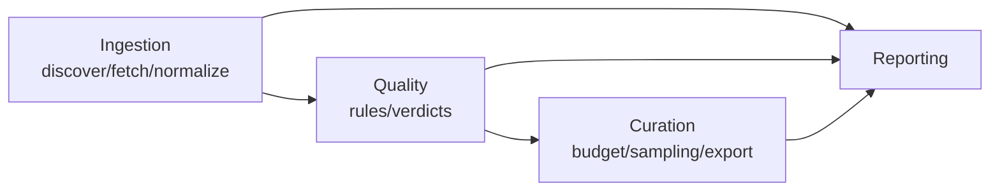

# Technical Design: Unified Ingestion and Quality Control for Multi-Source Robot Demonstration Data

Corresponding brief: [assessment_for_ai.md](assessment_for_ai.md).

This file is the **technical design**: it defines the domain model, the unified schema, the QC rules, the state machine, and the architectural layering. It is the single design authority during implementation. Scheduling and verification steps live in [implementation_plan.md](implementation_plan.md). When implementation collides with reality, **change this document before changing the code**, and record the reason in a corresponding `docs/adr/` entry.

---

## 0. Goals and Acceptance Alignment

The reviewer will do two things, and every design decision must satisfy them first:

1. Run once → kill the process **during the QC stage** → restart. It must resume from the checkpoint, not start over.
2. Run again. It must recognize that there is **no new data** and not re-ingest.

Two hard constraints follow directly:

- **The state machine must be persisted outside the process** (SQLite), and each episode's stage advance must be **committed in its own transaction** — not written to the database after a whole round finishes.
- **Every write is idempotent**: `(source_id, episode_uid, content_hash)` is the idempotency key; reprocessing updates rather than inserts a duplicate.

Everything else follows the priority order given in the brief: unified representation > QC specificity > incremental/resume > sampling judgment > engineering quality. AI usage is a parallel dimension, evidenced throughout (see §9).

---

## 1. Source Selection

Requirements: ≥3 sources, ≥2 storage formats, including one non-standard / non-single-arm source. We select 4 (the fourth is the evidence for graceful degradation, and is small in volume):

| #   | Source                                                             | Format                                                      | Embodiment                        | Action dim / semantics                                                                                                                      | Rate                                                                         | Cameras | Real/sim |
| --- | ------------------------------------------------------------------ | ----------------------------------------------------------- | --------------------------------- | ------------------------------------------------------------------------------------------------------------------------------------------- | ---------------------------------------------------------------------------- | ------- | -------- |
| A   | `lerobot/pusht`                                                    | Parquet + MP4                                               | 2D block pushing (not an arm)     | 2-D, end-effector xy position target                                                                                                        | 10 Hz                                                                        | 1       | sim      |
| B   | `lerobot/aloha_sim_insertion_human`                                | Parquet + MP4                                               | ALOHA bimanual                    | 14-D, bimanual joint positions + grippers                                                                                                   | 50 Hz                                                                        | 1–4     | sim      |
| C   | OXE `berkeley_autolab_ur5` 0.1.0 (read from the public GCS bucket) | RLDS TFRecord (episode→steps nesting)                       | UR5 single arm                    | 7-D physical (end-effector delta pose + gripper) + 1-D `terminate_episode` control flag                                                     | 5–10 Hz (no timestamps)                                                      | 3       | real     |
| D   | **EPIC-KITCHENS-100 (official release, taken by layer)**           | CSV/pickle annotations + JSON camera poses + IMU + long MP4 | Human hands / head-mounted camera | **Symbolic level**: (verb, noun) + time interval, an episode-level label; no per-frame continuous action. State has IMU(6) + camera pose(7) | events ~0.1–1 Hz; IMU **195 Hz measured**; video 29.97/47.95/50/59.94/90 fps | 1       | human    |

> **M0 status:** all four sources confirmed reachable, no substitution — see [ADR 000](adr/000-source-selection.md). Every cell in this table that M0 measured differently from the original draft has been corrected in place; the corrections are recorded in ADRs 001–004.

Selection rationale (to be written into the documentation):

- A's action is an **absolute task-space position (in pixels)**, B's is an **absolute joint-space position (in radians)**, C's is a **relative end-effector delta (in meters/radians)** — three physical meanings, three unit systems, three coordinate frames. This is exactly where "unified representation" is hardest, and it is far more convincing than picking three 7-DoF single arms.
- A and B share the LeRobot format but differ sharply in embodiment, dimensionality, and rate, which validates adapter reuse across "same format, different embodiment".
- **D is the only source where the action exists but lives at a different level of representation**: its action is a symbolic label ((verb, noun) + time interval), not a per-frame vector. A/B/C all have "per-frame fixed-width numeric vector" actions, so that implicit assumption in the schema would never be tested. D forces the orthogonal `SignalSpec.level` dimension (see §2.2a).
- **D is also the only source with mixed signal provenance and uneven capabilities within the source**: IMU is measured, camera pose is SfM-estimated, and action labels are human-annotated — three levels of trustworthiness inside a single episode. Moreover IMU covers only some videos, and pose covers only 671/700 videos. These two facts force `Provenance.signal_origin` (§2.2f) and the acceptance assertion that capabilities must be declared **per episode, not per source** (§1.1, point 5).

Scale control: 50–80 episodes per source, capped by `max_episodes` in `config/sources.yaml`. M0 measured the real episode lengths (A 124.5 frames avg, B exactly 500, C ~71 steps, D ~160), giving **≈50k frames total**. The earlier 80k–120k target is withdrawn: B has only 50 episodes upstream, so reaching 100k would mean padding the corpus with more of the trivial 2-D source A rather than adding representational diversity. Frame count is not a goal; cross-source heterogeneity is, and it is fully covered at 50k. See [ADR 000](adr/000-source-selection.md).

**Trade-off (must be stated explicitly in the documentation)**: `--no-video` is the default. For A and B we pull only the low-dimensional signals plus video **metadata** (HTTP Range read of the mp4 header / `ffprobe` for frame count and resolution — no full download). The cost: any QC that inspects pixel content (black frames, exposure anomalies, camera misalignment) degrades to **structural checks only** (frame-count consistency, missing camera streams, resolution consistency). A `--with-video` switch is provided; on a small sample (e.g. 5 episodes per source) it downloads full video and runs the complete pixel-level QC, proving the capability exists. D's official video is on the order of hundreds of GB and is likewise not fetched by default; with `--with-video`, a local mirror is preferred (see §1.1, point 6), but frame indices must be recomputed at the mirror's fps.

**C is the exception — this trade-off does not hold for it**: RLDS embeds images **as arrays inside the same records as the actions**; there is no separate mp4 to skip. `--no-video` is a no-op for C: it saves no bandwidth, only decoding and disk writes. C therefore records `CameraSpec.encoding="inline_frames"`, with `has_rgb=True` but `has_video=False` (see §2.2e), and rules that depend on `has_video` resolve to `SKIPPED` on C. Without stating this, the trade-off described above would be wrong for a quarter of the sources.

### 1.1 Landing details for source D (EPIC-KITCHENS-100, official release, taken by layer)

**First, two incorrect conclusions from the previous revision are corrected here**, because both would have derailed D's entire design (both should also be written into `docs/ai/rejected.md`, see §9):

1. ~~"A local copy already exists, so that is the data source."~~ The local 512×288 / 30fps copy is a **re-encoded derivative produced for another project**. Treating it as authoritative would bind every frame index in the corpus to a non-official fps. **The official release is authoritative**; the local copy is demoted to an **optional mirror** — and its new role is more valuable: it verifies that when the same episode exists in two copies at different fps, `provenance` can express the difference and frame indices get recomputed (see point 6).
2. ~~"D has no action and no state."~~ **This is wrong.** D's action exists; it merely lives at a **different level of representation**: a "(verb, noun) + time interval" symbolic label rather than a per-frame continuous vector. Furthermore the EPIC-KITCHENS ecosystem contains **two genuinely per-frame physical signals** (IMU and camera pose). Writing `ActionSpec.space="none"` is not graceful degradation — it records information that exists as information that does not, which is a more insidious form of corruption than zero-filling.

#### Officially available data layers (verified)

| Layer                                     | Contents                                                                                        | Volume              | This round                                                 |
| ----------------------------------------- | ----------------------------------------------------------------------------------------------- | ------------------- | ---------------------------------------------------------- |
| `epic-kitchens-100-annotations` (GitHub)  | 89.9K action segments; 97 verbs / 300 nouns; 20.5K natural-language narrations; official splits | ~50 MB, CI-viable   | **Required**                                               |
| **EPIC-Fields** (NeurIPS'23)              | **6-DoF camera extrinsics + intrinsics** for 671 videos / 18.7M frames (COLMAP reconstruction)  | one JSON per video  | **Required**                                               |
| **IMU** (bundled with Extended Sequences) | Gyroscope + accelerometer (built into the head-mounted camera)                                  | moderate, per video | **Take (a few videos only)**                               |
| VISOR (NeurIPS'22)                        | 271K manual masks + 9.9M densely interpolated masks + 67K hand-object relations                 | large               | Not taken; registered as a known limitation (§11)          |
| EPIC-SOUNDS                               | 117.5K audio events / 44 classes                                                                | —                   | Not taken                                                  |
| Video itself                              | 700 long videos, native 1080p @ 29.97 / 47.95 / 50 / 59.94 / 90 fps                             | hundreds of GB      | Not taken by default; `--with-video` uses the local mirror |

A single annotation record (equivalent view of the official CSV):

```json
{
  "narration_id": "P01_01_16",
  "participant_id": "P01",
  "video_id": "P01_01",
  "start_timestamp": "00:00:00.14",
  "stop_timestamp": "00:00:03.37",
  "narration": "open the door",
  "verb": "open",
  "verb_class": 3,
  "noun": "door",
  "noun_class": 3
}
```

#### Key decisions

**1. Episode granularity = one action segment, not a whole video.** `P01_01` runs 1652 seconds (≈80k frames @50fps) and is semantically equivalent to an entire capture session; a `segment` (a few seconds) is what corresponds to a single demonstration trajectory in robot data. `episode_uid = "epic100:P01_01_16"` — the official `narration_id` is used directly because it is a **stable upstream ID**, so unlike C, D does not need a synthesized `upstream_id` (see §5).

**2. D's action is `level="episode_label"`, not `space="none"`.** This relies on the `SignalSpec.level` dimension added in §2.2a:

- `task = "open door"` (verb + noun concatenated), occupying the same slot as C's `language_instruction`; the original narration plus `verb_class` / `noun_class` go into `raw_extra`.
- `has_action = True`, `ActionSpec.level = "episode_label"`, `physical_dim = 0`, and `frames.parquet` has **no** action column at all (not a column of NULLs — no column).
- Rules that depend on per-frame numerics (`ACTION_RANGE` / `ACTION_JERK` / `GRIPPER_STUCK`) resolve to `SKIPPED(reason=action_level_is_episode_label)` on D — a specific reason, rather than a vague "no action".

**3. D's state is a genuinely per-frame signal, and D is the only one of the four with mixed provenance.** Two channel groups:

| Channel group | Origin       | `role` | `space`                   | `unit`  | `metric_convertible`               | `origin`    |
| ------------- | ------------ | ------ | ------------------------- | ------- | ---------------------------------- | ----------- |
| `gyro[3]`     | IMU measured | `head` | `imu_angular_velocity`    | `rad/s` | **True**                           | `measured`  |
| `accel[3]`    | IMU measured | `head` | `imu_linear_acceleration` | `m/s^2` | **True**                           | `measured`  |
| `cam_t[3]`    | EPIC-Fields  | `head` | `camera_translation_abs`  | `None`  | **False** (SfM scale is arbitrary) | `estimated` |
| `cam_q[4]`    | EPIC-Fields  | `head` | `camera_rotation_abs`     | `None`  | False                              | `estimated` |

`cam_q` has `rotation = {"repr": "quat_wxyz", "compose": None}` (absolute rotations have no composition-order ambiguity) and `frame = "world"`.

**The IMU units above are now measured, not copied** ([ADR 004](adr/004-epic-frame-fps-and-imu-units.md)). On `P01_101` (362,865 samples): mean |accel| = **9.8998**, which is $g$ to within 0.9% — so accel is `m/s^2`, not $g$; and gyro has p50 = 0.083, p99 = 1.85, max = 4.74, which is `rad/s` (in `deg/s`, real head motion would reach the hundreds). The sample step is a constant 5.128205 ms — **195 Hz**, not the ~200 Hz previously assumed. The IMU clock and the video clock are therefore genuinely different; the IMU must not be resampled into the frame table, and is stored as an independent signal stream in `streams/imu.parquet` (see §2.2h).

This group stacks, for the first time, holes that earlier sources exposed only individually: C forced only `Channel.rotation`, and A forced only `metric_convertible=False` (and only for 2D pixels). D provides **a full 6-DoF pose that is simultaneously non-convertible** — an SfM reconstruction has no absolute scale, which is not "we could not find the unit" but "mathematically there is no scale". Hard-coding `unit="m"` would make downstream consumers treat reconstruction coordinates as meters.

**4. New `Provenance.signal_origin` (see §2.2f): `measured` / `estimated` / `interpolated` / `annotated` / `synthesized`.** This is not pedantry; it directly changes QC semantics:

- A jump in a COLMAP pose is **most likely a reconstruction failure, not data corruption**. EPIC-Fields registered only 18.7M of ~20M frames, and **unregistered frames have NULL pose** (not zero, not interpolated).
- Therefore: for channels with `origin != "measured"`, numeric rules have their severity **automatically downgraded one level** (FAIL → REVIEW), and the `reason` must state the basis for the downgrade.
- A/B/C states are entirely `measured`, so this rule is an identity transform on them — **only D can verify that it actually works**.

**5. Capabilities are uneven within the source — D's most distinctive property, and the hardest to substitute.** IMU covers only the EK-100 extension (the older EK-55 videos lack it); EPIC-Fields covers 671/700 videos, and **per-frame** coverage may still have gaps. So under a single `source_id`, different episodes have **different** `Capabilities`.

M0 confirmed both halves empirically: `P01_101` serves its gyro and accl CSVs, while `P01_01` returns **404** for both — `has_imu` is `True` and `False` for two videos of the same participant. And within `P28_101`'s pose layer, 35,823 of 35,885 frames are registered (**99.83%**) with inter-index gaps up to **22 frames**, so per-frame coverage gaps are real too. Both videos are pinned in `config/sources.yaml` so the property is reproducible, not incidental.

A/B/C are internally uniform and can never surface this. The schema in §4 already places `capabilities_json` on the `episodes` table (per episode) — **D is the only source that can prove this design is not decorative**. Hence an added acceptance assertion: two episodes under the same `source_id` have different `capabilities_json`, and their QC conclusions differ accordingly (one `PASS`, one `SKIPPED` on the corresponding rule).

**6. The local mirror's new role: a consistency check target, not a data source.**

```json
"provenance": {
  "is_original": true,
  "upstream_revision": "epic-kitchens-100-annotations@<sha>",
  "timestamp_source": "annotation_seconds",
  "frame_index_source": "derived_from_seconds@<extraction_fps>",
  "signal_origin": {"gyro": "measured", "accel": "measured",
                    "cam_t": "estimated", "cam_q": "estimated",
                    "task": "annotated"},
  "mirrors": [{"kind": "local_transcode", "fps": 30, "resolution": [512, 288],
               "note": "re-encoded for a prior project; frame indices differ from official"}]
}
```

Iron rule: **seconds are authoritative, frame indices are derived**. M0 measured just how sharp this is ([ADR 004](adr/004-epic-frame-fps-and-imu-units.md)). Official fps takes **five** distinct values across the 700 videos (59.94×423, 50×268, 29.97×4, 47.95×4, 90×1), not the two assumed here. Worse, the annotation CSV's own `start_frame`/`stop_frame` are **not** at the official fps: tested against all 67,217 train segments, `floor(seconds × official_fps)` reproduces only **58.1%** of them, while "50 fps videos at 50, everything else at a flat **60**" reproduces **100.00%**. So the frame indices are at an _extraction_ rate that differs from the video's real rate for 42% of the corpus. EPIC-Fields pose indices, by contrast, _are_ 1-based at the official fps (verified on `P28_101`: 35,889 max index vs 35,885 expected frames, ratio 1.0001).

Hence `frame_index_source` must carry the **extraction** fps, not the official fps — `derived_from_seconds@50` or `derived_from_seconds@60`, resolved per video from `EPIC_100_video_info.csv` via `epic100.frame_extraction_fps` in `config/sources.yaml`. Storing only frame indices means the whole corpus silently breaks when the copy changes; a bare `derived` is illegal. Costs: (a) with `--with-video` on the local mirror, pixel-level conclusions hold only for that mirror and cannot be extrapolated to official video; (b) 288p is insufficient for fine-grained hand/contact judgments, so no visual labels are produced this round.

**7. Boundaries and goals: instructions exist, adjudication does not.** `EpisodeBoundary.termination_source = "annotator"`, `end_reason = "annotation_bound"`, `success = None`. But **D's `None` and C's `None` mean different things**: C means "an adjudication mechanism exists, but this episode's outcome is unknown", D means "no adjudicator exists in this system at all". `EpisodeBoundary` therefore gains `success_adjudicator: "simulator" | "policy" | "operator" | "none"` (see §2.2g) — otherwise downstream cannot distinguish "label missing, can be filled in" from "label cannot exist".

**8. Sample selection and scale.** Pick 5–8 videos spread across participants, including **at least one with IMU and one without** (deliberately creating uneven capabilities), taking the first N segments of each video, capped by `max_episodes` in `config/sources.yaml`. Total volume is in the thousands to ten thousand frames — D's value is **demonstrating representation-level degradation, mixed provenance, and uneven in-source capabilities**, not adding bulk.

**9. Availability, licensing, and privacy.** The official annotations and EPIC-Fields are publicly downloadable under **CC BY-NC 4.0 (non-commercial)**, which must be recorded in the README and in the `license` field of the `sources` table. Which layers to take is declared by `layers: [annotations, camera_pose, imu]` in `config/sources.yaml`. The local mirror's absolute path appears only in `config/sources.local.yaml` (gitignored); the repository contains a `${EPIC_KITCHENS_MIRROR}` placeholder. **If any layer is unavailable, only that layer degrades — the whole source must not fail.** Layer availability rides on the same capability-declaration mechanism as episode-level capabilities; this is "degrade, don't error" applied at the data-source level.

---

## 2. Unified Schema Design (the core — think it through before writing code)

### 2.1 Three-level structure

```
Source (dataset level) → Episode (trajectory level) → Frame (frame level)
```

- **Source**: source_id, upstream URI, format kind, download snapshot version (HF revision / commit sha).
- **Episode**: embodiment information, capability declaration, timing information, QC conclusions, pointer to the frame data file.
- **Frame**: per-frame low-dimensional signals, stored as Parquet (not in SQLite; SQLite holds only the catalog and statistics).

### 2.2 Key design decisions

**a. Action space: do not force everything into one vector. Group and preserve, with structured labels.**

Rationale: cramming 2-D xy, 14-D joint angles, and 7-D delta poses into a single space requires zero-padding and arbitrary rescaling. That is irreversible information destruction, and downstream training cannot recover the semantics. Instead:

```python
SignalSpec = {                         # shared value object for action and state; see "b'" below
  "is_command": bool,                  # True = commanded target (action); False = measured readback (state)
  "level": "per_frame_continuous"      # A/B/C: per-frame fixed-width numeric vector
         | "per_frame_discrete"        # per-frame discrete (e.g. contact state)
         | "episode_label"             # D: one (verb, noun) symbolic label per segment
         | "absent",                   # genuinely absent
  "space": "joint_position" | "ee_pose_abs" | "ee_pose_delta" | "cartesian_2d"
           | "camera_pose_abs" | "imu"
           | "mixed" | "none" | "unknown",
                                       # **derived summary**: "mixed" when physical channels
                                       # disagree; "unknown" when upstream semantics are unclear
                                       # (C's state[15]) — guessing is forbidden
  "dim": int,                          # total stored column width; always 0 when level is not per_frame_*
  "physical_dim": int,                 # number of physical channels (statistics/thresholds use only these)
  "channels": [ Channel, ... ],
  "is_delta": bool,                    # **derived summary**: any(c.is_delta for c in physical channels)
  "clock": "frame" | "own_timeline",   # see 2.2h: own_timeline signals never enter frames.parquet
}

Channel = {
  "name": "left.gripper",
  "group": str | None,                 # logical vector group ("cam_q" / "ee_delta"...): the anchor for
                                       # cross-channel invariants (unit quaternion norm, shared frame
                                       # for xyz); None for standalone scalars
  "role": "joint" | "end_effector" | "gripper" | "base" | "head"
          | "control_flag" | "unknown",
  "space": "joint_position" | "ee_translation_abs" | "ee_translation_delta"
           | "ee_rotation_abs" | "ee_rotation_delta" | "cartesian_2d"
           | "camera_translation_abs" | "camera_rotation_abs"
           | "imu_angular_velocity" | "imu_linear_acceleration"
           | "gripper" | "flag" | "unknown",  # the single source of truth for semantics (see C below)
  "origin": "measured" | "estimated" | "interpolated"
            | "annotated" | "synthesized",  # measured, computed, or written by a human
  "is_delta": bool,                    # per channel: C's poses are deltas, its gripper command is absolute
  "frame": "base" | "tool" | "world" | "camera" | "sensor" | None,  # non-null only for pose/inertial channels
  "unit": "rad" | "m" | "px" | "rad/s" | "m/s^2" | "normalized" | None,
  "metric_convertible": bool,          # convertible to SI? pusht's px, normalized gripper aperture,
                                       # and SfM camera translation (arbitrary scale) are all False
  "arm_id": "left" | "right" | None,
  "is_physical": bool,
  "min": float | None, "max": float | None,
  "rotation": {                        # non-null only when space starts with ee_rotation / camera_rotation
      "repr": "axis_angle" | "rotvec" | "euler_xyz" | "euler_zyx"
              | "quat_wxyz" | "unknown",
      "compose": "pre" | "post" | "unknown" | None,  # composition order for delta rotations: ΔR·R or R·ΔR;
                                                     # None for absolute rotations (D's cam_q)
  } | None,
  "gripper": {                         # non-null only when role == "gripper"
      "convention": "0=closed,1=open",
      "original_convention": "continuous_width" | "-1=close,+1=open" | ...,
      "inverse": {"scale": float, "offset": float},   # parameters of the inverse normalization
  } | None,
}

ActionSpec = SignalSpec(is_command=True)
StateSpec  = SignalSpec(is_command=False)
```

The only thing genuinely unified is **channel-level metadata**: every channel must carry `role`, `space`, `is_delta`, `unit`, `metric_convertible`, `arm_id`, `is_physical`, and value range. Downstream can process generically across embodiments by role, or bucket by space for training.

**Three corrections relative to the first draft, all forced by source B**:

- **`gripper` moved from spec level down to channel level.** The draft's `{"indices": [6], "convention": ...}` assumed one gripper per episode; ALOHA has **two**, belonging to different `arm_id`s, potentially with different conventions and inverse parameters. §2.2b also requires preserving the inverse transform parameters, and the draft had nowhere to put them.
- **Added `metric_convertible` (channel level).** §2.2b and Appendix A.A.2 both assert this must be a channel-level attribute, but the draft's schema block lacked the field. B's 14 dimensions are the strongest evidence: 12 `rad` channels are convertible, 2 normalized gripper apertures are not — **two different values inside one vector**.
- **`role` enum corrected to `joint / end_effector / gripper / base / head / control_flag / unknown`.** The draft said `arm`, but Appendix A.A.3 assigns `role="end_effector"` to pusht — the two did not match. B's 12 joints are `joint` (interpolatable), A's xy is `end_effector`; the semantics differ, and §2.2c's "interpolation method depends on role" relies on the distinction.

**Four corrections relative to the previous revision, forced by source C** (B pushed `unit` / `gripper` down to the channel level; C shows that was not deep enough):

- **`space` / `is_delta` / `frame` also move from spec level down to channel level.** Three different things live in C's action vector: `world_vector` / `rotation_delta` are delta poses (base frame, m / rad), `gripper_closedness_action` is a **ternary change command** (`+1` close, `−1` open, `0` no change — measured in M0; see [ADR 003](adr/003-oxe-action-vector-is-8d.md)), and `terminate_episode` is a flag. So `is_delta` is `true` for C's gripper and `false` for B's, **within the same `role`** — no spec-level attribute can express that, and §2.2a itself requires bucketing cross-source statistics by `is_delta` first, so the lie would propagate into every statistic and every threshold. B had the same disease (`space="joint_position"` is false for its 2 gripper channels), just not in a load-bearing position. Spec-level fields are retained as a **derived summary** (a cheap gate for `STATE_ACTION_ECHO`); the channel level is the truth.
- **Added `Channel.rotation` (rotation representation and composition order).** `rotation_delta[3]` with `unit="rad"` is still insufficient to determine the semantics: three numbers could be axis-angle, a rotation vector, Euler XYZ, or Euler ZYX. Not knowing which makes the data impossible to integrate, compare, or convert — effectively unreadable. A has no rotations and B's radians are joint angles (no convention needed), so **only C exposes this hole**. M0 recovered half the answer from upstream's own field description ("Delta change in roll, pitch, yaw" → `repr="euler_rpy"`) and confirmed the other half is genuinely unstated (`compose="unknown"`). Per this section's "do not guess" principle, `unknown` is a legal value, but the field must exist.
- **`raw_extra` must be split by granularity** (episode level vs frame level, see the end of §2.2d) — nearly all of C's unmodeled upstream fields are per-step.
- **`Capabilities.has_video` must split into `has_rgb` / `has_video`, and the missing `CameraSpec` must be added** (see §2.2e) — C's frames are embedded in the records, and it has a wrist camera.

**Two corrections relative to the previous revision, forced by source D** (A/B/C pushed semantics down to the channel level; D shows two **orthogonal dimensions** were still unmodeled):

- **Added `SignalSpec.level` (representation level) — the most deeply hidden assumption in the schema.** A/B/C actions are all "per-frame, fixed-width, numeric vectors", so the entire `SignalSpec` grew around that shape — an assumption that was never written down and never tested. D's action is `(verb, noun) + [t_start, t_end]`: **not "no action", but an action living at another level**. The previous revision's `ActionSpec.space="none"` recorded "information exists" as "no information", which is more insidious than zero-filling, because zero-filling at least shows up as an anomaly in the numeric distribution while `space="none"` is a plausible-looking lie. With `level`, `has_action=True` and `physical_dim=0` can hold simultaneously, rule gating extends from `required_capabilities` to `required_capabilities + required_level`, and the `SKIPPED` reason changes from "no action" to "action is an episode-level label".
- **Added `Channel.origin` (measured, computed, or human-written).** Every state channel in A/B/C is `measured`, so the trustworthiness dimension did not exist at all. A single D episode contains three provenances at once: IMU is sensor-measured, camera pose is COLMAP-**estimated** (96% of frames registered, the rest NULL), action labels are human-**annotated**. This directly changes QC semantics — a jump in an SfM pose is most likely reconstruction failure rather than data corruption, so judging it FAIL by `measured` standards is friendly fire (see the severity downgrade in §3). `origin` sits at the channel level rather than the episode level for exactly the same reason `unit` / `gripper` did: **two kinds coexist inside a single vector**.

**b'. `state` must have a spec too, not just `action`.**

This was the largest structural gap in the first draft, and B makes it unavoidable: B's `observation.state` and `action` are a pair in the **same space, same dimensionality, same channel semantics** (target vs measured), while C's `observation.state[15]` is barely documented even in its dataset card. Without a `StateSpec`, three things become impossible:

1. `STATE_ACTION_ECHO`'s precondition ("same space, same dimensionality") **cannot be expressed in the data**, so the rule can only be gated by a fragile guess like equal column width;
2. Appendix A.C.7's "when the semantics are unclear, write `state=NULL`" has nowhere to land — it now becomes `StateSpec.space="unknown"` plus channel `role="unknown"`, an explicit declaration that is **queryable and skippable by rules** rather than a silent absence;
3. §8.4 invariant 3 (no zero-filling) covered only action, with no symmetric constraint on the state side.

Reusing one value object rather than writing a second class is justified because the field requirements are identical; the only difference is `is_command` — itself a field Appendix A.B.3 required but the draft omitted.

**The `control_flag` role is necessary, not filler**: C's action vector contains `terminate_episode` (a one-hot control flag emitted by the policy to say "I am done"). It sits in the same vector as `world_vector` (m) but has no unit, no physical limits, and a completely different variation pattern (a 0→1 step in the final frame). Treating it as a physical channel would make `ACTION_RANGE`'s limits meaningless and cause `ACTION_JERK` to **fire on every single C episode**. Therefore: all cross-channel statistics (mean/std/travel/jerk/limits) are computed only over channels with `is_physical == True`, and `dim` and `physical_dim` must be stored separately.

**b. Numeric normalization: unit and convention normalization only, no min-max scaling.**

- Unit normalization: angles in rad, lengths in m, time in seconds (float64, starting from 0 within an episode). **Units live on channels, not on episodes**: 12 of ALOHA's 14 dimensions are joints in rad and 2 are normalized gripper apertures — mixed units inside one vector. Non-convertible values keep their original unit and are marked `metric_convertible=false` (pusht's action is in **pixels**; without a scene scale it cannot become meters, and forcing it would be fabrication).
- Convention normalization: grippers are normalized to `0=closed, 1=open` (recording the original convention and preserving the inverse parameters; OXE commonly uses `-1=close/+1=open`, ALOHA uses a continuous aperture).
- Statistics (per-channel mean/std/min/max/p1/p99) are **computed and stored in metadata only**; raw values are never rewritten. Rationale: normalization parameters are a training-side hyperparameter, and scaling the data at ingestion time would force a full re-ingest whenever the policy changes.

**c. Frame rate: no resampling. Preserve as-is and record explicitly.**

Keep `fps_nominal` (upstream declaration) and `fps_effective` (measured from the median timestamp interval). Optional resampling (nearest / linear, with the interpolation method chosen by channel role — joint angles interpolate, binary grippers do not) is offered **at export time**, not at ingestion. Rationale: ingestion is the single source of truth; every lossy transform is deferred to the export layer so that everything remains traceable.

**d. Lossless / lossy boundary (the documentation must enumerate this)**

| Must be lossless                                                                             | May be lossy                                              | May be discarded                                                         |
| -------------------------------------------------------------------------------------------- | --------------------------------------------------------- | ------------------------------------------------------------------------ |
| Raw action / state values (unit conversion is reversible; conversion factors recorded)       | Video (transcoding, frame sampling, metadata only)        | Upstream internal debug fields (e.g. the redundant `frame_index` column) |
| Timestamps, episode boundaries, frame order                                                  | Image resolution                                          | Upstream inline padding / empty steps                                    |
| Original task language instruction                                                           | —                                                         | License/readme prose unrelated to trajectories (keep a URI reference)    |
| **Per-frame reward + the `terminated`/`truncated` distinction** (see the correction below)   | Depth maps (not processed this round; existence recorded) | Redundant mirrors of `discount` and `done`                               |
| Embodiment/camera topology metadata, control-flag channels such as `terminate_episode`       | —                                                         | —                                                                        |
| **Annotation interval seconds** (D's authoritative time), `Channel.origin` / `signal_origin` | Frame indices (recomputable from seconds + fps)           | —                                                                        |

**Correction regarding reward (the original plan classified it as "may be lossy", which was wrong)**: pusht's `next.reward` is the **polygon overlap ratio** between the T block and the goal region, and the dataset does not store the T block's pose at all (`observation.state` contains only the pusher's xy). So this value **can never be recomputed once discarded**. Behavior cloning indeed does not need it, but offline RL (IQL / CQL / Decision Transformer) treats it as the core supervision signal — the ingestion layer has no authority to make that decision on downstream's behalf. The cost argument does not hold either: one float per frame, a few hundred KB across all sources. Likewise, if control-flag channels such as `terminate_episode` are to be dropped, that must be recorded in `provenance.transforms` (`{"op": "drop_channels", ...}`) rather than silently disappearing.

Upstream fields that cannot be mapped into unified fields are all preserved, but **must be stored at the correct granularity**: episode-level fields go into `raw_extra` (JSON); frame-level fields stay as **extra columns in `frames.parquet`** with a `raw.` prefix, and the column list is recorded in `episode.json`'s `raw_frame_columns`. This rule was forced by source C: nearly all of C's unmodeled upstream fields are per-step (`discount`, `is_first/is_last/is_terminal`, `language_instruction`, `language_embedding`). Stuffing per-frame data into an episode-level JSON blob makes it neither queryable nor usable — "never discard information we do not understand" would lose its landing mechanism precisely where it is needed most.

**e. Graceful degradation for missing modalities: capability declarations.**

```python
Capabilities = {                        # **per episode, not per source** (see D's note below)
  "has_action": bool, "has_state": bool, "has_gripper": bool,
  "has_rgb": bool,                      # any RGB imagery exists (including C's inline frames)
  "has_video": bool,                    # a **decodable standalone video file** exists (what QC rules depend on)
  "has_language": bool, "has_reward": bool, "has_depth": bool,
  "has_imu": bool,                      # some D episodes have it, some do not
  "has_camera_pose": bool,              # D: only episodes EPIC-Fields reconstructed successfully
  "has_termination_signal": bool,       # whether an explicit "it ended" signal exists in the data
  "is_real_robot": bool, "is_teleop": bool,
}

CameraSpec = {                          # the value object behind episodes.camera_json (previously a column with no definition)
  "name": "image" | "hand_image" | "top" | ...,
  "mount": "static" | "wrist" | "head" | "unknown",
  "resolution": [h, w], "channels": int,
  "encoding": "mp4_sidecar" | "inline_frames" | "absent",
  "is_present": bool,
}
```

- Source D has `has_action=True` (but `ActionSpec.level="episode_label"`, `physical_dim=0`, and **no** action column in `frames.parquet`), `has_language=True` (verb+noun is the instruction), `has_rgb`/`has_video` depending on `--with-video`, and `has_imu` / `has_camera_pose` that **differ per episode**. The previous revision's `has_action=False` + `ActionSpec.space="none"` was wrong; see the D-forced corrections in §2.2a.
- **`Capabilities` must be stored per episode, and only D can falsify the alternative.** A/B/C are internally uniform, so hanging capabilities off the source would work and the flaw would never surface. D's IMU covers only some videos and EPIC-Fields only 671/700, so two episodes under one `source_id` necessarily differ. §4's schema already places it on the `episodes` table — D moves that design from "looks right" to "verified". Hence the acceptance assertion: two episodes exist that share a source, differ in capability, and differ correspondingly in QC outcome (one `PASS`, one `SKIPPED` on the corresponding rule).
- **`has_rgb` / `has_video` must be split and `CameraSpec` must carry `mount` and `encoding` — both forced by source C**:
  - C's imagery is **an array embedded in the TFRecord records**, not a standalone mp4. Setting `has_video=True` uniformly would enable `VIDEO_FRAME_MISMATCH` (which compares mp4 frame count against parquet row count) on a source that has no mp4 at all; split apart, it cleanly resolves to `SKIPPED` on C.
  - C's `hand_image` is a **wrist camera that moves with the gripper**; A/B cameras are fixed. "Violent image change" is normal on a wrist camera and anomalous on a fixed one; without `mount`, QC can only pick one and be wrong about the other. Downstream training treats the distinction as first-class as well.
- **QC rules declare which capabilities they depend on**, and when unmet the verdict is `SKIPPED` (with the reason recorded), not `FAIL` — this is the line between "degrading" and "erroring", and the point where a reviewer can most easily judge competence.

**f. Provenance: distinguish "upstream fact" from "something we computed".**

All sources contain fields that look like data but are actually inferences; not marking them causes QC false positives directly:

```python
Provenance = {
  "is_original": bool,                 # whether the data passed through intermediate processing
  "timestamp_source": "real" | "synthesized@<hz>" | "annotation_seconds",
  "frame_index_source": "upstream" | "derived_from_seconds@<fps>",
  "signal_origin": {channel_name: "measured" | "estimated" | "interpolated"
                                  | "annotated" | "synthesized"},
  "transforms": [ ... ],               # record of lossy transforms (transcoding, downsampling...)
  "mirrors": [ ... ],                  # other copies of the same data and how they differ (D's local re-encode)
  "upstream_revision": str,
  "adapter_version": str,              # version of the adapter code that produced this record; together with
                                       # episode.json's top-level schema_version it forms the staleness
                                       # predicate (see §5, §8.7)
}
```

Typical values: A/B = `real` timestamps; C = `synthesized@5Hz` (RLDS steps have no timestamps at all); D = `annotation_seconds` + `derived_from_seconds@<official_fps>`.

**`signal_origin` is new relative to the previous revision, forced by D** (same origin as `Channel.origin`; this is the episode-level summary view): every state channel in A/B/C is `measured`, so the dimension did not exist; a single D episode has measured IMU, SfM-estimated camera pose, and human-annotated action labels. **It must affect QC severity** (see §3): judging an `estimated` channel by `measured` standards is systematic friendly fire, because COLMAP jumps come from reconstruction failure, not from corrupted data.

**g. Episode boundaries: record not just "where it ended" but "who decided it ended".**

"Why did this trajectory end here" has four completely different mechanisms across the four sources, and the same concept occupies **different structural positions** in the schema: A/B's end signal is a **label produced by the environment** (`next.done`), C's is an **action channel emitted by the policy** (`action.terminate_episode`), and D's boundary is **an interval drawn by an annotator after the fact**. Not modeling this explicitly produces two classes of error: cross-source statistics treating control flags as physical quantities, and offline RL computing bootstrapping incorrectly. (The draft had a third class — export truncation manufacturing boundaries that do not exist upstream — eliminated entirely by the "no truncation on export" decision, see §6.)

```python
EpisodeBoundary = {
  "termination_source": "env_rule" | "policy_flag" | "operator" | "annotator",
                             # the draft also had "exporter", removed along with export truncation (§6):
                             # no enum value without a producer
  "end_reason": "success" | "truncated" | "operator_stop" | "annotation_bound" | "unknown",
  "is_truncated": bool | None,  # cut off by a step limit: the final state is not a terminal state.
                             # None = the upstream export merged terminated/truncated (A, B) — see §11
  "success": bool | None,    # None means "unknown", not False
  "success_adjudicator": "simulator" | "policy" | "operator" | "none",
                             # who is entitled to judge success; "none" = no adjudicator exists at all
}
```

Typical values: A = `env_rule / success` (coverage > 0.95 judged by the simulator) or `truncated`; B = `operator / operator_stop` (the teleoperator stopped recording); C = `policy_flag`, with `is_truncated` derived from `is_last & ~is_terminal`; D = `annotator / annotation_bound`, `success=None`.

**`success_adjudicator` is new relative to the previous revision, forced by D**: C's `success=None` and D's `success=None` look identical in the schema but mean the opposite — C means "the adjudication mechanism exists but this episode is unknown" (it can be labeled later), D means "no adjudicator exists in this system" (it cannot). Without this field, downstream would treat D as an under-labeled dataset and try to label it, or include D in the denominator when computing success rates.

**`terminated` and `truncated` must be stored separately — the single easiest thing to get silently wrong**: `is_terminal=True` means the trajectory genuinely terminated and value bootstrapping must be cut off ($V(s_T)=0$); `is_last=True, is_terminal=False` means it was merely cut by a step limit, the final state is an ordinary state, and bootstrapping must continue ($V(s_T) \neq 0$). Collapsing these into one `done` boolean makes every offline RL run trained on that export **silently wrong**.

**M0 answered the open question, and the answer is bad: for A and B the distinction is already destroyed upstream** ([ADR 002](adr/002-lerobot-v3-layout-and-lost-termination.md)). pusht exports `next.done`, `next.success`, `next.reward`; aloha exports `next.done` and _nothing else_. Neither `terminated` nor `truncated` exists in either dataset, so it cannot be recovered — `is_truncated = None` for A and B, and the loss is registered in §11. C is therefore the **only** source that can populate `is_truncated=True` honestly (from `is_last & ~is_terminal`), which is a further argument for keeping it.

**h. Multiple clocks: `frames.parquet` carries only the frame clock; other signal streams carry their own time axis.**

The schema contained one never-stated assumption: **one row = one frame, and all signals share a single clock**. A/B/C all happen to be single-clock sources, so like `level` it was never tested; D breaks it outright — IMU at **195 Hz** (measured), camera pose at video rate (50–60 fps), event annotations at ~0.3 Hz, all within one episode. Forcing the IMU into the frame table leaves only two options: resampling (violating §2.2c's "no resampling at ingestion") or row-count explosion. Neither is acceptable. Therefore:

- `frames.parquet` stores only signals aligned to the **frame clock** (D's camera pose aligns naturally once frame indices are derived at official fps);
- non-frame-clock signals go to `normalized/.../streams/<stream_id>.parquet` with their own `t` column (seconds from 0 within the episode), each stream carrying its own `SignalSpec` (stored in `episode.json`'s `stream_specs`);
- `SignalSpec` gains `clock: "frame" | "own_timeline"`, with the hard constraint in §8.4 invariant 17;
- frame-aligned views are produced **at export time** (nearest neighbor / window aggregation, with the method chosen by role), following the same principle as §2.2c: the ingestion layer preserves fidelity, and lossy operations are deferred to export and recorded with their parameters.

D's state therefore splits in two: camera pose (`clock="frame"`, 7-D, in the frame table) and IMU (`clock="own_timeline"`, 6-D, in `streams/imu.parquet`); `Capabilities.has_imu` is unchanged in meaning. The example in Appendix A.D reflects this.

### 2.3 Unified reading

Each source implements a `SourceAdapter` with only three methods:

```python
class SourceAdapter(Protocol):
    def list_episodes(self) -> Iterator[EpisodeRef]: ...      # list only, no download
    def fetch(self, ref: EpisodeRef) -> RawEpisode: ...       # pull into local staging
    def normalize(self, raw: RawEpisode) -> CanonicalEpisode: ...
```

- `LeRobotAdapter` (shared by A and B, driven by `meta/info.json` for channel mapping)
- `RLDSAdapter` (C, read via `tfds`; if the TF dependency proves too heavy, fall back to parsing tfrecord + dataset_info.json directly — validate this technically first)
- `EpicKitchensAdapter` (D, a **multi-layer source**: annotations CSV + EPIC-Fields pose JSON + IMU, each layer independently available → per-episode `Capabilities`; with `--with-video`, additionally `ffprobe` the local mirror's header)
- `HDF5Adapter` reserved (robomimic/ALOHA), promoted to a replacement if C's TFDS environment proves unworkable.

**Risk front-loading**: installing TFDS/TensorFlow on macOS + modern Python is this project's largest uncertainty. **Spike it on day one**; if it fails, switch to HDF5 immediately (the brief permits swapping in an equivalent dataset).

### 2.4 On-disk layout

```
store/
  raw/<source_id>/<episode_uid>/…          # staging, disposable
  normalized/<source_id>/<episode_uid>/
      frames.parquet                        # per-frame low-dim signals (frame clock, see 2.2h)
      streams/<stream_id>.parquet           # non-frame-clock signal streams (e.g. D's IMU), with own t column
      episode.json                          # metadata + specs + capabilities + schema_version
  catalog.sqlite                            # catalog + state machine + QC results + run reports
  exports/subset_<ts>.jsonl
```

Principle: **bulk data on the filesystem, metadata and state in SQLite**. SQLite holds only pointers and statistics, keeping the database file small, queries fast, and backups easy.

**Column-name contract**: Appendix A.C.1 states that the channel expansion order is an external contract; that contract must be expressed in **column names**, not column positions. `frames.parquet` columns are fixed as `t` (seconds from 0 within the episode), `action.<channel.name>`, `state.<channel.name>`, `raw.<upstream field name>`. Physical column order equals the declaration order of `channels` in the spec, but consumers must always select by name — positional indexing is not part of the contract. Stream files follow the same rule (`t` + `<channel.name>`).

### 2.5 Why materialize a `normalized/` layer instead of "store the source as-is and convert with an adapter at read time"

This is the one fork in this design where both paths are defensible, so the trade-off must be spelled out. Note the question narrows: **adapters exist in both designs**; the actual disagreement is whether `normalize()`'s output is **computed once at ingestion and written to disk** or **recomputed on every read**. That is the classic ETL vs. virtual-federation split, and the deciding factors are: **read amplification × per-read decoding cost × whether an immutable artifact is needed to carry conclusions**.

Reasons for materializing:

1. **Read costs across the four sources are wildly asymmetric.** RLDS/TFRecord is a nested sequential stream, so "fetch frames 100–160 of episode 47" is O(scan) and drags TensorFlow into the reading process; Parquet row groups turn the same operation into one seek. Training will read the same episode hundreds of times while normalization runs once — **paying an RLDS decode per epoch to save disk is the wrong side of the trade**.
2. **Blast radius of dependencies.** §2.3 already flags TFDS on macOS as the top risk. If normalization happens at read time, that risk becomes a permanent dependency of **every downstream consumer**; materializing isolates it in a one-off batch job, and downstream needs only `pyarrow`.
3. **QC conclusions must point at bytes that will not change.** `episode_x: ACTION_JERK=REVIEW` is meaningful only if it describes a fixed artifact. With read-time normalization the conclusion describes **the output of a function**: upgrade an adapter or change the expansion order of an RLDS action dict, and every stored conclusion is silently invalidated with no way to detect it. The `IngestionStage` machine in §5 is the same story — it needs a stable object identity to advance against. An artifact plus a checksum is what makes a conclusion falsifiable.
4. **An "external contract" requires materialization to exist.** Appendix A.C says the channel expansion order becomes an external contract once fixed; a lazily computed order is not a contract, only "the current behavior of the current adapter". The written `episode.json` + `ActionSpec` is the contract itself.
5. **Cross-source sampling needs a uniform physical layout, not just a uniform logical view.** §6 selects a subset across A/B/C/D under a frame budget, which requires uniform random access and known frame counts. Across four incompatible IO models that is a distributed query; on uniform Parquet it is an index lookup.
6. **Errors concentrate in the normalization step.** Batch processing surfaces them all at once, lands them in the catalog, and gets them fixed; lazy computation surfaces them mid-way through the 400th training run, irreproducibly.

**The counter-case must be acknowledged**: when the corpus is enormous and reads are rare (normalizing 100 TB of OXE to use 1%), read-time adapters are the right answer. This design hedges that already — `list_episodes()` explicitly "lists but does not download", so **the catalog is lazy and only selected slices are materialized**.

Two accepted costs and their mitigations:

- **Storage doubles and the copy drifts from upstream** → `provenance` records the source revision/commit and the adapter version, making staleness detectable, and re-normalization targeted, idempotent, and resumable.
- **Early schema changes are expensive** (every `ActionSpec` change forces a re-run) → `normalized/` is defined as **derived, disposable, rebuildable** data, and `raw/` is always retained, so rebuilding is always possible.

**One final clarification, and the most easily misread point**: what is materialized here is **not "unified data"**. §2 explicitly refuses to unify values — no zero-padding, no forced common vector space; values stay in native units carrying `metric_convertible=false`. What is unified is only the **container and the metadata contract** (one file layout, channel-level `ActionSpec`, `Capabilities`, `Provenance`). This layer is therefore **re-encoding, not fusion**: lossless (anything unmodeled goes to `raw_extra`), reversible (`raw/` is retained), and fully recorded. Far from violating "lossy transforms must be traceable", it is the mechanism that implements that principle.

If the deliverable were only a catalog plus a QC report with no downstream training consumption, "don't materialize, convert at read time" would be the better answer; but §6 exports a trainable subset, so it is not.

---

## 3. QC Rules (target 10, minimum requirement 4)

Each rule is implemented as a `QCRule` declaring `rule_id / severity(FAIL|REVIEW) / required_capabilities / required_level / params`, and emitting `Verdict(PASS|FAIL|REVIEW|SKIPPED, metrics, reason)`.

| ID                        | Rule                                                                    | Criterion (initial values; tuned against real data later)                                                                                                                                                                                                                                             | Severity                                  | Depends on                                                                           |
| ------------------------- | ----------------------------------------------------------------------- | ----------------------------------------------------------------------------------------------------------------------------------------------------------------------------------------------------------------------------------------------------------------------------------------------------- | ----------------------------------------- | ------------------------------------------------------------------------------------ |
| `TS_MONOTONIC`            | Non-monotonic / duplicate timestamps                                    | any `dt <= 0`                                                                                                                                                                                                                                                                                         | FAIL                                      | `timestamp_source == real`                                                           |
| `FPS_DRIFT`               | Measured rate disagrees with nominal / dropped-frame gaps               | `abs(median_dt - 1/fps_nominal) / (1/fps_nominal) > 5%`, or a gap with `dt > 3×median_dt`                                                                                                                                                                                                             | REVIEW (FAIL if gaps exceed 1% of frames) | `timestamp_source == real`                                                           |
| `ACTION_RANGE`            | Action out of range / NaN / Inf                                         | **physical channels only**: outside the embodiment registry's channel limits (aloha joint limits, pusht's `[0,512]px`, UR5 delta ±0.1 m); any NaN/Inf                                                                                                                                                 | FAIL                                      | has_action                                                                           |
| `ACTION_JERK`             | Inter-frame discontinuity (jumps, packet-loss steps)                    | **physical channels only**: single-channel `abs(delta_a)` exceeds 5× that channel's p99.9 and the surrounding 2 frames are not smooth (excluding normal acceleration)                                                                                                                                 | REVIEW                                    | has_action                                                                           |
| `STATIC_EPISODE`          | Nearly motionless throughout / too short                                | frames < 20; or total travel over action **physical channels** below threshold; or 95% of frames have `abs(delta_state)` below the noise floor                                                                                                                                                        | FAIL                                      | —                                                                                    |
| `STATE_ACTION_ECHO`       | action written as a readback of state (capture-script bug)              | co-located `a_t` and `s_t` are **bit-identical** (`max abs(a-s) < 1e-9`) in > 90% of frames. **Correlation alone is not enough**: see the trap note below                                                                                                                                             | REVIEW                                    | has_action & has_state & same space, same dim                                        |
| `VIDEO_FRAME_MISMATCH`    | Video frame count disagrees with parquet rows / camera missing          | any camera with `abs(n_video - n_rows) > 1`; or fewer camera streams than the source declares                                                                                                                                                                                                         | FAIL                                      | has_video (standalone video files; C's inline frames are `has_rgb`, so SKIPPED on C) |
| `GRIPPER_STUCK`           | Gripper channel never changes (near-impossible in pick-and-place demos) | gripper channel has 1 unique value and episode frames > 50                                                                                                                                                                                                                                            | REVIEW                                    | has_action & has_gripper                                                             |
| `TERMINATION_CONSISTENCY` | End signal inconsistent with the declared adjudicator                   | `policy_flag` sources: the flag must be 0 throughout and exactly 1 on the final frame; `env_rule` sources: `done` may appear only on the final frame. A mid-episode end signal means episodes were concatenated incorrectly; no signal on the final frame means it was truncated without being marked | FAIL / REVIEW                             | has_termination_signal                                                               |
| `SEGMENT_BOUNDS` (D only) | Annotation interval out of bounds / overlapping / too short             | `end > video_duration`, `start >= end`, duration < 0.4 s (<12 frames), or > 50% overlap with an adjacent segment                                                                                                                                                                                      | FAIL / REVIEW                             | annotation-type source                                                               |
| `POSE_COVERAGE` (D only)  | SfM pose coverage too low / long gaps                                   | non-NULL `cam_t` in < 80% of frames within the segment, or a continuous unregistered run > 0.5 s                                                                                                                                                                                                      | REVIEW                                    | has_camera_pose                                                                      |

Design notes:

- **`STATE_ACTION_ECHO` is a genuine trap and must be documented**: ALOHA (source B) is a **joint-position-controlled teleoperated demonstration**, so the action _is_ the next target joint angle and `corr(a_t, s_t)` is naturally > 0.999 — judging by correlation would misclassify the entire dataset. The real anomaly signal is **bit-level equality** (a real servo always has tracking error and can never be bit-identical) plus lag-1 mutual information dropping to 0 (the action does not lead the state at all). Plot the distribution of `max abs(a-s)` in a first pass before fixing the threshold. Gating must not guess from equal column widths; it explicitly checks `action_spec.space == state_spec.space and action_spec.dim == state_spec.dim` (precisely why §2.2b' introduced `StateSpec`). C's `state.space == "unknown"` therefore resolves cleanly to `SKIPPED`.
- **Timestamp rules need `timestamp_source`, not just a capability**: RLDS (source C) steps have **no timestamps at all**; time is synthesized from step index and declared control frequency. Running `TS_MONOTONIC` on synthesized timestamps always passes, which is a meaningless false positive — so the verdict must be `SKIPPED(reason=synthetic_timestamp)`. This is the second canonical example of "degrading ≠ passing".
- **Non-physical channels must be excluded from numeric rules — the third false-positive trap**: C's `terminate_episode` steps from 0 to 1 on the final frame, a magnitude orders of magnitude beyond that "channel's" usual p99.9. Without filtering by `is_physical`, **every C episode would be marked REVIEW by `ACTION_JERK`**, and its "limits" are $\{0,1\}$ rather than ±0.1 m, so judging it by physical limits in `ACTION_RANGE` is equally meaningless. Thresholds and statistics are therefore bucketed by `role`, never by column index.
- **`GRIPPER_STUCK` must read `is_delta` before it reads the values — a trap M0 uncovered**: C's gripper channel is a change command where **`0` is the normal resting value** ("no change"), not a closed gripper ([ADR 003](adr/003-oxe-action-vector-is-8d.md)). In the probed episode it is `0.0` for all 71 steps. A `GRIPPER_STUCK` rule written against B's absolute-opening convention would fire on essentially every C episode. The rule is therefore gated on `channel.is_delta == False`, and for delta grippers a different question is asked (does the _cumulative_ command ever change?).
- **Gating cannot look only at capabilities; it must also look at `level` — the fourth trap (forced by D)**: D has `has_action=True`, but its action is an `episode_label`. Looking only at capabilities would enable `ACTION_RANGE` / `ACTION_JERK` / `GRIPPER_STUCK` on a source with no per-frame numeric columns, ending in a KeyError or an empty array. The correct approach declares `required_level={"action": "per_frame_continuous"}`, yielding `SKIPPED(reason=action_level_is_episode_label)` on D. Note this reason is a **different conclusion** from "no action" and the report must count them separately: the former means "a different rule could check this" (e.g. label validity), the latter means "there is nothing to check".
- **Channels with `origin != "measured"` have their severity automatically downgraded one level — the fifth trap (also forced by D)**: D's camera poses are COLMAP output, so a jump in them is most likely **reconstruction failure**, not corruption; judging them as `measured` and returning FAIL amounts to using model error to discredit data. The downgrade is **applied uniformly by the domain layer** (§8.4 invariant 13); rule implementations cannot bypass it, and the `reason` must state the basis, or the report will contain a batch of unexplainable REVIEWs. A/B/C states are entirely `measured`, so this rule is an identity transform on them — **only D can verify it works**.
- **`TERMINATION_CONSISTENCY` catches errors the other nine cannot see**: two episodes wrongly concatenated during normalization (an end signal appears mid-episode), or one episode split in half (no end signal on the final frame). B and D have no explicit end signal, so `has_termination_signal=False` → a clean `SKIPPED`, another instance of the degradation path.
- All thresholds live in `config/qc.yaml`, and are **set after a first statistical pass** (data-driven, not guessed — and that conversation is itself evidence of AI usage).
- Every rule emits **numeric metrics**, not just a boolean, stored in `qc_results`; hit rates and distributions in the report are computed directly from them.
- Failures do not block: per-episode rule exceptions are caught, recorded as an `ERROR` verdict, and processing continues. One bad episode never aborts a run.
- Rules are **pure functions** (`frames + EpisodeMeta -> Verdict`) that touch no IO and no database, so they can be tested against synthetic data before being implemented (see the TDD section, §8).

---

## 4. SQLite Schema (draft)

```sql
sources(source_id PK, kind, uri, revision, shard_layout_revision, config_json, created_at)

episodes(
  episode_uid PK,            -- f"{source_id}:{upstream_id}"
  source_id, upstream_id, content_hash,
  embodiment, action_space, action_dim, n_frames,
  fps_nominal, fps_effective, duration_s,
  capabilities_json, action_spec_json, state_spec_json, stream_specs_json, camera_json, raw_extra_json, boundary_json,
  frames_path, status,       -- state machine, see below
  schema_version, adapter_version,  -- components of the staleness predicate (see §5, §8.7)
  qc_verdict,                -- PASS | FAIL | REVIEW | PENDING
  first_seen_run, last_update_run, updated_at,
  UNIQUE(source_id, upstream_id)
)

episode_state(episode_uid PK, stage, attempt, last_error, lease_owner, lease_expires_at, updated_at)

qc_results(id PK, episode_uid, rule_id, verdict, metrics_json, reason, run_id,
           ruleset_version,   -- joint digest of rule code + qc.yaml thresholds
           UNIQUE(episode_uid, rule_id, run_id))

runs(run_id PK, started_at, finished_at, status, args_json, stats_json)

exports(export_id PK, run_id, budget_frames, strategy, path, stats_json, created_at)
```

`status` / `stage` state machine:

```
DISCOVERED → FETCHED → NORMALIZED → QC_DONE → COMMITTED
                ↘ FAILED(attempt, last_error) ↗ (retryable)
```

`PRAGMA journal_mode=WAL; synchronous=FULL;`. Each episode's stage advance is one transaction (write file → fsync → update stage inside the transaction).

---

## 5. Incremental Processing and Crash Resume

**Idempotency key**: `(source_id, upstream_id)` is unique; `content_hash` detects "upstream changed". A/B/D have natural carriers for `upstream_id` (`episode_000042.parquet`, or D's official `narration_id` such as `P01_01_16`), and `content_hash` can simply be the sha256 of the upstream file (or a combined digest of size + mtime + revision). D's layered structure needs care: `content_hash` must cover **all enabled layers** (annotations + pose + IMU), otherwise a change like "EPIC-Fields was downloaded later" would be mistaken for no change and skipped.

**C (RLDS) is the only source with no stable upstream ID, and needs special handling**: one TFRecord shard contains **many** episodes, and an episode's only identity is its index within the shard. Hashing the shard file would give every episode in it the same hash; and the moment upstream re-shards, all indices shift and every `upstream_id` becomes invalid — the second run would treat the entire old corpus as new. That lands directly on the acceptance criterion "a second run detects no new data", so it is not a detail:

```
upstream_id  = f"{split}/{shard_basename}#{index_in_shard}"
content_hash = sha256(canonical bytes of the normalized episode)   # not the hash of the shard file
sources gains a shard_layout_revision column                        # re-sharding is detected as stale, not "new"
```

The cost must be documented: C's `content_hash` can only be computed after normalization, so "skip the download early based on the hash" does not hold for C — skipping relies on `upstream_id`, and `content_hash` serves post-hoc verification and staleness detection.

**"Canonical bytes" must be defined explicitly; parquet file bytes do not qualify**: the compressor, row-group partitioning, and writer version all change the file bytes, so identical logical content would hash differently. Definition: following the channel order declared in the spec, convert each column's values to float64 little-endian raw bytes and concatenate them, prefixed with a key-sorted metadata JSON (column names, dtypes, row count), then sha256 the whole. The hash covers the **logical content**, not the container.

- After each round's `list_episodes`, take the difference: rows already `COMMITTED` with an unchanged hash are skipped (this is "detecting no new data").
- If the hash changed → mark `stale`, re-run, and write a new version (`episodes` retains the old row with a supersede marker; nothing is physically deleted).

**"Stale" is a single unified predicate that does not only look upstream**:

```
stale ⟺ the recorded (content_hash, schema_version, adapter_version, ruleset_version) ≠ the current tuple
```

"Upstream changed the data" and "we changed the schema / adapter / thresholds" share one detection and re-run path: on a hit, mark stale and idempotently re-run the appropriate stages in a targeted way (schema/adapter changes re-run from normalize; a ruleset-only change re-runs QC only). Schema iteration therefore **needs no one-off migration script** — it is just another round of incremental ingestion (see §8.7).

**Three iron rules for crash safety**:

1. All artifacts are written to `*.tmp` and then renamed atomically with `os.replace()`; fsync the file first, then fsync the directory.
2. File first, state second. A crash in between leaves the state at the previous stage, and the re-run overwrites the same tmp file — idempotent by construction.
3. Run a **recovery pass** at startup: clean orphaned `*.tmp` files; demote `IN_PROGRESS` rows with an expired `lease_expires_at` back to the last stable stage; verify that `NORMALIZED` parquet files can be opened, and demote to `FETCHED` if not.

**Test plan** (the documentation must state which faults were simulated and whether post-recovery behavior matched expectations):

- `tests/test_resume.py`: use the `FAULT_INJECT=qc:after_n=3` environment variable to `os._exit(1)` after the third episode's QC; assert that after restart the `fetch`/`normalize` call counts are 0 (verified via a counter file, proving nothing was reprocessed) and that the final result is identical to an uninterrupted run (comparing a DB snapshot plus parquet checksums).
- Cover three intermediate states: downloaded but not normalized, normalized but not QC'd, QC'd but not committed.
- Cover "a second run finds nothing new": assert the second round has `new_episodes=0`, the `episodes` row count is unchanged, and `updated_at` is unchanged.
- Cover "upstream added 1 episode": only the new one is processed.
- Provide `scripts/demo_crash_resume.sh` to reproduce the reviewer's scenario in one command (a real `kill -9`, not a simulation).

---

## 6. Training Subset Export

CLI: `rdp export --budget 50000 --strategy balanced [--embodiment <id>] --out exports/subset.jsonl`

The default is a cross-embodiment mixed subset (the brief asks precisely how the budget is divided across sources and embodiments, and cross-embodiment training is a real downstream use — models absorb the heterogeneity, which is possible only because this schema preserved each embodiment's native semantics). Single-embodiment training uses `--embodiment` to filter, moving the filter from downstream up into the export layer so budget is not wasted.

**Sampling strategy (stratified + square-root smoothing + quality first + within-group diversity)**:

1. Select only from episodes with `qc_verdict == PASS` (`REVIEW` can be included with `--include-review`; excluded by default).
2. The first stratification is by **embodiment**, not by source — training cares about coverage of embodiments and action spaces; the source is merely a storage fact.
3. **Between-group** quotas use **square-root smoothing**: $w_i = \sqrt{N_i} \big/ \sum_j \sqrt{N_j}$ (where $N_i$ is the eligible frame count of embodiment group $i$), then apply a floor and cap per group (e.g. no group above 40% of the total budget, none below 5%). Rationale: allocating strictly proportionally to frame count lets ALOHA's 50 Hz data drown pusht's 10 Hz (5× the frames, but not 5× the information); allocating uniformly wastes the diversity of large sources. Square root is the standard compromise (the same technique used for multilingual NLP corpus sampling).
4. **Within a group**, select episodes by QC quality score first (no REVIEW hits before any REVIEW hits), then round-robin over `(source, task)` to avoid one task consuming the whole quota. Note that in this round source and embodiment happen to map one-to-one, so round-robin by source is a degenerate identity; it only matters when several sources share an embodiment (e.g. two UR5 datasets) — this is the companion detail to "stratify by embodiment, not source", without which one source could consume the whole quota for that embodiment.
5. The frame budget is an **upper bound, not a target**: only whole episodes are packed, and packing stops when the next episode does not fit. **No truncation, and no option to truncate.** The arithmetic: without truncation the shortfall is at most one episode's length (< 2% for a 50k-frame budget, imperceptible in training); with truncation the cost is manufacturing episode boundaries that do not exist upstream (worst case: cutting off the final frames carrying `success=True`, silently turning a successful demonstration into unlabeled data), and the part cut off is exactly the highest-information tail (the moment of grasping/placing). Introducing a whole vocabulary of fake boundaries and downstream special cases to save < 2% of the budget is not a trade worth making. The report and the `exports` table record `budget_used / budget`; if the budget is smaller than the shortest eligible episode, the export errors out rather than degrading into truncation.
6. `--seed` is fixed so exports are reproducible; the `exports` table records the strategy and statistics.

Output line (JSONL) fields: `source_id, embodiment, action_space, action_dim, physical_dim, episode_uid, frame_start, frame_end, n_frames, fps, capabilities, boundary, task, frames_path, key_stats(mean/std/min/max per physical channel), qc_verdict, qc_rules_hit`. `frame_start/frame_end` are always the whole `[0, n_frames)`; the fields are retained so consumers can locate the frame range without a second metadata lookup.

---

## 7. Reporting

After `rdp run` finishes it emits both a console table and `reports/run_<run_id>.json` / `.md`:

- **This run**: new episode count, normalization successes/failures (with top-N failure reasons), QC pass/fail counted by `rule_id`, elapsed time, skip count (with skip reasons: already processed / capability unmet).
- **Cumulative**: total episodes, total frames, the source × embodiment cross-tabulation, per-rule hit and SKIPPED rates, store size.

`rdp report` can be replayed independently (pure SQL aggregation, with no dependence on this run's in-memory state).

---

## 8. Engineering Methodology: DDD + Clean Architecture + TDD

**Conclusion: use all three, but only the parts that pay for themselves.** This problem happens to be exactly where all three excel, but it is also very easy to slide into over-engineering — so this section states both **what is adopted** and **what is explicitly rejected** (the rejection list is itself a deliverable, see §9).

### 8.0 Why these three methods actually pay off here

| Method     | The real pain here                                                                                                                                        | What it solves                                                                                                                                                          | What happens without it                                                                                                                                          |
| ---------- | --------------------------------------------------------------------------------------------------------------------------------------------------------- | ----------------------------------------------------------------------------------------------------------------------------------------------------------------------- | ---------------------------------------------------------------------------------------------------------------------------------------------------------------- |
| DDD        | "Episode" is a parquet segment in LeRobot, nested steps in RLDS, and a time interval in a video in EPIC; action has 4 physical meanings                   | A ubiquitous language plus value objects nail these concepts down, making "normalization" a domain action with defined inputs and outputs rather than scattered if/else | Schema concept drift — the documentation and the code disagree on field meanings (exactly the downgrade signal the brief calls out)                              |
| Clean Arch | Upstream sources keep arriving (the brief says so); SQLite is only this round's choice, and the scale-out question asks for Postgres/object storage       | Sources and storage become pluggable **ports/adapters**; domain logic does not depend on them                                                                           | Adding a fifth source means touching core code; the scale-out answer becomes hand-waving ("it could be changed" with no seam in the code)                        |
| TDD        | The acceptance scenario is recovery after kill -9. Verifying it by hand takes tens of minutes per attempt and barely covers the three intermediate states | A fake adapter plus a fault-injection port runs every crash ordering in **seconds**, giving confidence before the real run                                              | The only evidence is "it ran once without failing"; the reviewer kills at a different moment and it breaks — and the brief explicitly asks how resume was tested |

### 8.1 Ubiquitous language

Code, database fields, documentation, and CLI output use **only this vocabulary**, with no synonym drift (`trajectory`/`demo`/`rollout` are all called Episode):

| Term                 | Meaning                                                                                         | Code location                                                    |
| -------------------- | ----------------------------------------------------------------------------------------------- | ---------------------------------------------------------------- |
| **Source**           | One upstream dataset (including revision)                                                       | `domain/source.py`                                               |
| **Episode**          | One complete demonstration/operation segment; **aggregate root**                                | `domain/episode.py`                                              |
| **Frame**            | One frame of low-dimensional signals within an episode                                          | Frames are not an entity; they are the `FrameTable` value object |
| **Embodiment**       | The physical body (aloha_bimanual / ur5 / pusht_planar / human_ego)                             | `domain/embodiment.py`                                           |
| **ActionSpec**       | Structured description of the action space (immutable value object)                             | `domain/action_spec.py`                                          |
| **StateSpec**        | Structured description of the state space; shares the `SignalSpec` value object with ActionSpec | `domain/action_spec.py`                                          |
| **Capabilities**     | Which modalities this episode has (value object)                                                | `domain/capabilities.py`                                         |
| **CameraSpec**       | One camera's topology and storage form (mount / encoding, value object)                         | `domain/camera.py`                                               |
| **Provenance**       | Where the data came from, what transformed it, whether timestamps are real or synthesized       | `domain/provenance.py`                                           |
| **EpisodeBoundary**  | Where the episode ended, who decided, and whether it terminated or was truncated                | `domain/boundary.py`                                             |
| **IngestionStage**   | The episode's stage in the pipeline (state machine with legal transitions)                      | `domain/stage.py`                                                |
| **QCRule / Verdict** | One QC rule / its conclusion (PASS/FAIL/REVIEW/SKIPPED)                                         | `domain/qc/`                                                     |
| **IngestionRun**     | One pipeline run (aggregate root; the statistical basis for reports)                            | `domain/run.py`                                                  |
| **SubsetPlan**       | One export's sampling plan (budget → per-group quotas → selected episode frame ranges)          | `domain/subset.py`                                               |

### 8.2 Bounded contexts

Four contexts sharing the `Episode` identity but each concerned with a different aspect — which maps exactly onto the brief's four stages:



Contexts communicate only via `EpisodeUid` plus an immutable `CanonicalEpisode`; no mutable object is shared. Quality does not know where the data came from (it sees only `FrameTable + ActionSpec + Capabilities + Provenance`), and Curation does not know how QC was computed (it sees only `Verdict`).

### 8.3 Layering and dependency direction (Clean Architecture)

**Dependency rule: arrows point inward only. `domain/` imports no third-party IO library (no sqlite3 / pyarrow / requests / tfds).**

```
src/rdp/
  domain/                    # innermost: entities, value objects, domain services. Pure Python + a little numpy, zero IO
    episode.py               # Episode aggregate root (including stage transition invariants)
    action_spec.py  capabilities.py  provenance.py  embodiment.py  boundary.py  camera.py
    frames.py                # FrameTable value object (column name / unit / dtype constraints)
    stage.py                 # IngestionStage state machine: advance() rejects illegal transitions
    qc/                      # QCRule protocol + the 10 rules (pure functions)
    curation/sampler.py      # sampling strategy (pure function: statistics -> SubsetPlan)
    errors.py

  application/               # use-case orchestration + port definitions (depends on domain, not on infra)
    ports.py                 # SourcePort / EpisodeRepository / FrameStore / BlobStore
                             # / UnitOfWork / Clock / RunReporter / FaultInjector
    ingest_episodes.py       # use case: discover -> fetch -> normalize -> qc -> commit
    recover_incomplete.py    # use case: the startup recovery pass
    export_subset.py         # use case: budget -> SubsetPlan -> JSONL
    build_report.py

  infrastructure/            # outermost: all the dirty work. Replaceable, never depended upon by inner layers
    sources/lerobot_adapter.py  rlds_adapter.py  epic_adapter.py  (hdf5_adapter.py)
    persistence/sqlite_repository.py  schema.sql  unit_of_work.py
    storage/parquet_frame_store.py  atomic_fs.py
    media/ffprobe.py
    config/yaml_loader.py

  interfaces/
    cli.py                   # typer: run / export / report / doctor / sources
    presenters/report_md.py

tests/
  unit/                      # domain only: no IO, millisecond-scale
  integration/               # infrastructure adapters (using the mini datasets in tests/fixtures)
  acceptance/                # end to end: crash resume, second-run no-op, export budget
  fakes/                     # InMemoryEpisodeRepository / FakeSource / FakeClock / CrashInjector
  fixtures/                  # a few dozen frames per source, committable to git (<1MB)
config/{sources.yaml, sources.local.yaml(gitignored), qc.yaml, embodiments.yaml}
scripts/demo_crash_resume.sh
```

**Where the seams are is where the scale-out answers live** — the most direct payoff of this layering:

- Adding a source = writing one class implementing `SourcePort` plus one line of configuration; `domain/` and `application/` change not at all.
- SQLite → Postgres = swapping the `EpisodeRepository` and `UnitOfWork` implementations; because the domain layer never writes SQL, transaction boundaries are held uniformly by `UnitOfWork`.
- Local FS → object storage = swapping the `FrameStore` / `BlobStore` implementations.
- Single process → queue workers = swapping the scheduler in the `application` layer; `IngestionStage`'s lease fields are already in the domain model.

**Key ports (draft)**:

```python
class SourcePort(Protocol):
    source_id: str
    def list_episodes(self) -> Iterator[EpisodeRef]: ...
    def fetch(self, ref: EpisodeRef, dest: Path) -> RawEpisode: ...
    def normalize(self, raw: RawEpisode) -> CanonicalEpisode: ...

class EpisodeRepository(Protocol):
    def get(self, uid: EpisodeUid) -> Episode | None: ...
    def upsert(self, ep: Episode) -> None: ...          # idempotent
    def list_by_stage(self, stage: IngestionStage) -> list[Episode]: ...

class UnitOfWork(Protocol):
    def __enter__(self) -> "UnitOfWork": ...            # one episode, one transaction
    def commit(self) -> None: ...
    def rollback(self) -> None: ...

class FaultInjector(Protocol):                          # the production implementation is a no-op
    def maybe_crash(self, checkpoint: str) -> None: ...
```

`FaultInjector` is a **production port deliberately created for testing**: it turns "crash during the QC stage" into a programmable, assertable event instead of a race against an external `kill`. Production injects a no-op implementation at zero cost. This is the small amount of design cost worth paying for testability.

### 8.4 Domain invariants (written into the domain, not scattered through the flow)

1. `IngestionStage.advance()` permits only `DISCOVERED → FETCHED → NORMALIZED → QC_DONE → COMMITTED`; skipping or reversing requires an explicit `reset_to()` call with a reason.
2. `CanonicalEpisode` is immutable once constructed; `SignalSpec.dim == len(channels) == the corresponding column width` (validated separately for action and state) is checked at construction, and a violation raises a domain exception immediately.
3. `SignalSpec.level == "absent"` ⟺ `Capabilities.has_* == False`; `level == "episode_label"` ⟹ `dim == 0` and the corresponding columns **must not exist** in `frames.parquet` (not a column of NULLs — no column); when `level` is a per-frame type and a frame has no value, only NULL may be written (**zero-filling is forbidden**; D's unregistered pose frames fall under this). Validated separately for action and state.
4. If a QCRule's `required_capabilities` are unmet ⟹ the verdict can only be `SKIPPED`, enforced by the domain layer and unbypassable by rule implementations.
5. A `SubsetPlan`'s total frames ≤ budget, and every entry is a **whole** episode (`frame_range == [0, n_frames)`; export never truncates, see §6).
6. `SignalSpec.physical_dim == len([c for c in channels if c.is_physical])`; and any cross-channel statistic (limits/jerk/travel) may be computed only over the physical channel subset — provided uniformly by the domain layer's `physical_view()`, so rules never receive the full vector and cannot misuse it by construction.
7. `EpisodeBoundary.is_truncated == True` ⇒ `end_reason != "success"`; when `success` is `None`, no downstream code may read it as `False` (enforced at the type level).
8. `role == "gripper"` ⟹ `channel.gripper` is non-null (it must carry the original convention and the inverse parameters); `role != "gripper"` ⟹ `channel.gripper is None`. Otherwise §2.2b's "normalization is reversible" is only a slogan.
9. `Channel.space` / `Channel.is_delta` are the single source of truth for semantics; `SignalSpec.space` / `SignalSpec.is_delta` **may only be derived from physical channels** (necessarily `"mixed"` when spaces disagree), and the constructor forbids setting them manually — otherwise C's gripper channel would be misrepresented by the spec-level `is_delta`.
10. `channel.space` starting with `ee_rotation` ⟺ `channel.rotation` is non-null; `repr` may be `"unknown"`, but the field must not be absent.
11. `Capabilities.has_video == True` ⟹ at least one `CameraSpec.encoding == "mp4_sidecar"`; `inline_frames` may only set `has_rgb`. Rules depending on `has_video` therefore resolve automatically to `SKIPPED` on C.
12. Unmodeled upstream columns written to `frames.parquet` must carry the `raw.` prefix and all be registered in `raw_frame_columns`; any unprefixed, unregistered column is a domain exception (preventing silent schema drift).
13. `Channel.origin != "measured"` ⟹ numeric rules on that channel have their severity automatically downgraded one level (FAIL → REVIEW), and `Verdict.reason` must include the basis for the downgrade. The downgrade is applied by the domain layer and cannot be bypassed by rule implementations — same as invariant 4.
14. `EpisodeBoundary.success_adjudicator == "none"` ⟹ `success is None`; the converse does not hold (C is `policy` + `None`). Any "success rate" aggregation must exclude episodes with `success_adjudicator == "none"` rather than counting them in the denominator.
15. Derived quantities must carry the parameters they depend on: `frame_index_source` must have the form `derived_from_seconds@<fps>`; a bare `derived` is illegal — otherwise there is no way to tell whether frame indices went stale when the copy changed.
16. Channels within the same `Channel.group` must agree on `space` / `frame` / `unit` / `origin`; group-level constraints (e.g. all four `quat_wxyz` channels present and normalizable) are validated once on the group rather than repeated on each scalar channel.
17. `SignalSpec.clock == "own_timeline"` ⟹ that spec's channels must not appear in `frames.parquet`, and the corresponding stream file must carry a monotonic `t` column; `clock == "frame"` ⟹ the column row count is exactly `n_frames`.

Every one of these invariants has a corresponding unit test, written before the implementation.

### 8.5 TDD strategy (concentrated on crash resume)

**Test pyramid and runtime budget**:

| Layer         | Order of magnitude | Dependencies                                      | Target runtime |
| ------------- | ------------------ | ------------------------------------------------- | -------------- |
| unit (domain) | ~60                | no IO, all fakes                                  | < 2 s          |
| integration   | ~15                | real SQLite (tmpdir), real parquet, mini fixtures | < 20 s         |
| acceptance    | 4–6                | real subprocess + real kill -9                    | < 60 s         |

**TDD order for recovery (red → green → refactor, one commit per step)**:

1. First write `tests/acceptance/test_resume.py::test_crash_during_qc_resumes`: `FakeSource` (10 synthetic episodes, counting how many times each method is called) + `CrashInjector(checkpoint="qc.after_episode_3")`. **No implementation exists yet, so the test necessarily fails.**
2. Assert three things; all are required:
   - after recovery, `FakeSource.fetch` / `normalize` call counts **do not increase** (nothing was genuinely reprocessed, as opposed to "it looked like it skipped");
   - the final DB state is **field-by-field equal** to the "ran straight through" baseline (comparing the whole `episodes` table + `qc_results` + parquet content hashes);
   - `runs` contains two rows, and the second has a non-null `resumed_from`.
3. Parametrize over **every stage boundary**: `fetch.before/after`, `normalize.after_write_before_commit` (the trickiest: the file is on disk but the transaction was not committed), `qc.mid_rule`, `commit.after_file_before_db`. `pytest.mark.parametrize` covers 8 crash points at once — something manual testing cannot do.
4. `test_second_run_is_noop`: assert the second round has `new_episodes == 0`, and the `episodes` row count and all `updated_at` values are unchanged (a strong idempotency assertion, not merely "it did not error").
5. `test_upstream_adds_one_episode`: only the 1 new episode is processed.
6. Only then `tests/acceptance/test_demo_script.py`: run the real `scripts/demo_crash_resume.sh` (real subprocess, real `kill -9`, real SQLite) and confirm it agrees with the fake layer — **fakes test exhaustiveness, the real kill tests realism; both are required**.

**Other uses of TDD**:

- QC rules: for each rule, write the test against **hand-constructed bad data** first (a rewound timestamp, injected NaN, action copied from state, one camera's frame count decremented), then the implementation. That way "the rule really does catch bad data" is proven rather than asserted.
- Sampler: first write the expected-quota test for "50k frame budget, four sources with wildly different frame counts", pinning down square-root smoothing and the floor/cap behavior, then implement.
- Normalization: use the mini real samples in `tests/fixtures` for **characterization tests**, asserting each source's channel names, units, and gripper conventions — a wrong channel mapping is the most insidious bug and must be locked down by tests.

### 8.6 Explicitly rejected "textbook" practices (guarding against over-engineering)

| Rejected                                     | Reason                                                                                                                                                               |
| -------------------------------------------- | -------------------------------------------------------------------------------------------------------------------------------------------------------------------- |
| Domain events + event bus / event sourcing   | A single-process sequential pipeline; an event bus only makes tracing harder. A state machine plus one `episode_state` table suffices                                |
| CQRS / read-write model separation           | The read side is a handful of aggregate SQL queries; separating them is pure ceremony                                                                                |
| A Service/Manager layer on top of Repository | The use-case classes are the application services; another layer would only forward calls                                                                            |
| An ORM (SQLAlchemy)                          | The schema is small and we need precise control over transactions and PRAGMAs; bare sqlite3 plus one `schema.sql` is more controllable                               |
| A Factory / Builder per value object         | pydantic's validating constructors are already sufficient                                                                                                            |
| 100% coverage / strict TDD for adapters too  | Adapters depend on real data formats; exploring first and adding characterization tests afterwards is more realistic. The coverage target is 90%+ for `domain/` only |
| Abstracting a "generic ETL framework"        | Only 4 sources — YAGNI. There is exactly one plug-in point: `SourcePort`                                                                                             |

Stack: Python, pydantic v2, numpy, pyarrow, typer, rich, pytest (+ `pytest-parametrize`), sqlite3 (standard library).

### 8.7 Schema evolution process (a mechanism for safe iteration, not a bet on getting it right first)

A schema cannot be designed correctly on the first attempt — the three rounds of revisions forced by B, C, and D in §2.2a already prove it. Safety comes from **changes being cheap**, not from **foresight being perfect**. Four mechanisms:

**① `raw/` authoritative + `normalized/` derived ⟹ schema iteration = targeted re-normalization, not data migration.** §2.5 established that `normalized/` is disposable and rebuildable; combined with §5's unified staleness predicate, the execution path for a schema revision is **the same path** as everyday incremental ingestion: bump `schema_version` → the catalog marks matching rows stale in bulk → the existing idempotent state machine re-runs normalize / QC in a targeted way. The species "one-off migration script" does not exist here.

**② Version policy: tolerant reader + graded changes.**

- Adding a nullable/optional field = **minor**: old `episode.json` files remain readable (readers ignore unknown fields and default the missing ones), and no rebuild is triggered;
- Renaming / deleting a field / changing semantics (such as pushing `is_delta` down from spec level to channel level) = **major**: triggers the targeted rebuild in ①;
- On the SQLite side, follow expand–migrate–contract: `PRAGMA user_version` + numbered migration scripts (applied at startup), adding nullable columns first, backfilling, and dropping last. Large JSON columns (`*_json`) make most catalog evolution naturally additive.

**③ Three safety nets DDD already provides — use them fully:**

- Value objects with validating constructors are the schema's **single enforcement point**: changing the schema means changing one `domain/` class plus its invariant tests, and every path violating the new schema blows up at construction time rather than being patched separately in four adapters;
- Adapters are the anti-corruption layer, which turns "a new source forces a schema change" into a **process**: spike the raw data → list the facts the current schema cannot express → each one either goes into `raw_extra` / `unknown` (no version bump) or gets an ADR and a schema change via ①. The pressure stays at the ACL boundary and never seeps directly into the domain;
- The narrow interfaces between bounded contexts bound the blast radius: Quality sees only `FrameTable + Spec + Capabilities`, Curation only `Verdict`. Both interfaces are deliberately minimal and independent of `SignalSpec`'s internal evolution — the internals can change completely with zero downstream change.

**④ Decision trail: ADRs + golden diffs.**

- `docs/adr/NNN-*.md`: every schema revision records context / decision / rejected alternatives / whether it triggers a rebuild (complementary to `docs/ai/rejected.md` — the latter records what was rejected, the former what was accepted and at what cost);
- The golden fixtures of the characterization tests are the schema's **executable snapshot**: on a revision, the golden diff is the review material — what gets reviewed is not code but domain facts like "pusht's column 2 changed from X to Y".

**A commandment against the opposite failure**: do not generalize the schema "so it will be easier to change later" — EAV, generic key-value, and unbounded `extensions` fields all defer validation to runtime, leaving the schema a schema in name only. `unknown` / `raw_extra` are already the escape hatch: facts that cannot yet be expressed go into the escape hatch first, and are promoted to first-class fields via an ADR once enough evidence accumulates — D's `level` is exactly that path succeeding.

---

## 8.8 Milestones

Scheduling, per-milestone verification commands, and exit criteria live in [implementation_plan.md](implementation_plan.md).

That plan's ordering principle differs from this section's earlier "layer by layer, inside out", and **the plan takes precedence**: first cut the thinnest possible vertical slice (one source × one rule × the full state machine) so that `discover → fetch → normalize → qc → commit → export → report` runs end to end and the acceptance scenarios are delivered, then thicken module by module (more sources, more rules, more spec dimensions). The reasoning is that this problem's two acceptance scenarios (kill -9 resume, second run finds nothing new) are **cross-cutting** by nature, so the sooner they run the sooner design errors in transaction boundaries and idempotency keys surface; scheduling them after all the adapters would leave the largest risk until last.

The layering, invariants, and TDD discipline defined in the rest of this section (8.1–8.7) apply inside every milestone and are not relaxed by the vertical slice — the slice reduces **breadth** (how many sources and rules), never **depth** (invariants and tests).

---

## 9. AI Usage Plan (a separately assessed dimension, executed per the brief)

Not "used casually along the way", but assigned roles by phase, with **the raw conversations preserved throughout** (original prompt + original response + my edits) under `docs/ai/NN_<phase>_<tool>.md` — raw transcripts, not after-the-fact summaries.

- **Design phase**: use AI-1 to produce a schema proposal; use **AI-2 for cross-review** with an explicit prompt ("find the 3 places this schema is most likely to be wrong about cross-embodiment action semantics").
- **Implementation phase**: one conversation per module, one commit per module, avoiding thousand-line dumps.
- **Review phase**: have AI attack the design in reverse — "under what concurrency/crash ordering does this checkpoint design re-ingest duplicates", "will these QC thresholds all misfire on 50 Hz data".
- **Acceptance phase**: give AI the non-code work: documentation/code consistency checks, **local path and secret leak scanning**, and error analysis (hand it the metrics of FAILed episodes and ask whether they are genuinely bad or the rule misfired).
- **Data-driven tuning**: QC thresholds must be revised by AI based on measured statistics, with before/after hit rates recorded in the transcript.
- **Record of active rejections**: maintain `docs/ai/rejected.md` separately, recording "AI suggested X / I did Y instead / because Z". Already anticipated rejections: forcing all embodiments into a unified 32-D vector; introducing over-engineered machinery like an ORM/Airflow/Ray; min-max normalization at ingestion time; trading multiprocess concurrency for marginal throughput; and the entire DDD/Clean Architecture ceremony listed in §8.6 (event bus, CQRS, Factory layers).
- **Two self-corrections already made (recorded in `rejected.md`; these are more valuable than rejecting AI suggestions)**: (1) writing D as "no action, no state" — in fact the EPIC-KITCHENS ecosystem has IMU, EPIC-Fields poses, VISOR masks, and 5 official challenges, and D's action merely lives at **a different level of representation**; (2) treating the locally re-encoded copy as the authoritative source — the correct approach makes the official release authoritative and demotes the local file to a mirror. Both stemmed from writing a schema before understanding the source, and both were corrected by **checking upstream official documentation** rather than by reasoning.

Commit discipline: small commits, messages explaining "what + why", with a cadence matching the conversation timeline.

---

## 10. Approach to the Architecture Scale-Out Question (500 datasets / 500M frames / random access by frame)

The documentation expands on this; here the arguments and choices are recorded. Do the arithmetic first, then answer by layer; each subsection ends by naming **the corresponding seam in the current code** — the credibility of the scale-out answer comes from §8's layering having left those seams in place from day one (summarized in §10.7).

### 10.0 Scale profile (do the arithmetic before choosing technology)

| Quantity        | This round (4 sources) | 500 datasets                                         | Implication                                                                        |
| --------------- | ---------------------- | ---------------------------------------------------- | ---------------------------------------------------------------------------------- |
| Episodes        | ~200                   | ~1.7M (at ~300 frames each)                          | `episodes` is still a "small table"; a single Postgres instance handles it         |
| Low-dim signals | < 1 GB                 | ~0.2–0.5 TB parquet                                  | Object storage is cheap; the difficulty is the **read pattern**, not the volume    |
| Video/images    | not fetched by default | tens to hundreds of TB                               | The bulk of the cost; requires tiered lifecycle management                         |
| `qc_results`    | ~2K rows               | ~10⁸ rows (1.7M × 10 rules × several runs)           | The genuinely large table: partition + archive                                     |
| Ingestion shape | one-off batch          | continuous inflow + on-demand targeted recomputation | From "run once" to a **long-running service**; maintainability becomes first-class |

### 10.1 Metadata and catalog layer: SQLite → managed Postgres

- The bottleneck is not row count but **write concurrency**: SQLite has a single writer, and hundreds of workers advancing the state machine would serialize on one lock. Move to managed Postgres (RDS / Aurora / cloud RDS): multi-AZ primary-standby, automatic failover, PITR backups, read replicas serving reports and dashboards. As an interim step, **sharded SQLite (one database per source) + periodic merges** can defer the migration — but cross-source queries and a global idempotency key become harder, so Postgres is the choice with less regret.
- Partition `qc_results` by `run_id` (or by month); archive old partitions as parquet in object storage and query them directly with DuckDB/Athena for reporting, keeping them off the primary.
- **Frame-level indexes do not go into Postgres**: `global_frame_id → (shard, row_offset)` is a static 500M-row mapping and belongs with the data files as a companion index (see §10.3) — storing it in an OLTP engine is picking the wrong engine.
- Seam: swap the `EpisodeRepository` / `UnitOfWork` implementations; the domain layer never writes SQL, and transaction boundary semantics do not change.

### 10.2 Scheduling layer: move the state machine onto Temporal (or an equivalent durable-execution engine)

Single-process for-loop → task orchestration. Choice and rationale:

- **First choice Temporal (self-hosted or Temporal Cloud)**: its core abstractions — durable execution, automatic activity retries, heartbeats, timeouts — are **isomorphic** to this design's `IngestionStage` machine. One workflow per episode, with `fetch / normalize / qc / commit` as activities; crash recovery is upgraded from "hand-written recovery pass + leases" to a platform guarantee. The current `lease_owner / lease_expires_at / attempt` fields are the manual version of Temporal worker heartbeats and retry policies — the migration replaces concepts rather than adding them.
- Equivalents: Argo Workflows if K8s infrastructure already exists; Dagster from a data-asset perspective (its asset + partitioned-materialization model fits "an episode is an asset" well). Airflow is unsuitable at per-episode granularity (millions of DAG runs is not its design point).
- Three disciplines: (a) workflow payloads carry only `EpisodeUid` and URIs — frame data never passes through the orchestrator (there are payload limits, and it should not carry data anyway); (b) **the catalog remains the single source of truth for data state**, while Temporal owns only execution state — workflow history may be pruned, but the `episodes` table may not be wrong; (c) activity semantics are at-least-once, so idempotency still rests on the existing `(source_id, upstream_id, content_hash)` key and atomic writes, never on orchestrator deduplication.
- Poison-pill episodes: once `attempt` hits the limit, move to a dead-letter queue (the state machine's `FAILED` already models this); human intervention goes through the dashboard in §10.6, and a Temporal signal wakes the workflow to continue after adjudication.
- QC execution shape upgrades correspondingly: from serial per-episode to batched vectorized activities plus **sampling / stratified re-checking** (a new source or newly released rule runs on everything first, then drops to sampling once stable, escalating back to full coverage when hit rates look anomalous). Re-running all 500M frames is unrealistic; §5's unified staleness predicate (`ruleset_version`) confines recomputation to affected shards.
- Seam: the application-layer use-case functions become activities **unchanged**; the scheduler was always outside the application layer.

### 10.3 Training-side IO: random access by frame is a joint problem of format × caching

"Random access across 500M frames" hits object storage at its weakest point (millisecond per-GET latency, per-request billing, per-prefix rate limits), so both ends must be addressed:

**Format side (reduce the amplification of each read)**

- Reorganize frame data into fixed-size chunks by `(embodiment, shard)`: a Lance-style columnar format (native `take(row_ids)`), or parquet with strictly aligned row groups, or WebDataset tars. Publish the global frame index alongside the data with a version number. The training-side read path is **mmap + row-group-level random reads**, not whole-file deserialization.
- Align with the training side on what is actually needed first: most training requires **sufficient shuffling**, not arbitrary addressing — shard-level shuffle plus in-shard buffer shuffle (the WebDataset pattern) turns random IO into sequential IO, an order of magnitude better in throughput. Index-based `take()` is reserved for genuinely arbitrary addressing (such as replaying the frame range of a QC hit).
- Do not random-seek-decode video: pre-cut clips or pre-extract frames into chunks, with keyframe indexes built in advance. If training consumes images, materialize JPEG chunks directly (trading storage for latency, the most common engineering answer).

**Infrastructure side (hide the latency)**

- Local NVMe cache on training nodes plus a distributed cache/acceleration layer (Alluxio / JuiceFS / Mountpoint-S3 / FSx for Lustre over S3): the hot subset stays resident, while cold data (`raw/`, superseded old normalized versions) moves to infrequent-access/archive tiers by lifecycle policy.
- **The exported training subset is itself the definition of the hot set**: the `exports` table plus the subset manifest drives cache pre-warming so prefetching completes before training starts — the curation layer and the IO layer close the loop here.
- Size capacity from "frames per second per GPU × node count"; S3 has per-prefix request rate limits, so shard naming must spread prefixes (an everyday pitfall of random reads in the cloud).
- Seam: swap the `FrameStore` / `BlobStore` implementations; the column-name contract, canonical schema, and export sampling logic (domain) change not at all.

### 10.4 Cloud maintainability and stability

- **Everything as IaC** (Terraform/Pulumi), so environments are reproducible and destroyable; prefer managed services (RDS, Temporal Cloud, object storage) and leave only the worker pool self-operated.
- Run the worker pool on spot/preemptible instances to save cost: normalization and QC are stateless batch work, and preemption is equivalent to kill -9 — **this design's acceptance scenario (idempotency + leases + crash resume) is the daily reality of spot instances**, which is how a single-machine design pays off directly in the cloud.
- Release and migration: blue-green/rolling worker deployments; production schema migrations follow §8.7's expand–migrate–contract (additive first, a dual-write window, contraction last); adapter/ruleset upgrades use the unified staleness predicate for targeted recomputation, with ingestion never stopping.
- Data integrity: the write path uses the object-storage version of §5's iron rules — "write the object first, commit the metadata second"; S3 has no rename, so atomicity rests on "same-key overwrite is atomic + existence means committed in the catalog". The existing `content_hash` reconciles against S3 ETag / S3 Inventory periodically, and backup drills (restore the catalog to a point in time and spot-check consistency between normalized data and the index) become routine.
- Monitoring and alerting are expanded in §10.5.
- Compliance becomes machine-enforced: at 500 datasets, the license field (D's CC BY-NC) can no longer rely on a documentation reminder — the export layer adds a hard check so non-commercial data cannot be mixed into a commercial-use subset.

### 10.5 Observability: grow the run report into a metrics system rather than building a second one

The single-machine design already contains three observability primitives; in the cloud they are not rebuilt, they get exporters attached:

| Single-machine primitive                              | Cloud form                                                                                   | Seam                                                                       |
| ----------------------------------------------------- | -------------------------------------------------------------------------------------------- | -------------------------------------------------------------------------- |
| `runs` table + `rdp report` (pure SQL aggregation)    | Prometheus metrics + Grafana dashboards                                                      | Add a reporting implementation of the `RunReporter` port (already in §8.3) |
| `qc_results` (numeric metrics, not just booleans, §3) | Data-quality dashboard + anomaly alerts                                                      | Reports query read replicas / archived parquet directly                    |
| State machine + `attempt` / `last_error`              | OpenTelemetry traces (Temporal workflow history is naturally a per-episode end-to-end trace) | No new instrumentation needed                                              |

**System metrics (organized by the four golden signals)**:

- Latency: p50/p95/p99 from "visible upstream" to `COMMITTED` (dimensioned by source); staging dwell time;
- Traffic: episodes/hour per stage, frame throughput, bytes ingested;
- Errors: per-stage failure rate (by error class), dead-letter queue depth, retry rate;
- Saturation: worker pool utilization, DB connection/lock waits, object storage throttling (503 SlowDown counts), storage cost slope.

**Data-quality metrics are a separate set and are worth more than the system metrics** (system metrics tell you the pipeline is alive; quality metrics tell you it is not quietly producing garbage):

- Time series of per-rule FAIL / REVIEW / SKIPPED rates, dimensioned by source × rule_id — **change-point alerts beat absolute thresholds**: a jump in a rule's hit rate usually means upstream changed revision or an adapter grew a bug, not that the data collectively got worse;
- Capability distribution drift (a sudden drop in a source's `has_video` share is an early signal of an upstream layout change);
- REVIEW queue depth and drain rate (the SLO for the dashboard in §10.6);
- Human override rate (how often a human disagrees with the machine): a proxy for threshold health, feeding the loop in §10.6.

**Alert tiering**: page (ingestion stopped, DB failover, dead-letter surge); ticket (a source's failure rate over threshold, a QC rate change point, anomalous cost slope); dashboard-only (long-term trends). Logs are structured (JSON) and keyed by `episode_uid` / `run_id` to align with traces.

Seam: the `RunReporter` port and the `IngestionRun` aggregate root already define the **statistical vocabulary** in the domain; the cloud merely re-points that same vocabulary from the markdown presenter to a metrics exporter, with metric meanings matching the run report word for word — if the dashboard's numbers disagree with `rdp report`, that is an incident.

### 10.6 Human review: is a web dashboard needed?

Yes, but in stages — and it is already provided for in the schema: the brief requires distinguishing "pass / fail / needs human review", and the `REVIEW` verdict exists precisely for humans.

- **Not building a web UI this round (4 sources, ~100 episodes) is the correct trade-off** (same reasoning as §8.6's anti-over-engineering): the REVIEW queue is one SQL query, and CLI + markdown reports suffice.
- At 500 datasets, REVIEW becomes a continuously generated workflow (10⁴–10⁵ items per month); without a dashboard nobody drains it and the queue grows monotonically. Build a **thin** one: a REVIEW queue page (filterable by rule/source), an episode detail page (metric curves, evidence for the rules hit, video clip), and exactly one write operation — a human override recording `human_verdict + reason` with an audit trail (who/when/why), written back to the catalog and signaling the waiting workflow to resume.
- **Override records are free labeled data**: use them periodically to regress QC thresholds (a high share of "rule says REVIEW, human says PASS" means the threshold is too tight). This feedback loop is the prerequisite for the QC system to improve, and is the dashboard's second value beyond draining a queue.
- Seam: the dashboard is just a second presenter in `interfaces/`, calling **the same** application use cases as the CLI; add one override use case plus a `human_verdict` field and its invariant in the domain (the human override **coexists with** the machine verdict rather than overwriting it).

### 10.7 The payoff of Clean Architecture: every scale-out answer maps to an existing seam

Every "change" above is an adapter swap rather than a rewrite — not by coincidence, but because §8.3's dependency rule specified from day one where change is isolated:

| Scale-out change                                           | What changes                                                                    | What does not                                        |
| ---------------------------------------------------------- | ------------------------------------------------------------------------------- | ---------------------------------------------------- |
| SQLite → Postgres                                          | `EpisodeRepository` / `UnitOfWork` implementations                              | Domain state machine, transaction boundary semantics |
| Local FS → S3 + Lance/chunks                               | `FrameStore` / `BlobStore` implementations                                      | Column-name contract, canonical schema               |
| for-loop → Temporal                                        | The scheduling shell outside application; use cases become activities unchanged | Use-case orchestration logic, idempotency keys       |
| Per-episode QC → batched vectorized + sampling             | The rule executor in the application layer                                      | The `QCRule` pure functions themselves               |
| Run report → Prometheus/Grafana                            | Add a metrics reporting implementation to `RunReporter`                         | `IngestionRun`'s statistical vocabulary              |
| CLI → CLI + web dashboard                                  | Add a presenter in `interfaces/`                                                | All use cases and the domain                         |
| Single-machine crash recovery → spot instances as the norm | Nothing (the same mechanism, a different trigger)                               | Idempotency + leases + atomic writes                 |

**Incremental migration path** (strangler pattern; each step ships and rolls back independently): ① point `FrameStore` at object storage (lowest risk, addresses cost first) → ② swap the repository to Postgres (addresses write concurrency) → ③ wrap use cases as Temporal activities (addresses scheduling and long-running operation) → ④ add the dashboard (addresses human review throughput). The order is interchangeable because the four seams are mutually decoupled.

**What does not change**: the canonical schema, capability declarations, the idempotency key design, and the stage state machine — which is exactly where this design's value lies. "Scalable" in code is not shaped like a pre-built distributed system; it is shaped like **every decision that will change later being placed somewhere it can be replaced independently**. A change in scale swaps only the execution engine and the storage medium; the domain model does not change a line.

---

## 11. Known Limitations (registered in advance; to be written into the documentation)

- Video is not downloaded by default → pixel-level QC for A/B/C degrades (see §1).
- No cross-embodiment unification of the action space → downstream needing a single vector input must add its own projection layer (a deliberate trade-off).
- Single machine, single process; throughput is not a goal this round.
- Only one small OXE sub-dataset is taken, which does not represent OXE's full diversity.
- **Source D is taken by layer, and VISOR (hand-object masks and contact relations) and EPIC-SOUNDS (audio events) are not taken this round**; therefore D's contact/grasp semantics cannot yet be aligned with the robots' gripper channels. This is a schedule trade-off, not an architectural limit — the `layers` configuration already provides the seam.
- **D's camera poses are SfM estimates with arbitrary scale** (`metric_convertible=false`), covering only 671/700 videos and possibly with per-frame gaps; any distance/velocity conclusion based on them is a relative quantity.
- **D's official video is not downloaded by default** (hundreds of GB); with `--with-video` over the local mirror, that mirror is a **re-encoded** 512×288 / 30fps version differing from the official original (1080p @ 50/59.94fps), so visual conclusions do not extrapolate and frame indices must be recomputed at the mirror's fps.
- **D's license is CC BY-NC 4.0 (non-commercial)**, unlike A/B/C; if an exported subset includes D, the whole subset is bound by that constraint. Both the `sources.license` field and the export lines must carry this information.
- **`terminated` vs `truncated` is unrecoverable for A and B** (measured in M0; [ADR 002](adr/002-lerobot-v3-layout-and-lost-termination.md)). LeRobot's v3.0 export keeps only `next.done` (plus `next.success`/`next.reward` for pusht, and nothing at all beyond `next.done` for aloha), so `EpisodeBoundary.is_truncated` is `None` for both. **Consumers doing value bootstrapping must not assume $V(s_T)=0$ on A/B episodes.** Circumstantially, all 50 aloha episodes are exactly 500 frames, which indicates a fixed step limit — i.e. they are probably all truncated — but "probably" is recorded in `raw_extra`, not promoted into the field. Only source C carries the distinction honestly.
- **D's annotation frame indices are at an extraction fps that differs from the video's official fps** for 42% of the corpus (measured in M0; [ADR 004](adr/004-epic-frame-fps-and-imu-units.md)). We store seconds as authoritative and re-derive indices, but any join against a third-party EPIC artifact that assumed official fps will be off by up to a frame per 10 s of video.
- **C has no timestamps at all**, so its `timestamp_source` is `synthesized@5Hz`; any velocity or jerk computed on C is in units of "per step", not per second, and the QC thresholds for C are set accordingly.
- D's action is at the `episode_label` level and cannot be used directly for behavior cloning; it is excluded from the default training-subset quota this round. Its value lies in validating three paths: **representation-level degradation, mixed signal provenance, and uneven in-source capabilities**.
- **The `terminated` / `truncated` distinction may already be lost upstream**: LeRobot's export of A/B has only `next.done`. If M0 confirms that "goal achieved" cannot be distinguished from "cut off by a step limit", then `EpisodeBoundary.is_truncated` can only be `unknown` for A/B, and that subset is unsuitable for direct use in offline RL.

---

## 12. Deliverables Checklist

- [ ] A complete project including `.git/` (small commits with meaningful messages)
- [ ] `docs/technical_design.md` (this file, kept in sync with the implementation): architecture, schema trade-offs, checkpoint strategy, crash-resume testing, sampling strategy, productionization considerations, the scale-out question, known limitations
- [ ] `docs/implementation_plan.md`: milestones and verification steps
- [ ] `docs/ai/`: complete raw conversation transcripts + `rejected.md`
- [ ] `docs/adr/`: schema evolution decision records (see §8.7)
- [ ] `README.md`: run it with one command (including the script reproducing the reviewer's scenario)
- [ ] Sample output: `reports/` reports, a sample `exports/subset.jsonl`

---

## Appendix A. Concrete Data Shapes of the Four Sources (read this before writing the schema)

> **M0 measured all four.** The values below are what `spikes/probe_*.py` actually read (captured in `spikes/_out/*.txt`), not documentation. Where the measurement contradicted the earlier draft, the correction is marked and carries an ADR reference.

### A. `lerobot/pusht` — 2D planar block pushing (not an arm; pixel units)

The real v3.0 layout — **the whole repo is 8 files**, and one parquet holds _all_ 206 episodes:

```
pusht/
  meta/info.json                        # codebase_version=v3.0, robot_type, fps, totals, features, path templates
  meta/tasks.parquet                    # task_index -> natural-language task (1 row)
  meta/episodes/chunk-000/file-000.parquet  # 206 rows: per-episode row range, video time range, length, stats/*
  data/chunk-000/file-000.parquet       # 25,650 rows = every episode concatenated
  videos/observation.image/chunk-000/file-000.mp4   # one mp4 for the entire dataset
```

Paths are **not** hardcodable; `info.json` publishes them as format strings:
`data_path = "data/chunk-{chunk_index:03d}/file-{file_index:03d}.parquet"`,
`video_path = "videos/{video_key}/chunk-{chunk_index:03d}/file-{file_index:03d}.mp4"`.

Episode 0 in `meta/episodes`: `dataset_from_index=0`, `dataset_to_index=161`, `length=161`,
`videos/observation.image/from_timestamp=0.0`, `to_timestamp=16.1`. So **an episode is a row range into a shared parquet plus a time range into a shared mp4** ([ADR 002](adr/002-lerobot-v3-layout-and-lost-termination.md)).

Key fragment of `meta/info.json` (**verbatim from the M0 probe**):

```json
{
  "codebase_version": "v3.0",
  "robot_type": "unknown",
  "fps": 10,
  "total_episodes": 206,
  "total_frames": 25650,
  "total_tasks": 1,
  "chunks_size": 1000,
  "features": {
    "action": {
      "dtype": "float32",
      "shape": [2],
      "names": { "motors": ["motor_0", "motor_1"] }
    },
    "observation.state": {
      "dtype": "float32",
      "shape": [2],
      "names": { "motors": ["motor_0", "motor_1"] }
    },
    "observation.image": { "dtype": "video", "shape": [96, 96, 3] },
    "next.reward": {},
    "next.done": {},
    "next.success": {},
    "timestamp": {},
    "frame_index": {},
    "episode_index": {},
    "index": {},
    "task_index": {}
  }
}
```

One parquet row (**row 0, as printed by the probe**):

```
episode_index=0  frame_index=0  timestamp=0.0  index=0  task_index=0
action           = [233.0, 71.0]    # pusher target xy, in pixels, range roughly [0, 512]
observation.state= [222.0, 97.0]    # pusher current xy (pixels)
next.reward=0.1903  next.done=false  next.success=false
task             = "Push the T-shaped block onto the T-shaped target."
```

Arrow types: `action` and `observation.state` are `fixed_size_list<float>[2]` here, but plain
`list<float>` in B — the adapter must accept both.

**What this teaches the schema**:

1. The `names` `motor_0` / `motor_1` are **misleading** — they are actually task-space xy, not motors. And `robot_type` is literally `"unknown"`. **Upstream field names cannot be trusted; semantics must be asserted by our own `embodiments.yaml`**, which is exactly what the adapter layer is for. (M0 also found `names` is a _dict_ keyed by `"motors"`, not the flat list assumed here — one more reason not to build on upstream shapes.)
2. The unit is **pixels**, and without a scene scale there is no conversion to meters. That shatters the naive idea of "normalize all lengths to meters" → `unit="px"` + `metric_convertible=false` must be a **channel-level** attribute.
3. No gripper, no joints, no orientation: `space=cartesian_2d`, `channels[*].role="end_effector"`. This is the "non-standard single-arm" source.
4. `next.reward` is a **per-frame continuous value** (the polygon overlap ratio between the T block and the goal region), and the T block's pose appears in **no** column — so it is unrecoverable once dropped and must be **preserved losslessly** (the original plan's "lossy is fine, keep only episode-level success" was wrong; see §2.2d).
5. **Termination is decided by the environment**: `coverage > 0.95` is computed by the simulator, and the policy itself emits no end signal → `EpisodeBoundary.termination_source="env_rule"`. M0 confirmed the feared loss: the export carries `next.done` / `next.success` / `next.reward` and **no** `terminated` or `truncated`, so `is_truncated=None` (§11, [ADR 002](adr/002-lerobot-v3-layout-and-lost-termination.md)).

### B. `lerobot/aloha_sim_insertion_human` — dual-arm, 14 DoF (joint space, mixed units)

The same directory structure, entirely different content (shape sketch):

```json
{
  "robot_type": "aloha",
  "fps": 50,
  "total_episodes": 50,
  "total_frames": 25000,
  "features": {
    "action": {
      "dtype": "float32",
      "shape": [14],
      "names": {
        "motors": [
          "left_waist",
          "left_shoulder",
          "left_elbow",
          "left_forearm_roll",
          "left_wrist_angle",
          "left_wrist_rotate",
          "left_gripper",
          "right_waist",
          "right_shoulder",
          "right_elbow",
          "right_forearm_roll",
          "right_wrist_angle",
          "right_wrist_rotate",
          "right_gripper"
        ]
      }
    },
    "observation.state": { "dtype": "float32", "shape": [14] },
    "observation.images.top": { "dtype": "video", "shape": [480, 640, 3] }
  }
}
```

Measured differences from the sketch above: `total_frames` is **25,000**, not 20,000; the data
is split across **4** parquet files (7,500 rows in the first) while there is still only **one**
mp4; and every one of the 50 episodes is **exactly 500 frames** (10.0 s @ 50 Hz).
Only `next.done` is present — **no `next.success`, no `next.reward` at all**.
Task: "Insert the peg into the socket."

One row of data:

```
timestamp = 0.06
action            = [-0.011, -0.96, 1.11, ..., 0.021, ...]   # target joint angles (rad) + gripper opening
observation.state = [-0.010, -0.95, 1.10, ..., 0.019, ...]   # measured joint angles (rad) + gripper opening
```

**What this teaches the schema**:

1. **Two units are mixed inside one vector**: the 12 joints are in `rad`, the 2 grippers are a normalized opening (or meters). So `unit` can only be a channel-level attribute; it cannot hang off the episode.
2. **`arm_id` is required**: `left_*` / `right_*` must be structured into `arm_id="left"/"right"`, otherwise downstream cannot split dual-arm data by arm, nor align it with single-arm data at all. This is the direct justification for the "preserve groups + attach labels" strategy.
3. **action and state are "target vs measured" in the same space** — the origin of the `STATE_ACTION_ECHO` false-positive trap (§3); it also shows that action semantics have more than a "space" dimension, and need `is_command: bool` to distinguish commanded values from read-back values, and that state must have a spec symmetric to action's (already captured by §2.2's `SignalSpec`).
4. Camera count varies by dataset (the sim version usually has only `top`; real ALOHA commonly has 4: top / low / left_wrist / right_wrist) → camera topology must be read data-driven, never hardcoded.
5. 50 Hz versus pusht's 10 Hz: **the same 8-second trajectory differs by 5× in frame count**. This alone determines that the sampling strategy cannot allocate in proportion to frame count (§6).
6. **Uniform 500-frame episodes plus a total absence of success/reward** is itself evidence: these episodes end on a fixed step limit, i.e. they are truncated, and no adjudicator ever ran. But since the export states neither, `is_truncated` stays `None` and the observation is preserved in `raw_extra` rather than promoted to a claim ([ADR 002](adr/002-lerobot-v3-layout-and-lost-termination.md)). `success_adjudicator="operator"` with `success=None`.

### C. OXE / RLDS (`berkeley_autolab_ur5` 0.1.0) — end-effector delta control (nested structure, no timestamps)

`episode → steps` nesting. The shape below is the **flattened leaf list from the dataset's own
`features.json`**, read straight from the public bucket by `spikes/probe_rlds.py`; the quoted
descriptions are upstream's:

```python
{
  "episode_metadata": {"file_path": "..."},
  "steps": [
    {
      "observation": {
         "image":            uint8[480, 640, 3],   # external camera
         "hand_image":       uint8[480, 640, 3],   # wrist camera
         "image_with_depth": float32[480, 640, 1], # a THIRD stream the earlier draft missed
         "robot_state":      float32[15],          # key is `robot_state`, not `state`;
                                                   # description defers to an external web page
         "natural_language_instruction":  str,
         "natural_language_embedding":    float32[512],
      },
      "action": {                            # note: a dict, not a flat vector
         "world_vector":              float32[3],  # "Delta change in XYZ" (m), |v| p99 = 0.020
         "rotation_delta":            float32[3],  # "Delta change in roll, pitch, yaw" (rad)
         "gripper_closedness_action": float32,     # SCALAR. "1 if close gripper, -1 if open
                                                   #  gripper, 0 if no change."
         "terminate_episode":         float32,     # SCALAR, not [3] — see ADR 003
      },
      "reward": 0.0, "is_first": True, "is_last": False, "is_terminal": False,
    },
  ]
}
```

Measured on train shard 0, episode 0 (71 steps): `world_vector` |v| p50 = 0.0111 / max = 0.0200;
`rotation_delta` p50 = 0.0027 / max = 0.0301; `gripper_closedness_action` is 0.0 throughout;
`terminate_episode` is 1.0 on the last step only; the final step's `world_vector` and
`rotation_delta` are **exactly zero**, confirming the trailing padding step. Split `train` has
896 episodes across 412 shards; `fileFormat` is `tfrecord`, read without TensorFlow
([ADR 001](adr/001-rlds-reader-no-tensorflow.md)).

**What this teaches the schema**:

1. **action is a nested dict, and the flattening order is ours to decide**; once chosen it is a public contract → the expanded channel-name list must be written into `ActionSpec.channels` and persisted, otherwise in a few months nobody can explain what column 4 is. Expanded per §2.2a's channel-level schema it looks like this (`dim=8, physical_dim=7, space="mixed"` — **8, not 10: `terminate_episode` is a scalar**, [ADR 003](adr/003-oxe-action-vector-is-8d.md)):

| idx | name                     | role         | channel.space          | is_delta | frame  | unit       | is_physical | Note                                         |
| --- | ------------------------ | ------------ | ---------------------- | -------- | ------ | ---------- | ----------- | -------------------------------------------- |
| 0-2 | `ee.dx/dy/dz`            | end_effector | `ee_translation_delta` | **true** | `base` | m          | true        | measured \|v\| p99 = 0.020                   |
| 3-5 | `ee.drx/dry/drz`         | end_effector | `ee_rotation_delta`    | **true** | `base` | rad        | true        | `rotation.repr="euler_rpy"`, compose unknown |
| 6   | `gripper`                | gripper      | `gripper_command`      | **true** | None   | normalized | true        | **ternary change command -1/0/+1**           |
| 7   | `flag.terminate_episode` | control_flag | `flag`                 | false    | None   | None       | **false**   | a non-physical channel inside one vector     |

This table is the entire argument for §2.2a's "`space` / `is_delta` / `frame` must be pushed down to the channel level": **not one column is homogeneous across the four rows.**

2. **Deltas and absolutes are mixed in the same vector** — and M0 made this _sharper_ than the draft assumed. The 6 pose dimensions are deltas, and so, it turns out, is the gripper: `"1 if close gripper, -1 if open gripper, 0 if no change"` is a **ternary change command**, not an absolute opening ([ADR 003](adr/003-oxe-action-vector-is-8d.md)). So `is_delta` differs between B's gripper channel and C's gripper channel **within the same `role`**, which no spec-level attribute could ever express. Any cross-source statistic must first bucket by `is_delta`, and bucketing can only be done at **channel granularity**; `ACTION_RANGE`'s thresholds are therefore maintained per `(embodiment, channel.space)`, not per `(embodiment, spec.space)`.
   - An incidental insight, now half-resolved: the representation of `rotation_delta[3]` — axis-angle / rotation vector / Euler XYZ / Euler ZYX are all 3 radians. M0 found upstream's own description says "Delta change in roll, pitch, yaw", so `rotation.repr="euler_rpy"`; but the **composition order is still stated nowhere**, so `rotation.compose="unknown"` (the field must exist; see §2.2a).
3. **There are no timestamps in `steps`** — M0 confirmed: no time field appears anywhere in the 14 flattened leaves. Time must be synthesized, `provenance.timestamp_source="synthesized@5Hz"`, and all timestamp rules are `SKIPPED`. This is the origin of that design point in §3.
4. **`is_first/is_last/is_terminal` and the trailing padding step**: RLDS's final step often carries a zero or placeholder action, and counting it into statistics pollutes `ACTION_JERK` and static detection → during normalization, trim it by `is_last` and record it in `raw_extra`. M0 found something odder still in episode 0: `is_last` and `is_terminal` are set on the **final two** steps, not just the last. The adapter must therefore trim defensively by scanning for the first `is_last`, and record how many steps it trimmed.
5. **Gripper conventions differ** (-1/+1 vs 0/1 vs continuous width) → for **absolute** gripper channels normalize to `0=closed, 1=open` and preserve the inverse-transform parameters. C's gripper is **not** absolute, so it must be left in its native -1/0/+1 encoding with `is_delta=true`; mapping "no change" (0) onto "fully closed" would be a silent reinterpretation.
6. `natural_language_instruction` (text) **must be preserved losslessly**; `natural_language_embedding` (512-D) **may be dropped** — it is a derivative recomputable from the text, takes space, and is bound to a specific encoder version. This is the best teaching example of the "lossless / droppable" boundary; it is declared in `berkeley_ur5.drop_channels` in `config/sources.yaml`. Note that this batch of fields (along with `is_first/is_last/is_terminal`) are all **per-step**, so the unmodeled parts go into `frames.parquet`'s `raw.*` columns, not the episode-level `raw_extra` — the origin of the split rule at the end of §2.2d.
7. The semantics of `observation/robot_state[15]` are inconsistent across sub-datasets and the documentation is often vague — here the description literally defers to an external web page. **Principle: for a field whose semantics are uncertain, prefer `state=NULL` + preserving it verbatim over guessing a role** — a wrong guess is more harmful than absence. `state_spec.space="unknown"`.
8. **`terminate_episode` is a control flag stuffed into the action vector, not a physical quantity**: here the answer to "who decides the ending" is **the policy itself** (`termination_source="policy_flag"`), completely unlike A's environment rule, B's operator stopping the recording, and D's after-the-fact annotation. Therefore:
   - The dimensions are declared `dim=8, physical_dim=7`, with that 1 column as `role="control_flag", is_physical=False`, excluded from `ACTION_RANGE / ACTION_JERK / STATIC_EPISODE` statistics;
   - If we ultimately keep only 7 dimensions, **that is a lossy transform** and must be recorded as `provenance.transforms = [{"op": "drop_channels", "channels": [...], "reason": ...}]`; it cannot be written as "7 dims (3+3+1)" as if lossless, the way the original table did;
   - `is_last` and `is_terminal` must be read separately: `is_last & ~is_terminal` means truncated (`is_truncated=True`), the final state is not terminal, and offline RL must not treat $V(s_T)$ as 0 here. **C is the only one of the four sources that can populate this honestly** (§11).

9. **Cameras: three of them, one being a wrist camera and one carrying depth, and all inline frames rather than mp4** (the direct origin of §2.2e's new `CameraSpec` and the split between `has_rgb` and `has_video`):

```json
"cameras": [
  {"name": "image",            "mount": "static", "resolution": [480, 640], "encoding": "inline_frames"},
  {"name": "hand_image",       "mount": "wrist",  "resolution": [480, 640], "encoding": "inline_frames"},
  {"name": "image_with_depth", "mount": "static", "resolution": [480, 640], "encoding": "inline_frames",
   "note": "float32 single channel — depth, not RGB"}
]
```

"Violent frame-to-frame change" is normal on `wrist` and anomalous on `static`; and `inline_frames` means §1's `--no-video` is a no-op for C. The images dominate the bytes: shard 0 is 178.7 MB for 3 episodes, and episode 0 alone is 54.85 MB.

10. **It is the only source with no stable upstream episode ID**: one shard holds many episodes (train = 896 episodes over 412 shards, ~2–3 each), and identity is only the index within the shard. `upstream_id = f"{split}/{shard}#{i}"`, and `content_hash` must be computed over the **normalized episode bytes** rather than the shard file — otherwise the moment upstream re-shards, the entire old corpus is misidentified as new, landing directly on an acceptance criterion. The shard layout is pinned in `config/sources.yaml` as `shard_layout_revision: "train:412-shards@0.1.0"` so a re-shard is detectable rather than silent. See §5.

### D. EPIC-KITCHENS-100 (official release) — human egocentric data where action exists but at **a different level of representation**

Structure and decisions are in §1.1. Among the four sources it carries three things nothing else can test: **representation-level degradation** (action is an episode-level symbolic label), **mixed signal provenance** (measured / SfM-estimated / human-annotated coexisting in one episode), and **uneven capabilities within a source**. Once in the unified schema it looks like this:

```json
{
  "episode_uid": "epic100:P01_101_0",
  "schema_version": 1,
  "embodiment": "human_ego",
  "task": "open door",
  "time_range_s": [0.14, 3.37],
  "frame_range": [7, 168],
  "n_frames": 162,
  "fps_nominal": 50.0,
  "fps_effective": 50.0,
  "action_spec": {
    "level": "episode_label",
    "space": "none",
    "dim": 0,
    "physical_dim": 0,
    "channels": []
  },
  "state_spec": {
    "level": "per_frame_continuous",
    "clock": "frame",
    "space": "mixed",
    "dim": 7,
    "physical_dim": 7,
    "channels": [
      {
        "name": "cam_t.x",
        "group": "cam_t",
        "role": "head",
        "space": "camera_translation_abs",
        "origin": "estimated",
        "unit": null,
        "metric_convertible": false,
        "frame": "world",
        "is_physical": true
      },
      {
        "name": "cam_q.w",
        "group": "cam_q",
        "role": "head",
        "space": "camera_rotation_abs",
        "origin": "estimated",
        "unit": null,
        "metric_convertible": false,
        "frame": "world",
        "is_physical": true,
        "rotation": { "repr": "quat_wxyz", "compose": null }
      }
    ]
  },
  "stream_specs": {
    "imu": {
      "level": "per_frame_continuous",
      "clock": "own_timeline",
      "space": "mixed",
      "dim": 6,
      "physical_dim": 6,
      "channels": [
        {
          "name": "gyro.x",
          "group": "gyro",
          "role": "head",
          "space": "imu_angular_velocity",
          "origin": "measured",
          "unit": "rad/s",
          "metric_convertible": true,
          "frame": "sensor",
          "is_physical": true
        },
        {
          "name": "accel.x",
          "group": "accel",
          "role": "head",
          "space": "imu_linear_acceleration",
          "origin": "measured",
          "unit": "m/s^2",
          "metric_convertible": true,
          "frame": "sensor",
          "is_physical": true
        }
      ]
    }
  },
  "capabilities": {
    "has_action": true,
    "has_state": true,
    "has_imu": true,
    "has_camera_pose": true,
    "has_rgb": false,
    "has_video": false,
    "has_language": true,
    "has_gripper": false,
    "is_real_robot": false
  },
  "provenance": {
    "is_original": true,
    "upstream_revision": "epic-kitchens-100-annotations@<sha>",
    "adapter_version": "epic_adapter@<git-sha>",
    "timestamp_source": "annotation_seconds",
    "frame_index_source": "derived_from_seconds@50",
    "signal_origin": {
      "gyro": "measured",
      "accel": "measured",
      "cam_t": "estimated",
      "cam_q": "estimated",
      "task": "annotated"
    }
  },
  "boundary": {
    "termination_source": "annotator",
    "end_reason": "annotation_bound",
    "is_truncated": false,
    "success": null,
    "success_adjudicator": "none"
  }
}
```

Contrast this with **another episode in the same source** — `P01_01`, an EK-55-era video whose IMU files return HTTP 404: `has_imu=false`, and where SfM registration failed, `has_camera_pose=false` with `state_spec.level="absent"`. Both videos are pinned in `config/sources.yaml`, so this is measured, not hypothetical. Two episodes, same source, same adapter, yet different `capabilities_json` — precisely the target of the acceptance assertion in §1.1 point 5.

### Four-source comparison (this table is the argument for "why they cannot be squashed into one vector")

| Dimension                   | A pusht                          | B aloha                     | C ur5 (RLDS)                                                  | D epic100                                                         |
| --------------------------- | -------------------------------- | --------------------------- | ------------------------------------------------------------- | ----------------------------------------------------------------- |
| Storage                     | Parquet + MP4                    | Parquet + MP4               | Nested TFRecord                                               | CSV annotations + JSON poses + IMU + MP4                          |
| Embodiment                  | Planar pusher                    | Dual-arm 6+1 ×2             | Single UR5 arm                                                | Human hands / head-mounted camera                                 |
| action level                | Per-frame continuous             | Per-frame continuous        | Per-frame continuous                                          | **Episode-level symbolic label**                                  |
| action space                | Task-space absolute xy           | Joint-space absolute angles | End-effector delta pose                                       | (verb, noun) + time interval                                      |
| action dim                  | 2                                | 14                          | **8** (7 physical + 1 control flag)                           | 0 (no per-frame columns)                                          |
| state dim                   | 2                                | 14                          | 15 (semantics unclear)                                        | Pose 7 (frame clock) + IMU 6 (own clock, §2.2h)                   |
| Units                       | **Pixels**                       | rad + normalized opening    | m + rad                                                       | rad/s + m/s² (**both measured**) + **scale-free pose**            |
| Signal provenance           | Measured                         | Measured                    | Measured                                                      | **Mixed: measured / SfM-estimated / human-annotated**             |
| Delta?                      | No                               | No                          | **Pose yes / gripper also yes (a −1/0/+1 change command)**    | No                                                                |
| Timestamps                  | Real                             | Real                        | **None (must be synthesized)**                                | Annotation seconds → derived frame index                          |
| Frame rate                  | 10 Hz                            | 50 Hz                       | ~5 Hz                                                         | Events ~0.3 Hz; IMU **195 Hz**; video **5 distinct official fps** |
| Cameras                     | 1 (96×96)                        | 1 (640×480, sim)            | **3** (static + **wrist** + depth), **inline frames, no mp4** | 1 (head, not fetched by default)                                  |
| Real / sim                  | Sim                              | Sim                         | Real robot                                                    | Real human                                                        |
| Language instruction        | Yes (single task)                | Yes (single task)           | Yes (per step)                                                | verb+noun composed + original narration                           |
| Gripper                     | None                             | Continuous opening ×2       | **Ternary change command −1/0/+1**                            | None                                                              |
| Termination decided by      | Environment rule (coverage>0.95) | Operator stops recording    | **Policy output `terminate_episode`**                         | Annotator drawing the interval afterwards                         |
| Success adjudicator         | Simulator                        | Operator                    | Policy                                                        | **None (not unknown — nonexistent)**                              |
| `terminated` vs `truncated` | **Lost upstream (§11)**          | **Lost upstream (§11)**     | **Preserved** (`is_last & ~is_terminal`)                      | N/A (interval, not a rollout)                                     |
| Within-source consistency   | Uniform                          | Uniform                     | Uniform                                                       | **Capabilities differ per episode**                               |

**Conclusion**: the only thing that can genuinely be unified is the **structure** (how episodes/frames are organized, channel-level metadata, capability declarations, provenance) — **not the numbers**. That is the entire basis for the schema in §2. And the last three rows only appeared once D was added: **representation level, signal trustworthiness, and within-source consistency are invisible when looking only at A/B/C** — because those three dimensions are constant across the three robot datasets, which makes it easy to mistake them for "not worth modeling".
